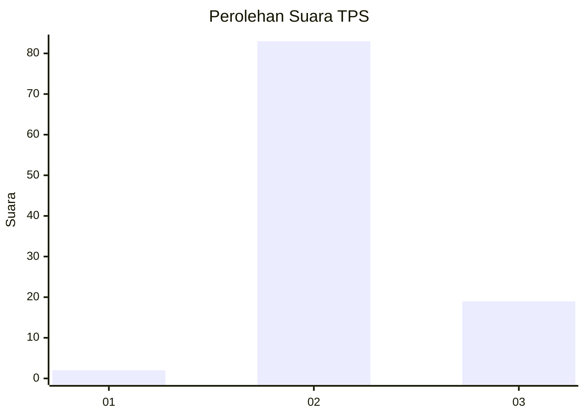
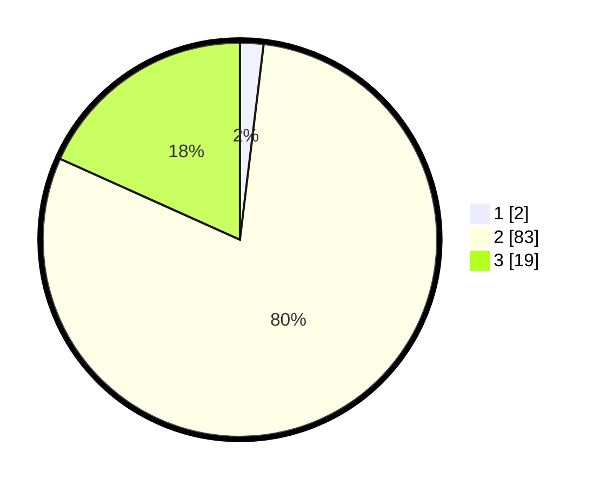

# Hasil

## Grafik

## Tabel

| No. | Nama Paslon    | Suara | Suara (raw) | Persentase |
|:--- |:-------------- | -----:| -----------:| ----------:|
| 1   | ANIES MUHAIMIN | 2     | [2][p-1]    | 1,92       |
| 2   | PRABOWO GIBRAN | 83    | [83][p-2]   | 79,81      |
| 3   | GANJAR MAHFUD  | 19    | [19][p-3]   | 18,27      |

[p-1]: https://github.com/gigit-pemilu/pemilu-2024/blob/main/pilpres/hitung-suara/sub/12-sumatera-utara/sub/08-simalungun/sub/29-raya/sub/2016-bongguron-kariahan/sub/003-tps/sub/paslon-1.txt
[p-2]: https://github.com/gigit-pemilu/pemilu-2024/blob/main/pilpres/hitung-suara/sub/12-sumatera-utara/sub/08-simalungun/sub/29-raya/sub/2016-bongguron-kariahan/sub/003-tps/sub/paslon-2.txt
[p-3]: https://github.com/gigit-pemilu/pemilu-2024/blob/main/pilpres/hitung-suara/sub/12-sumatera-utara/sub/08-simalungun/sub/29-raya/sub/2016-bongguron-kariahan/sub/003-tps/sub/paslon-3.txt

## Foto C Plano

https://sirekap-obj-formc.kpu.go.id/936d/pemilu/ppwp/12/08/29/20/16/1208292016003-20240215-031412--3a106cb8-2f18-4dbc-aaa0-139715313a1f.jpg

https://sirekap-obj-formc.kpu.go.id/936d/pemilu/ppwp/12/08/29/20/16/1208292016003-20240215-031427--f0a70a38-2ca6-49d6-a75c-52a7d39b0e10.jpg

https://sirekap-obj-formc.kpu.go.id/936d/pemilu/ppwp/12/08/29/20/16/1208292016003-20240215-031441--d222f50c-01e2-4472-9c40-234360e1e214.jpg

## Metadata

| Key        | Value               |
| ---------- | ------------------- |
| Time Stamp | 2024-02-25 18:00:00 |

