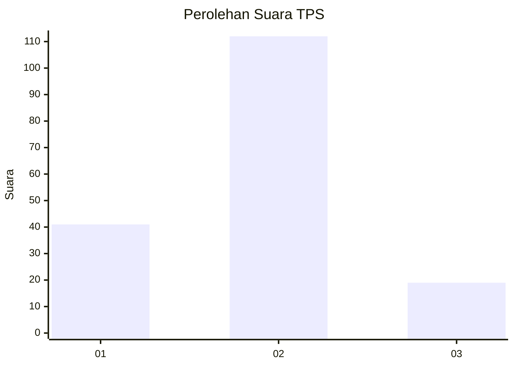
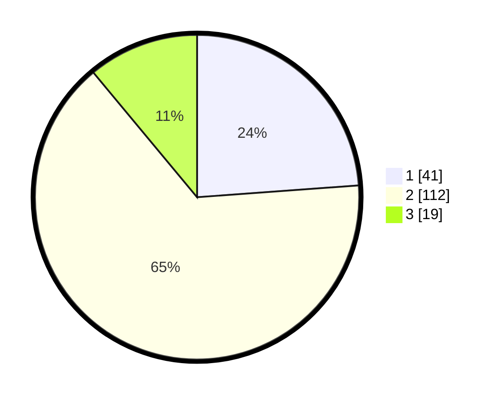

# Hasil

## Grafik

## Tabel

| No. | Nama Paslon    | Suara | Suara (raw) | Persentase |
|:--- |:-------------- | -----:| -----------:| ----------:|
| 1   | ANIES MUHAIMIN | 41    | [41][p-1]   | 23,84      |
| 2   | PRABOWO GIBRAN | 112   | [112][p-2]  | 65,12      |
| 3   | GANJAR MAHFUD  | 19    | [19][p-3]   | 11,05      |

[p-1]: https://github.com/gigit-pemilu/pemilu-2024/blob/main/pilpres/hitung-suara/sub/12-sumatera-utara/sub/08-simalungun/sub/30-ujung-padang/sub/1001-ujung-padang/sub/005-tps/sub/paslon-1.txt
[p-2]: https://github.com/gigit-pemilu/pemilu-2024/blob/main/pilpres/hitung-suara/sub/12-sumatera-utara/sub/08-simalungun/sub/30-ujung-padang/sub/1001-ujung-padang/sub/005-tps/sub/paslon-2.txt
[p-3]: https://github.com/gigit-pemilu/pemilu-2024/blob/main/pilpres/hitung-suara/sub/12-sumatera-utara/sub/08-simalungun/sub/30-ujung-padang/sub/1001-ujung-padang/sub/005-tps/sub/paslon-3.txt

## Foto C Plano

https://sirekap-obj-formc.kpu.go.id/84f7/pemilu/ppwp/12/08/30/10/01/1208301001005-20240217-142522--f0497cf6-a0cc-4fc5-9e8b-6adc5b9b30ed.jpg

https://sirekap-obj-formc.kpu.go.id/84f7/pemilu/ppwp/12/08/30/10/01/1208301001005-20240217-142445--d1e81ce4-ca9c-4f01-9dba-ad1376557837.jpg

https://sirekap-obj-formc.kpu.go.id/84f7/pemilu/ppwp/12/08/30/10/01/1208301001005-20240217-142310--d963f6d3-4010-4511-ad92-2004d2cdc890.jpg

## Metadata

| Key        | Value               |
| ---------- | ------------------- |
| Time Stamp | 2024-02-25 17:00:00 |

