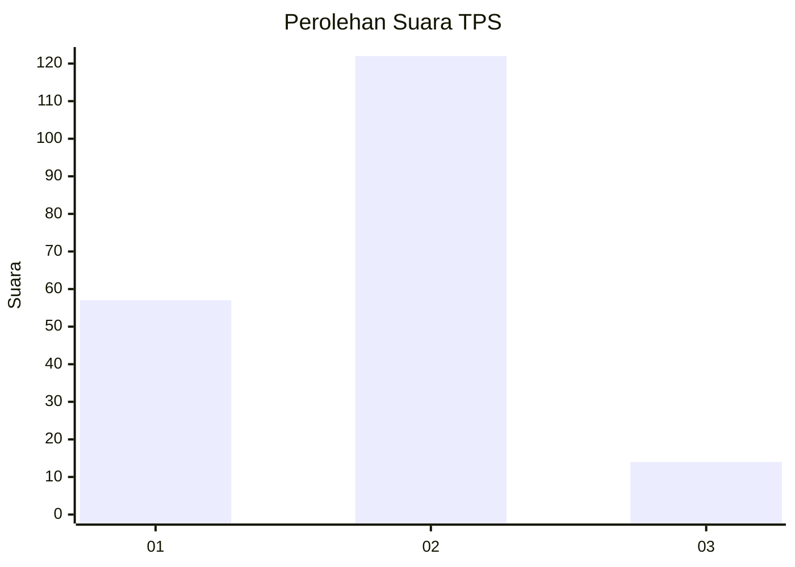
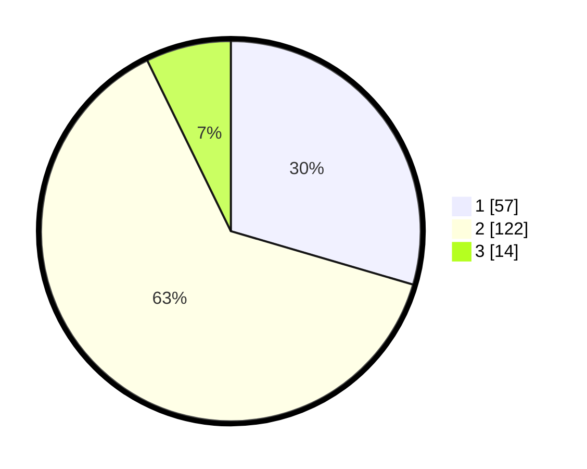

# Hasil

## Grafik

## Tabel

| No. | Nama Paslon    | Suara | Suara (raw) | Persentase |
|:--- |:-------------- | -----:| -----------:| ----------:|
| 1   | ANIES MUHAIMIN | 57    | [57][p-1]   | 29,53      |
| 2   | PRABOWO GIBRAN | 122   | [122][p-2]  | 63,21      |
| 3   | GANJAR MAHFUD  | 14    | [14][p-3]   | 7,25       |

[p-1]: https://github.com/gigit-pemilu/pemilu-2024/blob/main/pilpres/hitung-suara/sub/12-sumatera-utara/sub/08-simalungun/sub/30-ujung-padang/sub/1001-ujung-padang/sub/007-tps/sub/paslon-1.txt
[p-2]: https://github.com/gigit-pemilu/pemilu-2024/blob/main/pilpres/hitung-suara/sub/12-sumatera-utara/sub/08-simalungun/sub/30-ujung-padang/sub/1001-ujung-padang/sub/007-tps/sub/paslon-2.txt
[p-3]: https://github.com/gigit-pemilu/pemilu-2024/blob/main/pilpres/hitung-suara/sub/12-sumatera-utara/sub/08-simalungun/sub/30-ujung-padang/sub/1001-ujung-padang/sub/007-tps/sub/paslon-3.txt

## Foto C Plano

https://sirekap-obj-formc.kpu.go.id/33b5/pemilu/ppwp/12/08/30/10/01/1208301001007-20240214-155138--36363292-7fab-417b-aabc-cd0fb7b6bc6b.jpg

https://sirekap-obj-formc.kpu.go.id/33b5/pemilu/ppwp/12/08/30/10/01/1208301001007-20240214-155317--78abc116-ee1e-498e-8cd1-01a94df705c5.jpg

https://sirekap-obj-formc.kpu.go.id/33b5/pemilu/ppwp/12/08/30/10/01/1208301001007-20240214-155432--7e6640e0-60fe-4d3e-96a4-8df4b4ea5ac1.jpg

## Metadata

| Key        | Value               |
| ---------- | ------------------- |
| Time Stamp | 2024-02-25 13:00:00 |

