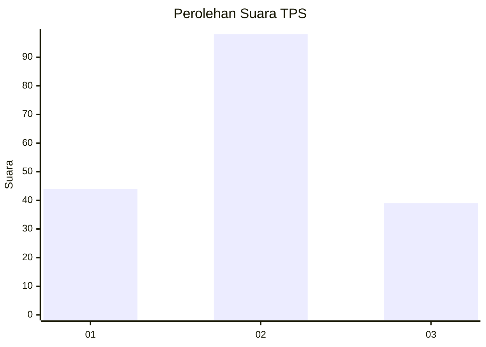
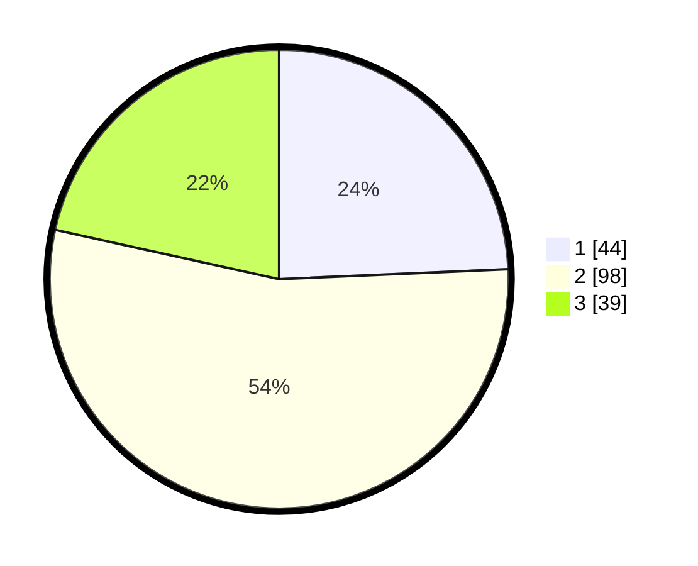

# Hasil

## Grafik

## Tabel

| No. | Nama Paslon    | Suara | Suara (raw) | Persentase |
|:--- |:-------------- | -----:| -----------:| ----------:|
| 1   | ANIES MUHAIMIN | 44    | [44][p-1]   | 24,31      |
| 2   | PRABOWO GIBRAN | 98    | [98][p-2]   | 54,14      |
| 3   | GANJAR MAHFUD  | 39    | [39][p-3]   | 21,55      |

[p-1]: https://github.com/gigit-pemilu/pemilu-2024/blob/main/pilpres/hitung-suara/sub/12-sumatera-utara/sub/08-simalungun/sub/30-ujung-padang/sub/1001-ujung-padang/sub/012-tps/sub/paslon-1.txt
[p-2]: https://github.com/gigit-pemilu/pemilu-2024/blob/main/pilpres/hitung-suara/sub/12-sumatera-utara/sub/08-simalungun/sub/30-ujung-padang/sub/1001-ujung-padang/sub/012-tps/sub/paslon-2.txt
[p-3]: https://github.com/gigit-pemilu/pemilu-2024/blob/main/pilpres/hitung-suara/sub/12-sumatera-utara/sub/08-simalungun/sub/30-ujung-padang/sub/1001-ujung-padang/sub/012-tps/sub/paslon-3.txt

## Foto C Plano

https://sirekap-obj-formc.kpu.go.id/ff19/pemilu/ppwp/12/08/30/10/01/1208301001012-20240214-224659--6f0e49b9-a8b2-4979-81ab-b4d2c62bf656.jpg

https://sirekap-obj-formc.kpu.go.id/ff19/pemilu/ppwp/12/08/30/10/01/1208301001012-20240217-214335--cbcd88d7-3bef-4279-9021-83881376f009.jpg

https://sirekap-obj-formc.kpu.go.id/ff19/pemilu/ppwp/12/08/30/10/01/1208301001012-20240214-210617--f97c06d8-a8cb-4d40-babd-7bebb3ebfadf.jpg

## Metadata

| Key        | Value               |
| ---------- | ------------------- |
| Time Stamp | 2024-02-24 22:31:28 |

