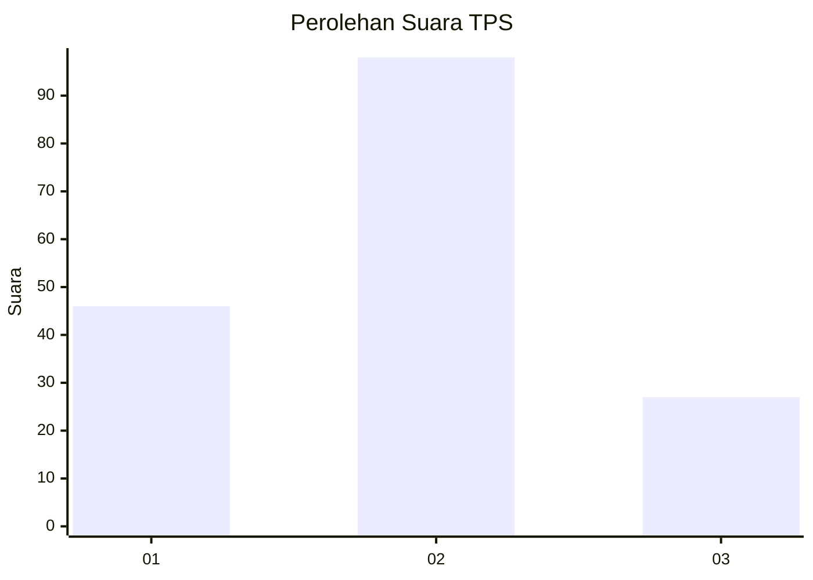
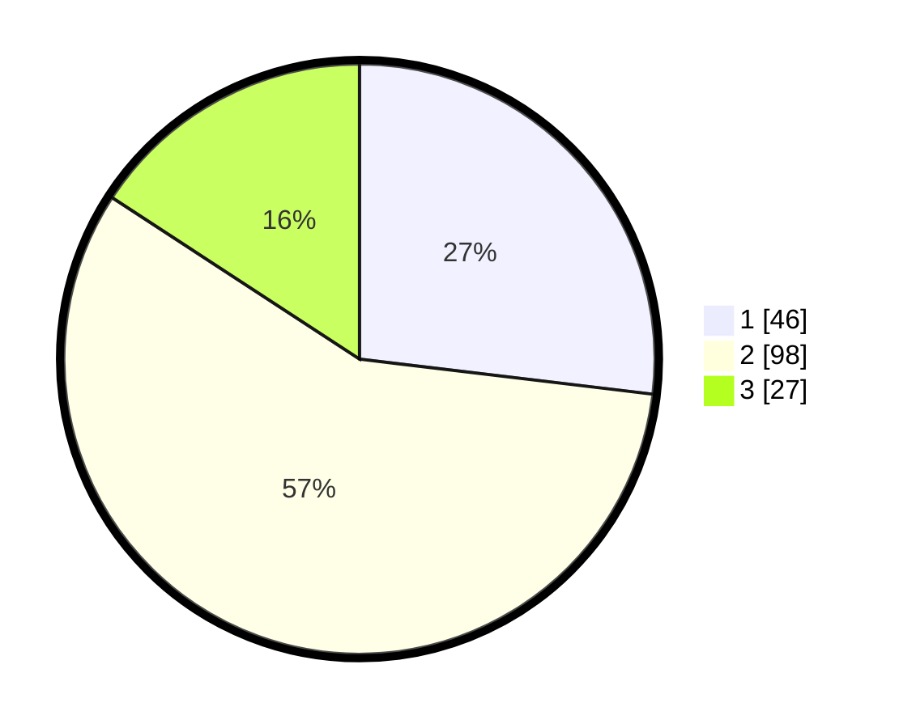

# Hasil

## Grafik

## Tabel

| No. | Nama Paslon    | Suara | Suara (raw) | Persentase |
|:--- |:-------------- | -----:| -----------:| ----------:|
| 1   | ANIES MUHAIMIN | 46    | [46][p-1]   | 26,90      |
| 2   | PRABOWO GIBRAN | 98    | [98][p-2]   | 57,31      |
| 3   | GANJAR MAHFUD  | 27    | [27][p-3]   | 15,79      |

[p-1]: https://github.com/gigit-pemilu/pemilu-2024/blob/main/pilpres/hitung-suara/sub/12-sumatera-utara/sub/08-simalungun/sub/30-ujung-padang/sub/2002-huta-parik/sub/004-tps/sub/paslon-1.txt
[p-2]: https://github.com/gigit-pemilu/pemilu-2024/blob/main/pilpres/hitung-suara/sub/12-sumatera-utara/sub/08-simalungun/sub/30-ujung-padang/sub/2002-huta-parik/sub/004-tps/sub/paslon-2.txt
[p-3]: https://github.com/gigit-pemilu/pemilu-2024/blob/main/pilpres/hitung-suara/sub/12-sumatera-utara/sub/08-simalungun/sub/30-ujung-padang/sub/2002-huta-parik/sub/004-tps/sub/paslon-3.txt

## Foto C Plano

https://sirekap-obj-formc.kpu.go.id/a76a/pemilu/ppwp/12/08/30/20/02/1208302002004-20240215-002106--f8bbe9a7-8eba-4736-856e-4f2ca1e2b52e.jpg

https://sirekap-obj-formc.kpu.go.id/a76a/pemilu/ppwp/12/08/30/20/02/1208302002004-20240215-002114--a96419bb-58a3-4d16-8449-0e48715ca321.jpg

https://sirekap-obj-formc.kpu.go.id/a76a/pemilu/ppwp/12/08/30/20/02/1208302002004-20240215-002135--ec6e8f76-7059-411f-93c7-addcef929714.jpg

## Metadata

| Key        | Value               |
| ---------- | ------------------- |
| Time Stamp | 2024-02-25 12:00:00 |

