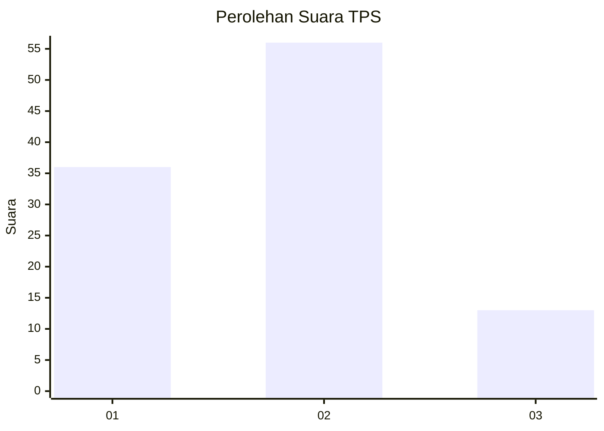
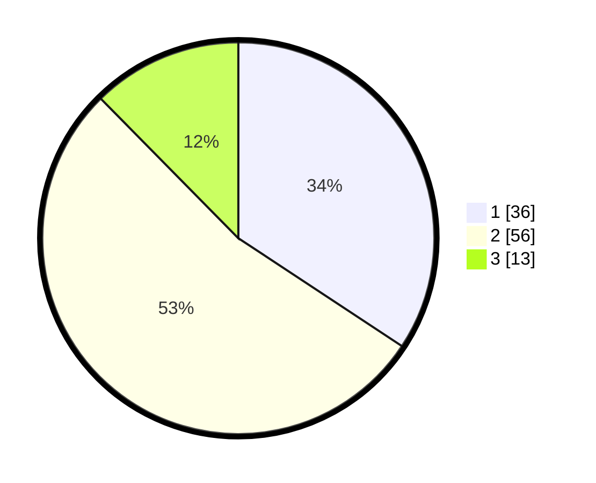

# Hasil

## Grafik

## Tabel

| No. | Nama Paslon    | Suara | Suara (raw) | Persentase |
|:--- |:-------------- | -----:| -----------:| ----------:|
| 1   | ANIES MUHAIMIN | 36    | [36][p-1]   | 34,29      |
| 2   | PRABOWO GIBRAN | 56    | [56][p-2]   | 53,33      |
| 3   | GANJAR MAHFUD  | 13    | [13][p-3]   | 12,38      |

[p-1]: https://github.com/gigit-pemilu/pemilu-2024-12-sumatera-utara/blob/main/pilpres/hitung-suara/sub/12-sumatera-utara/sub/08-simalungun/sub/30-ujung-padang/sub/2006-taratak-nagodang/sub/006-tps/sub/paslon-1.txt
[p-2]: https://github.com/gigit-pemilu/pemilu-2024-12-sumatera-utara/blob/main/pilpres/hitung-suara/sub/12-sumatera-utara/sub/08-simalungun/sub/30-ujung-padang/sub/2006-taratak-nagodang/sub/006-tps/sub/paslon-2.txt
[p-3]: https://github.com/gigit-pemilu/pemilu-2024-12-sumatera-utara/blob/main/pilpres/hitung-suara/sub/12-sumatera-utara/sub/08-simalungun/sub/30-ujung-padang/sub/2006-taratak-nagodang/sub/006-tps/sub/paslon-3.txt

## Foto C Plano

https://sirekap-obj-formc.kpu.go.id/95d3/pemilu/ppwp/12/08/30/20/06/1208302006006-20240215-010003--094965c6-fca4-448c-9130-0487beecc65a.jpg

https://sirekap-obj-formc.kpu.go.id/95d3/pemilu/ppwp/12/08/30/20/06/1208302006006-20240215-005516--e6c0a05b-2539-41d8-9678-a27f2bf23d4b.jpg

https://sirekap-obj-formc.kpu.go.id/95d3/pemilu/ppwp/12/08/30/20/06/1208302006006-20240215-005555--d69f9fd0-e120-4b96-abe6-020425aaea35.jpg

## Metadata

| Key        | Value               |
| ---------- | ------------------- |
| Time Stamp | 2024-02-25 00:00:00 |

