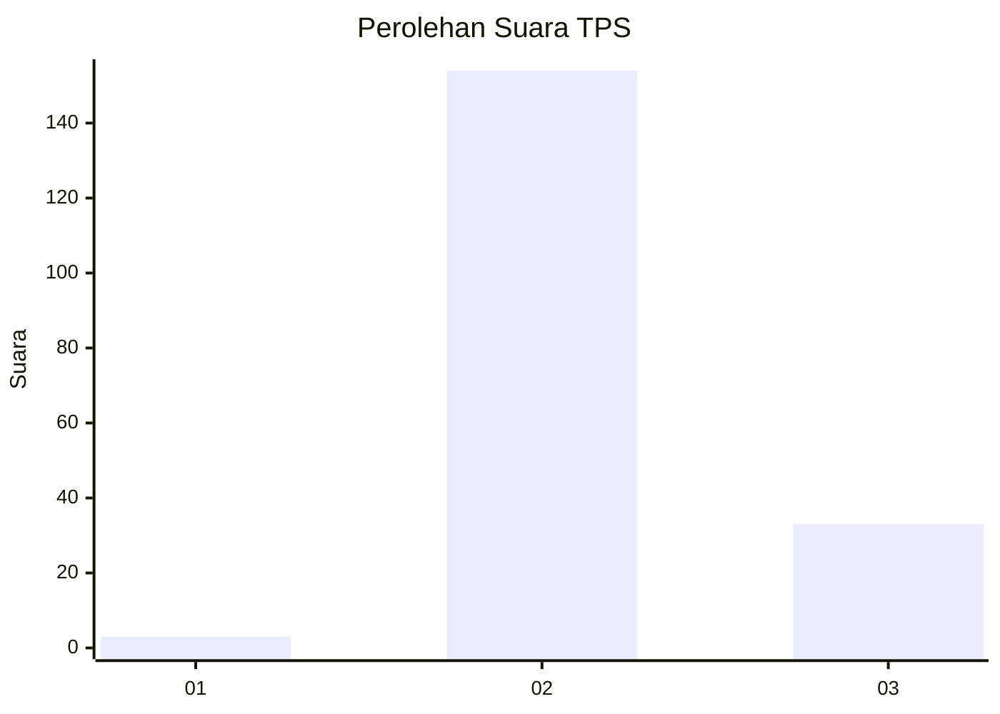

# Hasil

## Grafik

## Tabel

| No. | Nama Paslon    | Suara | Suara (raw) | Persentase |
|:--- |:-------------- | -----:| -----------:| ----------:|
| 1   | ANIES MUHAIMIN | 3     | [3][p-1]    | 1,58       |
| 2   | PRABOWO GIBRAN | 154   | [154][p-2]  | 81,05      |
| 3   | GANJAR MAHFUD  | 33    | [33][p-3]   | 17,37      |

[p-1]: https://github.com/gigit-pemilu/pemilu-2024-12-sumatera-utara/blob/main/pilpres/hitung-suara/sub/12-sumatera-utara/sub/08-simalungun/sub/31-pamatang-silima-huta/sub/2001-ujung-saribu/sub/001-tps/sub/paslon-1.txt
[p-2]: https://github.com/gigit-pemilu/pemilu-2024-12-sumatera-utara/blob/main/pilpres/hitung-suara/sub/12-sumatera-utara/sub/08-simalungun/sub/31-pamatang-silima-huta/sub/2001-ujung-saribu/sub/001-tps/sub/paslon-2.txt
[p-3]: https://github.com/gigit-pemilu/pemilu-2024-12-sumatera-utara/blob/main/pilpres/hitung-suara/sub/12-sumatera-utara/sub/08-simalungun/sub/31-pamatang-silima-huta/sub/2001-ujung-saribu/sub/001-tps/sub/paslon-3.txt

## Foto C Plano

https://sirekap-obj-formc.kpu.go.id/ef49/pemilu/ppwp/12/08/31/20/01/1208312001001-20240214-224146--10206de0-1abe-46dd-a47c-64bbb09de10c.jpg

https://sirekap-obj-formc.kpu.go.id/ef49/pemilu/ppwp/12/08/31/20/01/1208312001001-20240214-224031--293ed78f-3e63-4773-ab98-168a4cf4f182.jpg

https://sirekap-obj-formc.kpu.go.id/ef49/pemilu/ppwp/12/08/31/20/01/1208312001001-20240214-223748--23f2c7c1-7e3e-4fd1-a92b-7b7fb3e41b3c.jpg

## Metadata

| Key        | Value               |
| ---------- | ------------------- |
| Time Stamp | 2024-02-24 22:31:28 |

