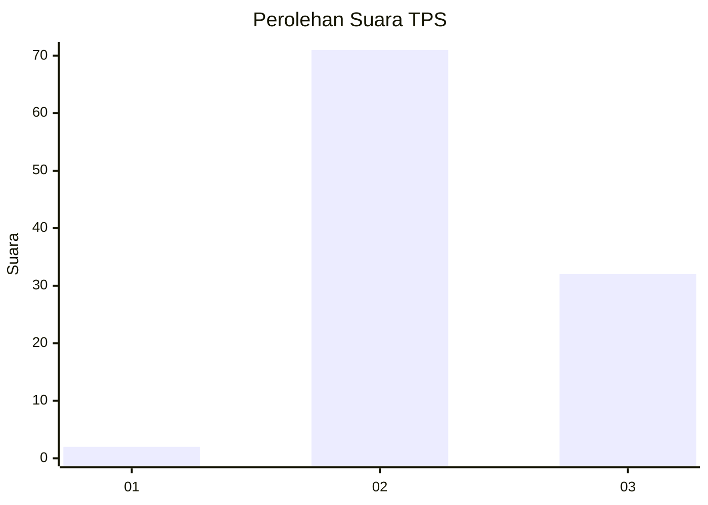
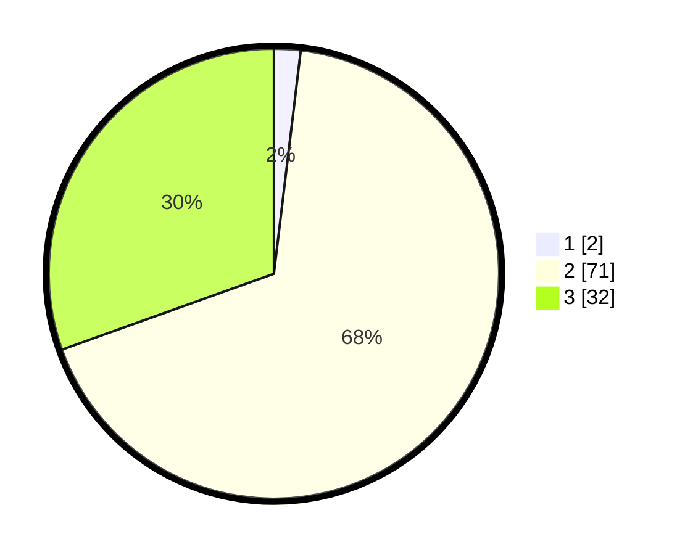

# Hasil

## Grafik

## Tabel

| No. | Nama Paslon    | Suara | Suara (raw) | Persentase |
|:--- |:-------------- | -----:| -----------:| ----------:|
| 1   | ANIES MUHAIMIN | 2     | [2][p-1]    | 1,90       |
| 2   | PRABOWO GIBRAN | 71    | [71][p-2]   | 67,62      |
| 3   | GANJAR MAHFUD  | 32    | [32][p-3]   | 30,48      |

[p-1]: https://github.com/gigit-pemilu/pemilu-2024/blob/main/pilpres/hitung-suara/sub/12-sumatera-utara/sub/08-simalungun/sub/31-pamatang-silima-huta/sub/2001-ujung-saribu/sub/002-tps/sub/paslon-1.txt
[p-2]: https://github.com/gigit-pemilu/pemilu-2024/blob/main/pilpres/hitung-suara/sub/12-sumatera-utara/sub/08-simalungun/sub/31-pamatang-silima-huta/sub/2001-ujung-saribu/sub/002-tps/sub/paslon-2.txt
[p-3]: https://github.com/gigit-pemilu/pemilu-2024/blob/main/pilpres/hitung-suara/sub/12-sumatera-utara/sub/08-simalungun/sub/31-pamatang-silima-huta/sub/2001-ujung-saribu/sub/002-tps/sub/paslon-3.txt

## Foto C Plano

https://sirekap-obj-formc.kpu.go.id/cacd/pemilu/ppwp/12/08/31/20/01/1208312001002-20240214-230645--8085df15-f976-46db-9bd4-da6a1f995291.jpg

https://sirekap-obj-formc.kpu.go.id/cacd/pemilu/ppwp/12/08/31/20/01/1208312001002-20240215-014702--2dcc7743-cf18-4f75-8746-ff9b1a5b5456.jpg

https://sirekap-obj-formc.kpu.go.id/cacd/pemilu/ppwp/12/08/31/20/01/1208312001002-20240215-014745--43c23d6b-77af-41e7-8399-077abc99df9b.jpg

## Metadata

| Key        | Value               |
| ---------- | ------------------- |
| Time Stamp | 2024-02-25 12:00:00 |

