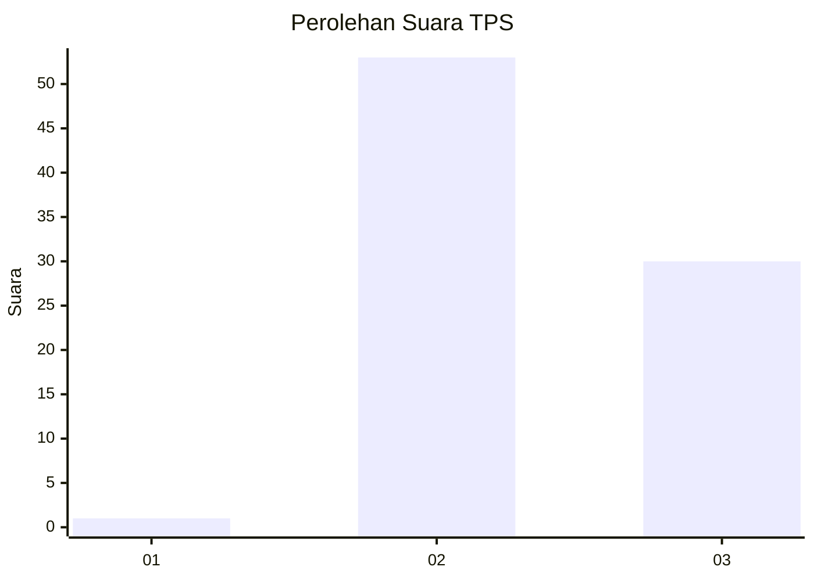
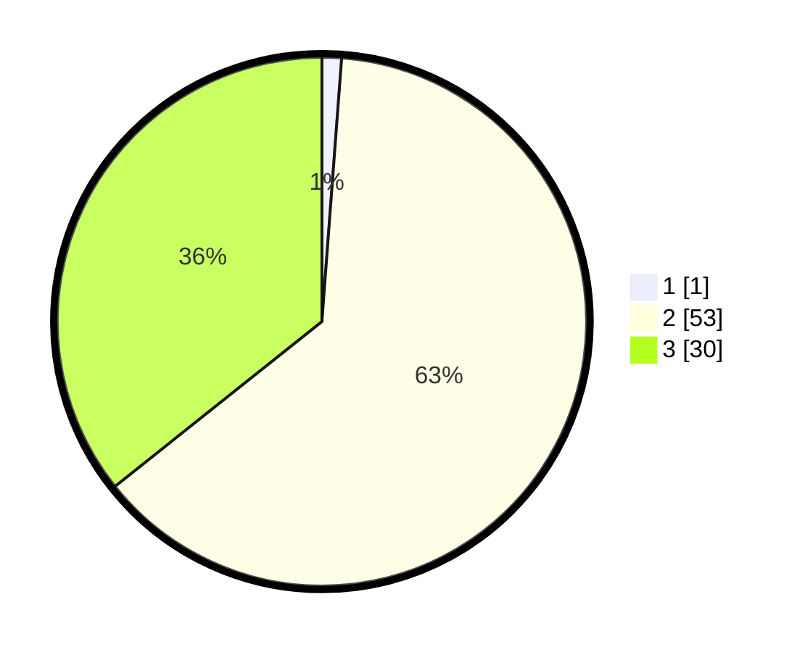

# Hasil

## Grafik

## Tabel

| No. | Nama Paslon    | Suara | Suara (raw) | Persentase |
|:--- |:-------------- | -----:| -----------:| ----------:|
| 1   | ANIES MUHAIMIN | 1     | [1][p-1]    | 1,19       |
| 2   | PRABOWO GIBRAN | 53    | [53][p-2]   | 63,10      |
| 3   | GANJAR MAHFUD  | 30    | [30][p-3]   | 35,71      |

[p-1]: https://github.com/gigit-pemilu/pemilu-2024/blob/main/pilpres/hitung-suara/sub/12-sumatera-utara/sub/08-simalungun/sub/31-pamatang-silima-huta/sub/2001-ujung-saribu/sub/003-tps/sub/paslon-1.txt
[p-2]: https://github.com/gigit-pemilu/pemilu-2024/blob/main/pilpres/hitung-suara/sub/12-sumatera-utara/sub/08-simalungun/sub/31-pamatang-silima-huta/sub/2001-ujung-saribu/sub/003-tps/sub/paslon-2.txt
[p-3]: https://github.com/gigit-pemilu/pemilu-2024/blob/main/pilpres/hitung-suara/sub/12-sumatera-utara/sub/08-simalungun/sub/31-pamatang-silima-huta/sub/2001-ujung-saribu/sub/003-tps/sub/paslon-3.txt

## Foto C Plano

https://sirekap-obj-formc.kpu.go.id/86f9/pemilu/ppwp/12/08/31/20/01/1208312001003-20240214-234446--9c9ef857-262a-46fc-b6ae-0db3a9071f5c.jpg

https://sirekap-obj-formc.kpu.go.id/86f9/pemilu/ppwp/12/08/31/20/01/1208312001003-20240214-234620--35cffe23-29cf-422d-9c2c-a8865c8fca2d.jpg

https://sirekap-obj-formc.kpu.go.id/86f9/pemilu/ppwp/12/08/31/20/01/1208312001003-20240214-234653--e3b73a93-ee2a-4292-8b80-17690e42506a.jpg

## Metadata

| Key        | Value               |
| ---------- | ------------------- |
| Time Stamp | 2024-02-15 22:30:27 |

