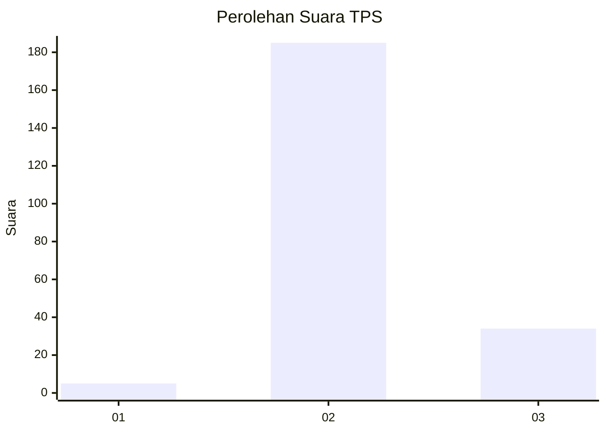
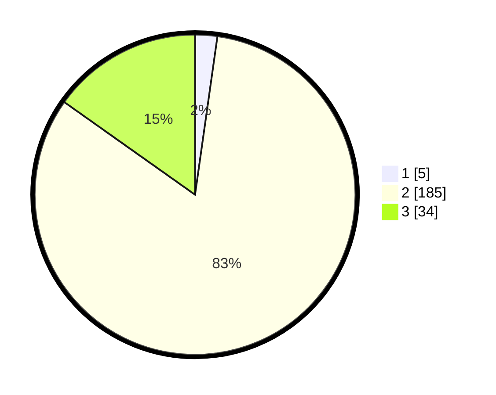

# Hasil

## Grafik

## Tabel

| No. | Nama Paslon    | Suara | Suara (raw) | Persentase |
|:--- |:-------------- | -----:| -----------:| ----------:|
| 1   | ANIES MUHAIMIN | 5     | [5][p-1]    | 2,23       |
| 2   | PRABOWO GIBRAN | 185   | [185][p-2]  | 82,59      |
| 3   | GANJAR MAHFUD  | 34    | [34][p-3]   | 15,18      |

[p-1]: https://github.com/gigit-pemilu/pemilu-2024-12-sumatera-utara/blob/main/pilpres/hitung-suara/sub/12-sumatera-utara/sub/08-simalungun/sub/31-pamatang-silima-huta/sub/2003-siboras/sub/002-tps/sub/paslon-1.txt
[p-2]: https://github.com/gigit-pemilu/pemilu-2024-12-sumatera-utara/blob/main/pilpres/hitung-suara/sub/12-sumatera-utara/sub/08-simalungun/sub/31-pamatang-silima-huta/sub/2003-siboras/sub/002-tps/sub/paslon-2.txt
[p-3]: https://github.com/gigit-pemilu/pemilu-2024-12-sumatera-utara/blob/main/pilpres/hitung-suara/sub/12-sumatera-utara/sub/08-simalungun/sub/31-pamatang-silima-huta/sub/2003-siboras/sub/002-tps/sub/paslon-3.txt

## Foto C Plano

https://sirekap-obj-formc.kpu.go.id/6b08/pemilu/ppwp/12/08/31/20/03/1208312003002-20240216-231326--b508857a-8326-4fcd-86d3-55d9ced05a86.jpg

https://sirekap-obj-formc.kpu.go.id/6b08/pemilu/ppwp/12/08/31/20/03/1208312003002-20240216-225752--1bf5359b-3fc0-4224-8aa6-99c3eda9ff3e.jpg

https://sirekap-obj-formc.kpu.go.id/6b08/pemilu/ppwp/12/08/31/20/03/1208312003002-20240216-231848--90a304ea-5594-4ad6-9118-3b586e99a1fd.jpg

## Metadata

| Key        | Value               |
| ---------- | ------------------- |
| Time Stamp | 2024-02-24 22:31:28 |

