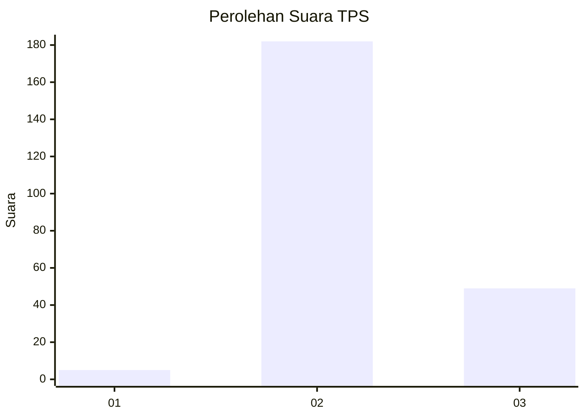

# Hasil

## Grafik

## Tabel

| No. | Nama Paslon    | Suara | Suara (raw) | Persentase |
|:--- |:-------------- | -----:| -----------:| ----------:|
| 1   | ANIES MUHAIMIN | 5     | [5][p-1]    | 2,12       |
| 2   | PRABOWO GIBRAN | 182   | [182][p-2]  | 77,12      |
| 3   | GANJAR MAHFUD  | 49    | [49][p-3]   | 20,76      |

[p-1]: https://github.com/gigit-pemilu/pemilu-2024/blob/main/pilpres/hitung-suara/sub/12-sumatera-utara/sub/08-simalungun/sub/32-dolog-masagal/sub/2001-raya-huluan/sub/005-tps/sub/paslon-1.txt
[p-2]: https://github.com/gigit-pemilu/pemilu-2024/blob/main/pilpres/hitung-suara/sub/12-sumatera-utara/sub/08-simalungun/sub/32-dolog-masagal/sub/2001-raya-huluan/sub/005-tps/sub/paslon-2.txt
[p-3]: https://github.com/gigit-pemilu/pemilu-2024/blob/main/pilpres/hitung-suara/sub/12-sumatera-utara/sub/08-simalungun/sub/32-dolog-masagal/sub/2001-raya-huluan/sub/005-tps/sub/paslon-3.txt

## Foto C Plano

https://sirekap-obj-formc.kpu.go.id/f84d/pemilu/ppwp/12/08/32/20/01/1208322001005-20240214-231633--d74681b3-5a0b-4af9-a912-1a922c7fe4e2.jpg

https://sirekap-obj-formc.kpu.go.id/f84d/pemilu/ppwp/12/08/32/20/01/1208322001005-20240215-095622--ffe926c1-2dce-411e-9527-eba586fdee0c.jpg

https://sirekap-obj-formc.kpu.go.id/f84d/pemilu/ppwp/12/08/32/20/01/1208322001005-20240215-094524--be58f53c-2c7e-4950-ae61-67d0f0db42bc.jpg

## Metadata

| Key        | Value               |
| ---------- | ------------------- |
| Time Stamp | 2024-02-25 12:00:00 |

