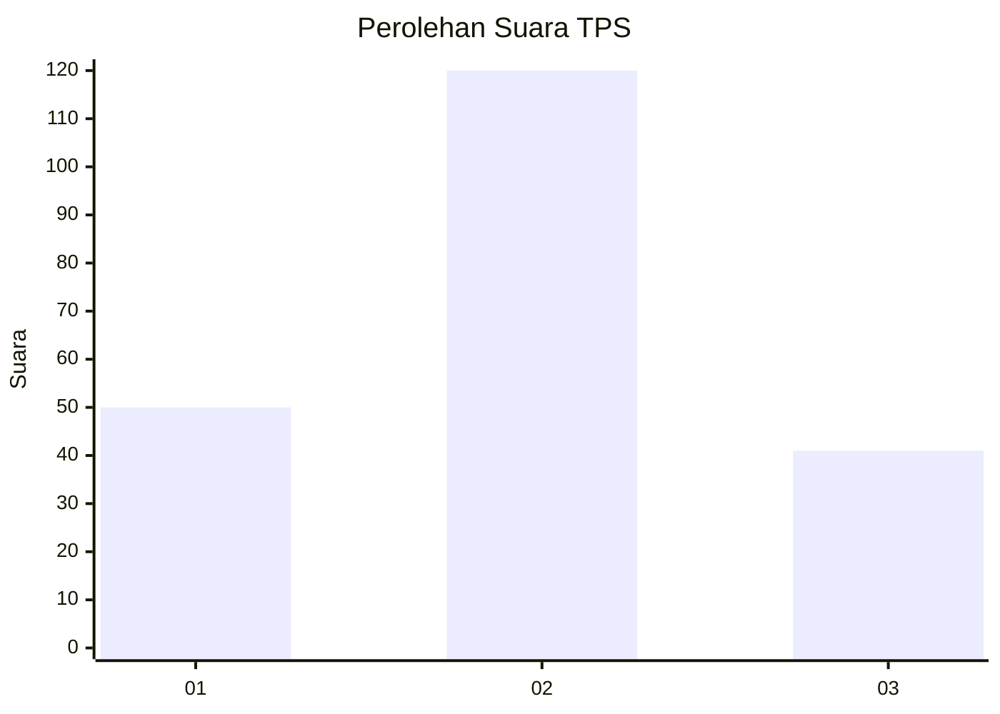
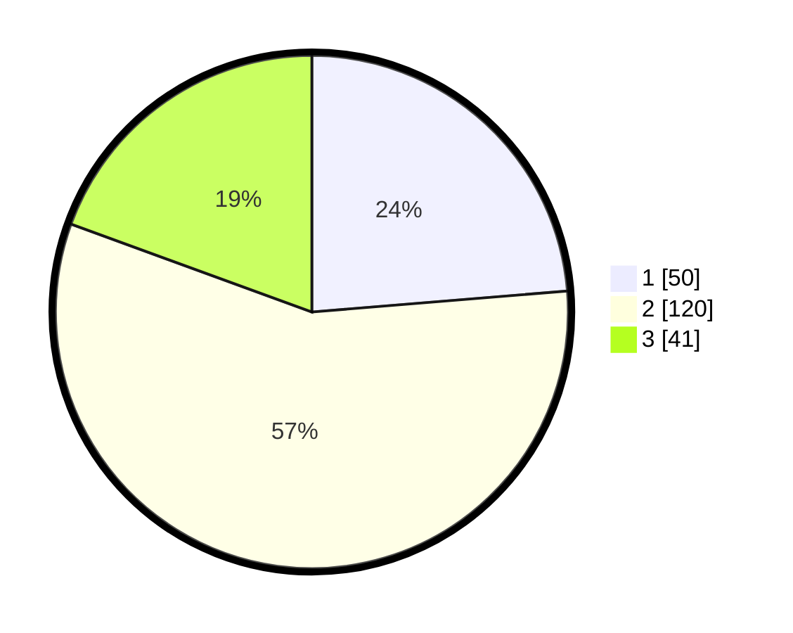

# Hasil

## Grafik

## Tabel

| No. | Nama Paslon    | Suara | Suara (raw) | Persentase |
|:--- |:-------------- | -----:| -----------:| ----------:|
| 1   | ANIES MUHAIMIN | 50    | [50][p-1]   | 23,70      |
| 2   | PRABOWO GIBRAN | 120   | [120][p-2]  | 56,87      |
| 3   | GANJAR MAHFUD  | 41    | [41][p-3]   | 19,43      |

[p-1]: https://github.com/gigit-pemilu/pemilu-2024/blob/main/pilpres/hitung-suara/sub/12-sumatera-utara/sub/09-asahan/sub/08-meranti/sub/2002-meranti/sub/003-tps/sub/paslon-1.txt
[p-2]: https://github.com/gigit-pemilu/pemilu-2024/blob/main/pilpres/hitung-suara/sub/12-sumatera-utara/sub/09-asahan/sub/08-meranti/sub/2002-meranti/sub/003-tps/sub/paslon-2.txt
[p-3]: https://github.com/gigit-pemilu/pemilu-2024/blob/main/pilpres/hitung-suara/sub/12-sumatera-utara/sub/09-asahan/sub/08-meranti/sub/2002-meranti/sub/003-tps/sub/paslon-3.txt

## Foto C Plano

https://sirekap-obj-formc.kpu.go.id/f95a/pemilu/ppwp/12/09/08/20/02/1209082002003-20240215-024526--9c4f031a-30f2-49f0-a41b-1c476ee87bcf.jpg

https://sirekap-obj-formc.kpu.go.id/f95a/pemilu/ppwp/12/09/08/20/02/1209082002003-20240215-024621--c52bec08-0eeb-40e0-80e1-3a7d5ffaeb05.jpg

https://sirekap-obj-formc.kpu.go.id/f95a/pemilu/ppwp/12/09/08/20/02/1209082002003-20240215-024707--a4d4d9f6-0ad0-4219-8d6c-61b57ceb5141.jpg

## Metadata

| Key        | Value               |
| ---------- | ------------------- |
| Time Stamp | 2024-02-15 12:00:28 |

