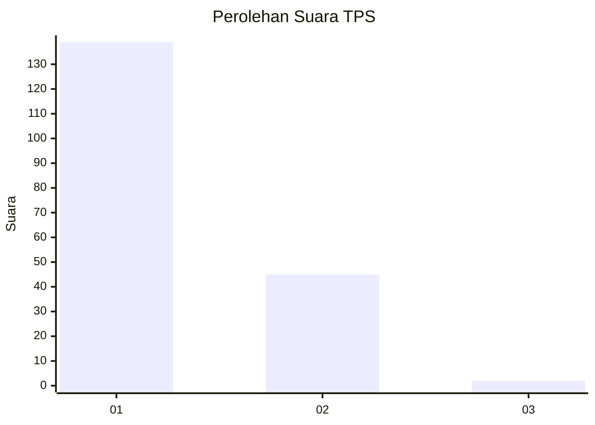
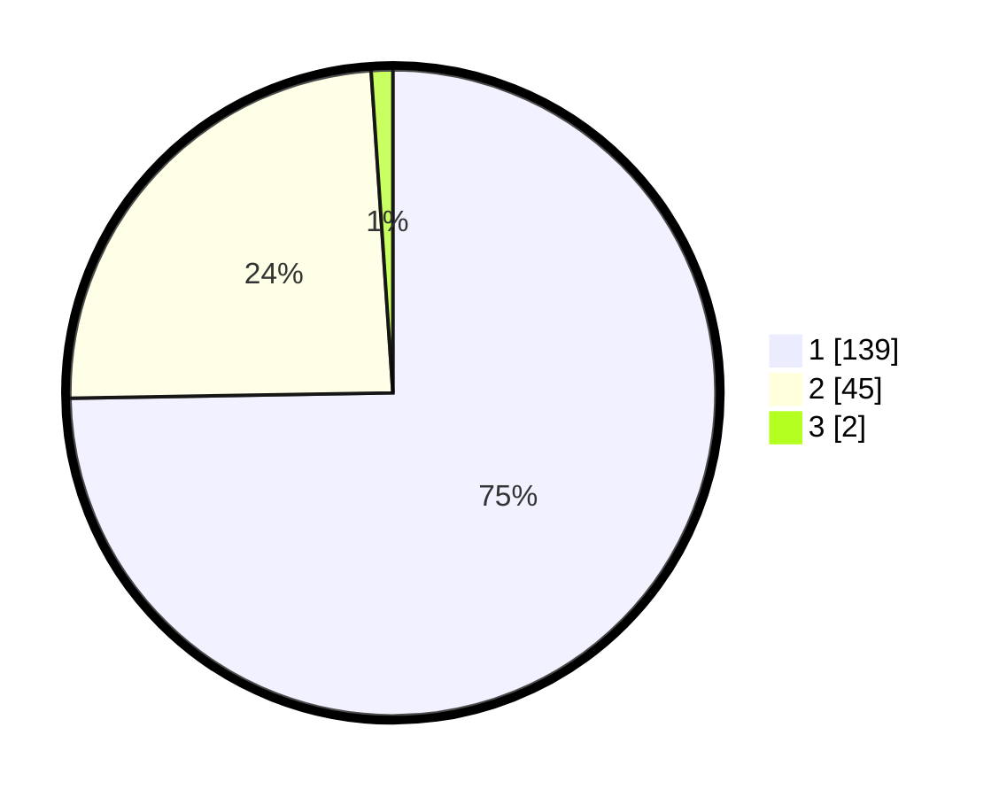

# Hasil

## Grafik

## Tabel

| No. | Nama Paslon    | Suara | Suara (raw) | Persentase |
|:--- |:-------------- | -----:| -----------:| ----------:|
| 1   | ANIES MUHAIMIN | 139   | [139][p-1]  | 74,73      |
| 2   | PRABOWO GIBRAN | 45    | [45][p-2]   | 24,19      |
| 3   | GANJAR MAHFUD  | 2     | [2][p-3]    | 1,08       |

[p-1]: https://github.com/gigit-pemilu/pemilu-2024-12-sumatera-utara/blob/main/pilpres/hitung-suara/sub/12-sumatera-utara/sub/09-asahan/sub/09-air-joman/sub/1001-binjai-serbangan/sub/005-tps/sub/paslon-1.txt
[p-2]: https://github.com/gigit-pemilu/pemilu-2024-12-sumatera-utara/blob/main/pilpres/hitung-suara/sub/12-sumatera-utara/sub/09-asahan/sub/09-air-joman/sub/1001-binjai-serbangan/sub/005-tps/sub/paslon-2.txt
[p-3]: https://github.com/gigit-pemilu/pemilu-2024-12-sumatera-utara/blob/main/pilpres/hitung-suara/sub/12-sumatera-utara/sub/09-asahan/sub/09-air-joman/sub/1001-binjai-serbangan/sub/005-tps/sub/paslon-3.txt

## Foto C Plano

https://sirekap-obj-formc.kpu.go.id/1852/pemilu/ppwp/12/09/09/10/01/1209091001005-20240215-055350--bbf6eb20-c85a-47a2-ad37-7dd24a490ad2.jpg

https://sirekap-obj-formc.kpu.go.id/1852/pemilu/ppwp/12/09/09/10/01/1209091001005-20240215-090617--cb68734f-1395-4dac-83ea-ad3e6ce4ffe0.jpg

https://sirekap-obj-formc.kpu.go.id/1852/pemilu/ppwp/12/09/09/10/01/1209091001005-20240215-055609--a253113c-37d4-4e93-b70d-2d0ee9d87d7d.jpg

## Metadata

| Key        | Value               |
| ---------- | ------------------- |
| Time Stamp | 2024-02-25 12:00:00 |

