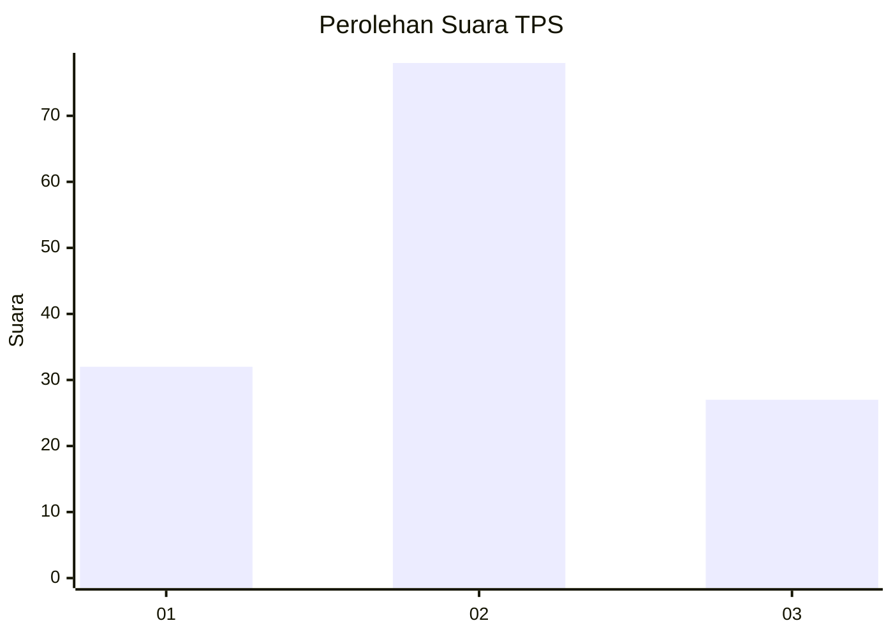
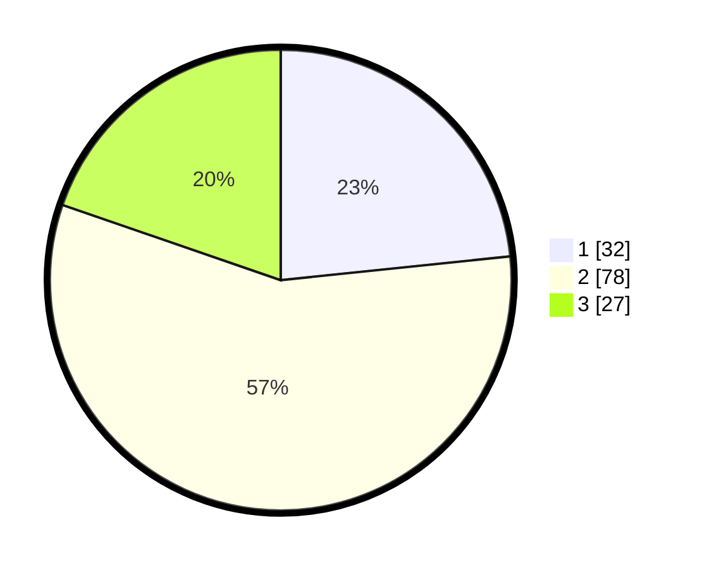

# Hasil

## Grafik

## Tabel

| No. | Nama Paslon    | Suara | Suara (raw) | Persentase |
|:--- |:-------------- | -----:| -----------:| ----------:|
| 1   | ANIES MUHAIMIN | 32    | [32][p-1]   | 23,36      |
| 2   | PRABOWO GIBRAN | 78    | [78][p-2]   | 56,93      |
| 3   | GANJAR MAHFUD  | 27    | [27][p-3]   | 19,71      |

[p-1]: https://github.com/gigit-pemilu/pemilu-2024/blob/main/pilpres/hitung-suara/sub/12-sumatera-utara/sub/09-asahan/sub/09-air-joman/sub/2003-air-joman-baru/sub/012-tps/sub/paslon-1.txt
[p-2]: https://github.com/gigit-pemilu/pemilu-2024/blob/main/pilpres/hitung-suara/sub/12-sumatera-utara/sub/09-asahan/sub/09-air-joman/sub/2003-air-joman-baru/sub/012-tps/sub/paslon-2.txt
[p-3]: https://github.com/gigit-pemilu/pemilu-2024/blob/main/pilpres/hitung-suara/sub/12-sumatera-utara/sub/09-asahan/sub/09-air-joman/sub/2003-air-joman-baru/sub/012-tps/sub/paslon-3.txt

## Foto C Plano

https://sirekap-obj-formc.kpu.go.id/6c9f/pemilu/ppwp/12/09/09/20/03/1209092003012-20240214-195139--1b8a9e61-2955-460a-918a-ebfb49e32cd9.jpg

https://sirekap-obj-formc.kpu.go.id/6c9f/pemilu/ppwp/12/09/09/20/03/1209092003012-20240214-195318--3cbcaf06-7288-454c-9bdc-f6e028112e64.jpg

https://sirekap-obj-formc.kpu.go.id/6c9f/pemilu/ppwp/12/09/09/20/03/1209092003012-20240214-195429--79ef0de8-dbeb-4f8a-bd6b-5d95017b43a2.jpg

## Metadata

| Key        | Value               |
| ---------- | ------------------- |
| Time Stamp | 2024-02-24 22:31:28 |

