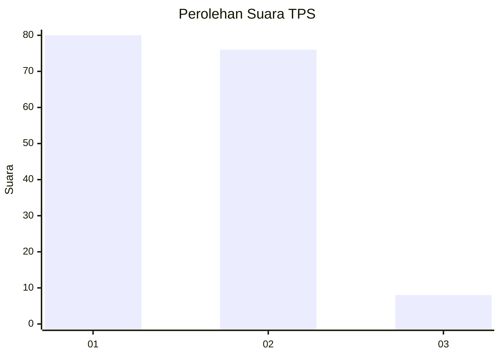
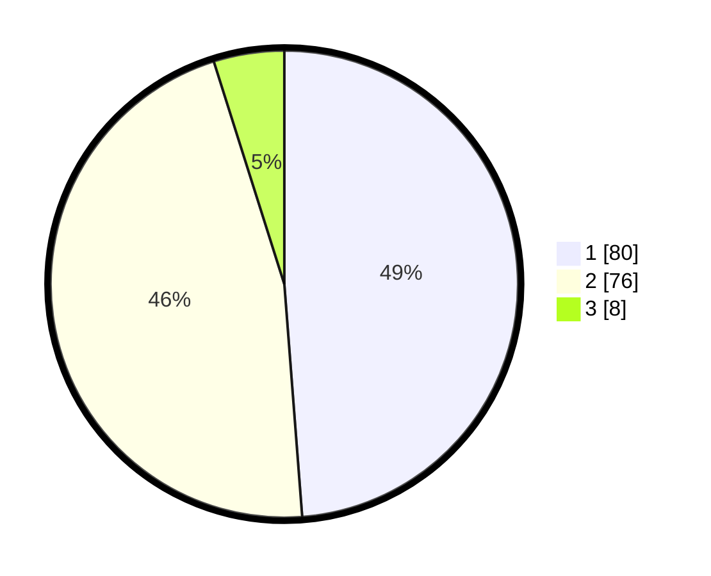

# Hasil

## Grafik

## Tabel

| No. | Nama Paslon    | Suara | Suara (raw) | Persentase |
|:--- |:-------------- | -----:| -----------:| ----------:|
| 1   | ANIES MUHAIMIN | 80    | [80][p-1]   | 48,78      |
| 2   | PRABOWO GIBRAN | 76    | [76][p-2]   | 46,34      |
| 3   | GANJAR MAHFUD  | 8     | [8][p-3]    | 4,88       |

[p-1]: https://github.com/gigit-pemilu/pemilu-2024-12-sumatera-utara/blob/main/pilpres/hitung-suara/sub/12-sumatera-utara/sub/09-asahan/sub/09-air-joman/sub/2007-pasar-lembu/sub/003-tps/sub/paslon-1.txt
[p-2]: https://github.com/gigit-pemilu/pemilu-2024-12-sumatera-utara/blob/main/pilpres/hitung-suara/sub/12-sumatera-utara/sub/09-asahan/sub/09-air-joman/sub/2007-pasar-lembu/sub/003-tps/sub/paslon-2.txt
[p-3]: https://github.com/gigit-pemilu/pemilu-2024-12-sumatera-utara/blob/main/pilpres/hitung-suara/sub/12-sumatera-utara/sub/09-asahan/sub/09-air-joman/sub/2007-pasar-lembu/sub/003-tps/sub/paslon-3.txt

## Foto C Plano

https://sirekap-obj-formc.kpu.go.id/d9ee/pemilu/ppwp/12/09/09/20/07/1209092007003-20240214-222246--caf6069d-f2bb-44d3-b7b4-7a3589d91309.jpg

https://sirekap-obj-formc.kpu.go.id/d9ee/pemilu/ppwp/12/09/09/20/07/1209092007003-20240214-222307--24bd3ff0-36f7-4e19-9801-4eb0054aed6e.jpg

https://sirekap-obj-formc.kpu.go.id/d9ee/pemilu/ppwp/12/09/09/20/07/1209092007003-20240215-014612--7f4905c6-c90a-451d-9808-3c11e081bcb1.jpg

## Metadata

| Key        | Value               |
| ---------- | ------------------- |
| Time Stamp | 2024-02-25 21:00:00 |

