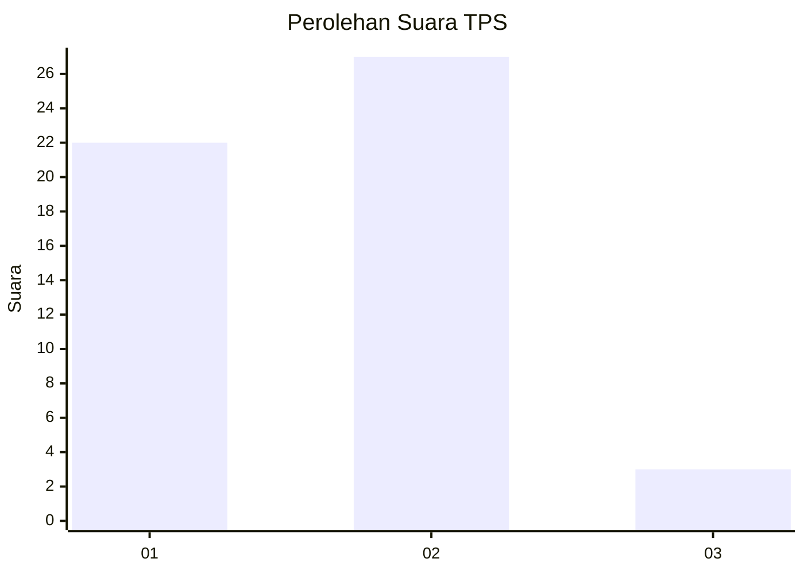
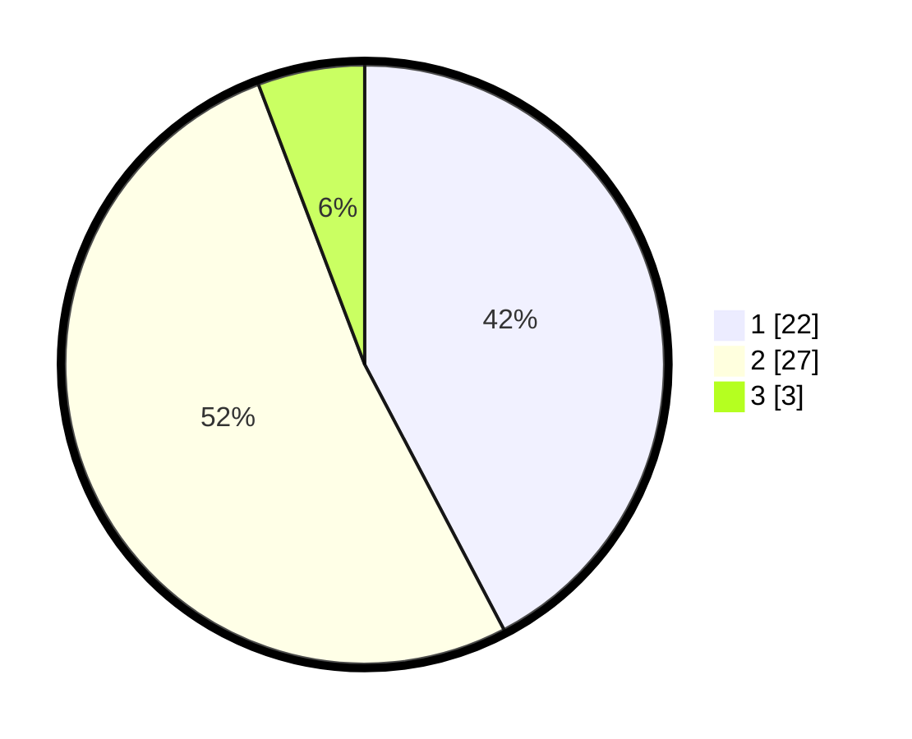

# Hasil

## Grafik

## Tabel

| No. | Nama Paslon    | Suara | Suara (raw) | Persentase |
|:--- |:-------------- | -----:| -----------:| ----------:|
| 1   | ANIES MUHAIMIN | 22    | [22][p-1]   | 42,31      |
| 2   | PRABOWO GIBRAN | 27    | [27][p-2]   | 51,92      |
| 3   | GANJAR MAHFUD  | 3     | [3][p-3]    | 5,77       |

[p-1]: https://github.com/gigit-pemilu/pemilu-2024/blob/main/pilpres/hitung-suara/sub/12-sumatera-utara/sub/09-asahan/sub/09-air-joman/sub/2007-pasar-lembu/sub/013-tps/sub/paslon-1.txt
[p-2]: https://github.com/gigit-pemilu/pemilu-2024/blob/main/pilpres/hitung-suara/sub/12-sumatera-utara/sub/09-asahan/sub/09-air-joman/sub/2007-pasar-lembu/sub/013-tps/sub/paslon-2.txt
[p-3]: https://github.com/gigit-pemilu/pemilu-2024/blob/main/pilpres/hitung-suara/sub/12-sumatera-utara/sub/09-asahan/sub/09-air-joman/sub/2007-pasar-lembu/sub/013-tps/sub/paslon-3.txt

## Foto C Plano

https://sirekap-obj-formc.kpu.go.id/208b/pemilu/ppwp/12/09/09/20/07/1209092007013-20240214-141904--7617de1d-57bf-4321-82f9-dbf0660b76ee.jpg

https://sirekap-obj-formc.kpu.go.id/208b/pemilu/ppwp/12/09/09/20/07/1209092007013-20240214-140937--04b751c5-16eb-4140-ae08-a7de99e409fb.jpg

https://sirekap-obj-formc.kpu.go.id/208b/pemilu/ppwp/12/09/09/20/07/1209092007013-20240214-141514--b3de1c9b-49ec-4de9-bbc0-d941db0ec18a.jpg

## Metadata

| Key        | Value               |
| ---------- | ------------------- |
| Time Stamp | 2024-02-14 21:46:01 |

