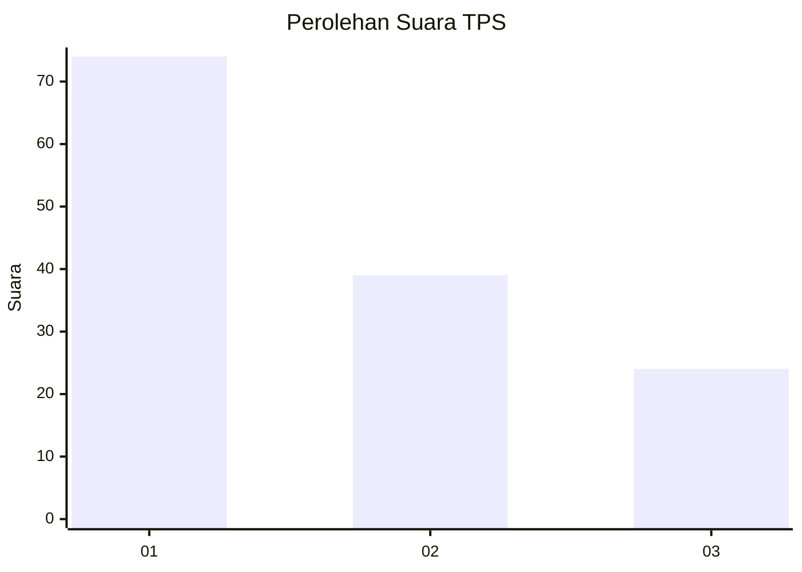
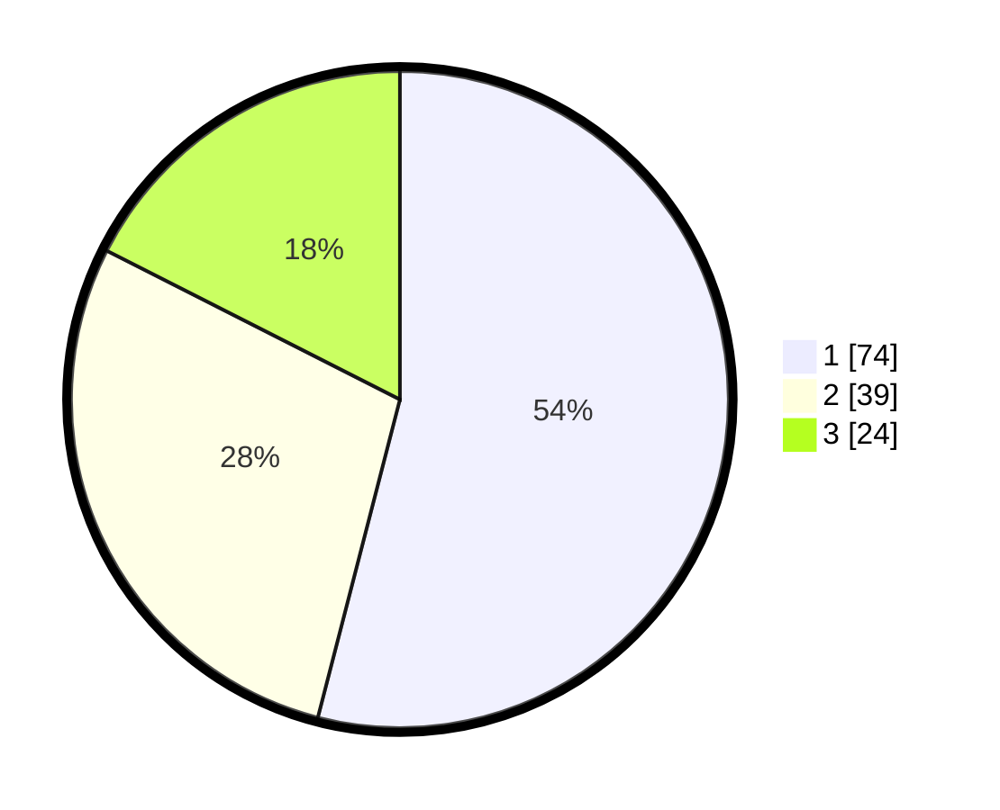

# Hasil

## Grafik

## Tabel

| No. | Nama Paslon    | Suara | Suara (raw) | Persentase |
|:--- |:-------------- | -----:| -----------:| ----------:|
| 1   | ANIES MUHAIMIN | 74    | [74][p-1]   | 54,01      |
| 2   | PRABOWO GIBRAN | 39    | [39][p-2]   | 28,47      |
| 3   | GANJAR MAHFUD  | 24    | [24][p-3]   | 17,52      |

[p-1]: https://github.com/gigit-pemilu/pemilu-2024/blob/main/pilpres/hitung-suara/sub/12-sumatera-utara/sub/09-asahan/sub/09-air-joman/sub/2008-punggulan/sub/030-tps/sub/paslon-1.txt
[p-2]: https://github.com/gigit-pemilu/pemilu-2024/blob/main/pilpres/hitung-suara/sub/12-sumatera-utara/sub/09-asahan/sub/09-air-joman/sub/2008-punggulan/sub/030-tps/sub/paslon-2.txt
[p-3]: https://github.com/gigit-pemilu/pemilu-2024/blob/main/pilpres/hitung-suara/sub/12-sumatera-utara/sub/09-asahan/sub/09-air-joman/sub/2008-punggulan/sub/030-tps/sub/paslon-3.txt

## Foto C Plano

https://sirekap-obj-formc.kpu.go.id/e6e1/pemilu/ppwp/12/09/09/20/08/1209092008030-20240214-141626--3d693edc-6a6e-4c22-887e-d41e50049275.jpg

https://sirekap-obj-formc.kpu.go.id/e6e1/pemilu/ppwp/12/09/09/20/08/1209092008030-20240214-141749--c8594dc8-c6ce-4221-97d7-60cb2f5bb4f1.jpg

https://sirekap-obj-formc.kpu.go.id/e6e1/pemilu/ppwp/12/09/09/20/08/1209092008030-20240214-141936--d9bdfd93-79d5-4660-8e2d-fdb5de2caacc.jpg

## Metadata

| Key        | Value               |
| ---------- | ------------------- |
| Time Stamp | 2024-02-25 17:00:00 |

