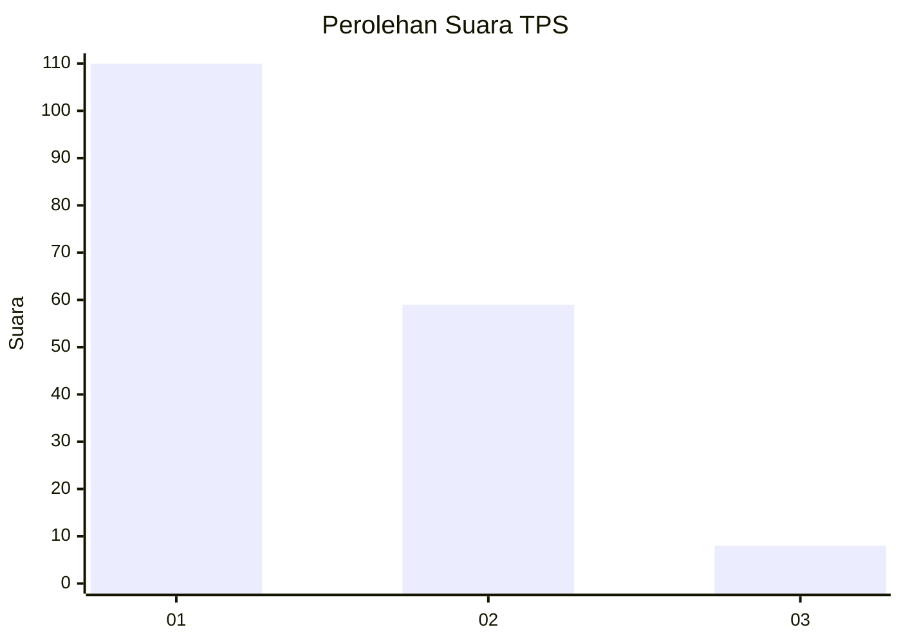
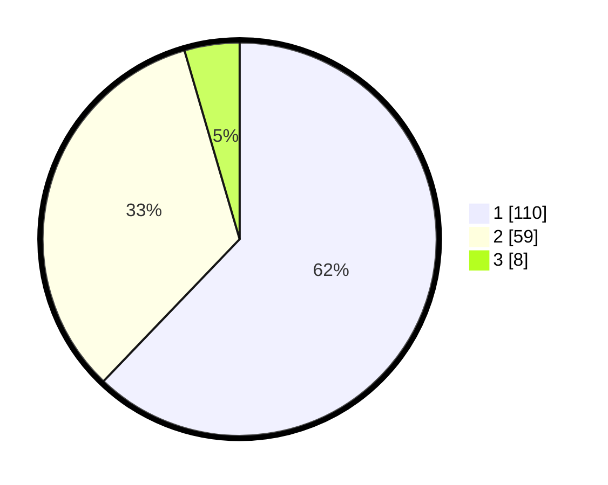

# Hasil

## Grafik

## Tabel

| No. | Nama Paslon    | Suara | Suara (raw) | Persentase |
|:--- |:-------------- | -----:| -----------:| ----------:|
| 1   | ANIES MUHAIMIN | 110   | [110][p-1]  | 62,15      |
| 2   | PRABOWO GIBRAN | 59    | [59][p-2]   | 33,33      |
| 3   | GANJAR MAHFUD  | 8     | [8][p-3]    | 4,52       |

[p-1]: https://github.com/gigit-pemilu/pemilu-2024/blob/main/pilpres/hitung-suara/sub/12-sumatera-utara/sub/09-asahan/sub/10-tanjung-balai/sub/2004-bagan-asahan-pekan/sub/003-tps/sub/paslon-1.txt
[p-2]: https://github.com/gigit-pemilu/pemilu-2024/blob/main/pilpres/hitung-suara/sub/12-sumatera-utara/sub/09-asahan/sub/10-tanjung-balai/sub/2004-bagan-asahan-pekan/sub/003-tps/sub/paslon-2.txt
[p-3]: https://github.com/gigit-pemilu/pemilu-2024/blob/main/pilpres/hitung-suara/sub/12-sumatera-utara/sub/09-asahan/sub/10-tanjung-balai/sub/2004-bagan-asahan-pekan/sub/003-tps/sub/paslon-3.txt

## Foto C Plano

https://sirekap-obj-formc.kpu.go.id/eda4/pemilu/ppwp/12/09/10/20/04/1209102004003-20240219-220102--db7636ad-3df4-4558-a0d5-e5639da05adb.jpg

https://sirekap-obj-formc.kpu.go.id/eda4/pemilu/ppwp/12/09/10/20/04/1209102004003-20240215-015506--d5cb0cba-cdee-4b50-98ba-6ac2e8cb23a5.jpg

https://sirekap-obj-formc.kpu.go.id/eda4/pemilu/ppwp/12/09/10/20/04/1209102004003-20240215-014738--834b59b7-598e-4e60-a42f-2ea32ae0e3a9.jpg

## Metadata

| Key        | Value               |
| ---------- | ------------------- |
| Time Stamp | 2024-02-24 22:31:28 |

