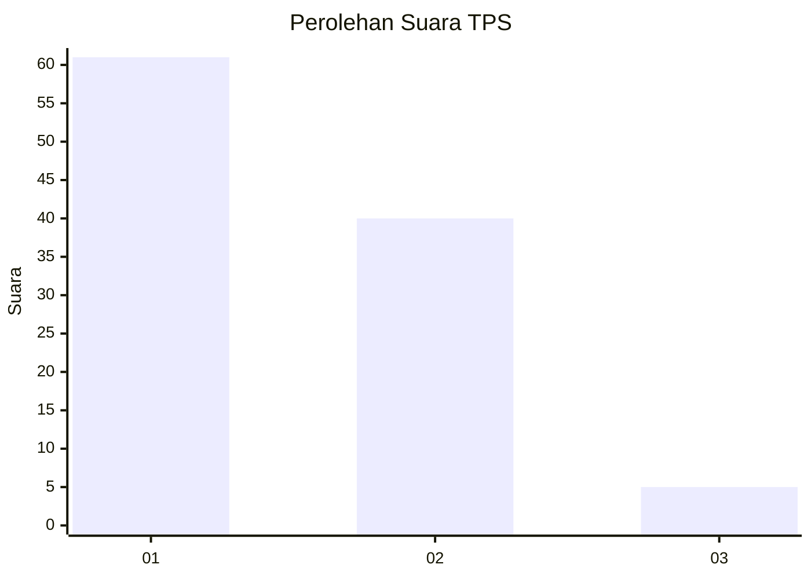
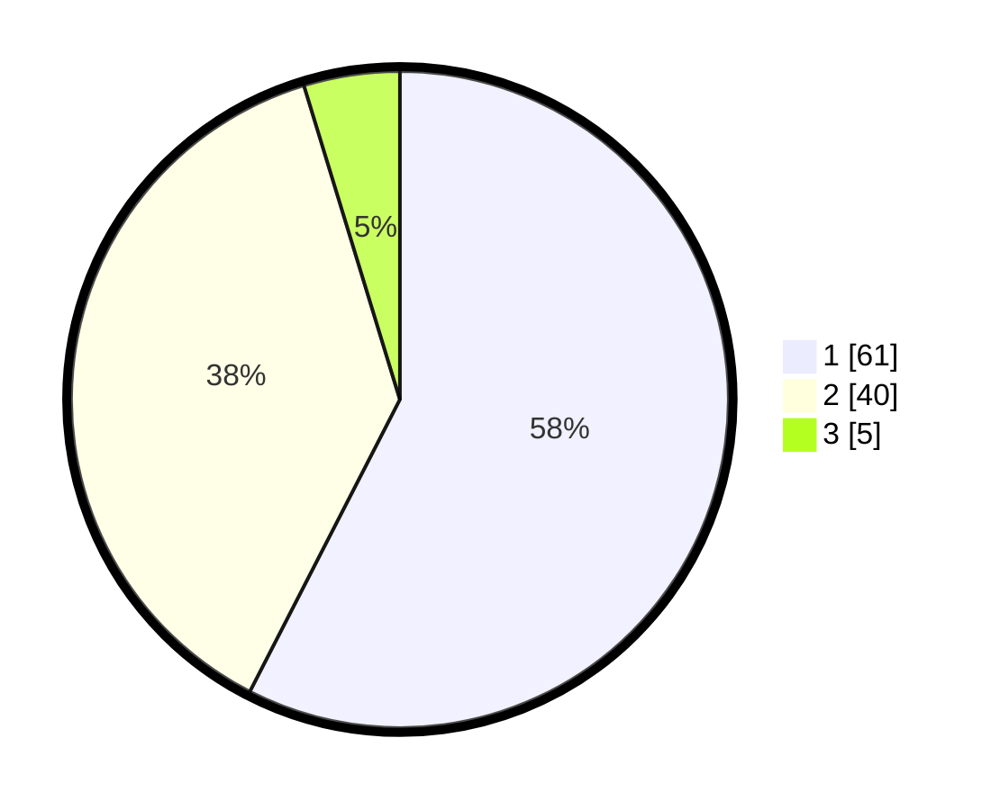

# Hasil

## Grafik

## Tabel

| No. | Nama Paslon    | Suara | Suara (raw) | Persentase |
|:--- |:-------------- | -----:| -----------:| ----------:|
| 1   | ANIES MUHAIMIN | 61    | [61][p-1]   | 57,55      |
| 2   | PRABOWO GIBRAN | 40    | [40][p-2]   | 37,74      |
| 3   | GANJAR MAHFUD  | 5     | [5][p-3]    | 4,72       |

[p-1]: https://github.com/gigit-pemilu/pemilu-2024-12-sumatera-utara/blob/main/pilpres/hitung-suara/sub/12-sumatera-utara/sub/09-asahan/sub/10-tanjung-balai/sub/2004-bagan-asahan-pekan/sub/004-tps/sub/paslon-1.txt
[p-2]: https://github.com/gigit-pemilu/pemilu-2024-12-sumatera-utara/blob/main/pilpres/hitung-suara/sub/12-sumatera-utara/sub/09-asahan/sub/10-tanjung-balai/sub/2004-bagan-asahan-pekan/sub/004-tps/sub/paslon-2.txt
[p-3]: https://github.com/gigit-pemilu/pemilu-2024-12-sumatera-utara/blob/main/pilpres/hitung-suara/sub/12-sumatera-utara/sub/09-asahan/sub/10-tanjung-balai/sub/2004-bagan-asahan-pekan/sub/004-tps/sub/paslon-3.txt

## Foto C Plano

https://sirekap-obj-formc.kpu.go.id/d246/pemilu/ppwp/12/09/10/20/04/1209102004004-20240219-220809--0f939c99-f3f5-4f9b-b96f-02b30988e2ff.jpg

https://sirekap-obj-formc.kpu.go.id/d246/pemilu/ppwp/12/09/10/20/04/1209102004004-20240219-220851--ffd64364-b118-4ae7-9b0f-17bccec2ec01.jpg

https://sirekap-obj-formc.kpu.go.id/d246/pemilu/ppwp/12/09/10/20/04/1209102004004-20240219-221001--65efce56-80fd-4871-989b-80d9f2eae9c4.jpg

## Metadata

| Key        | Value               |
| ---------- | ------------------- |
| Time Stamp | 2024-02-25 21:00:00 |

