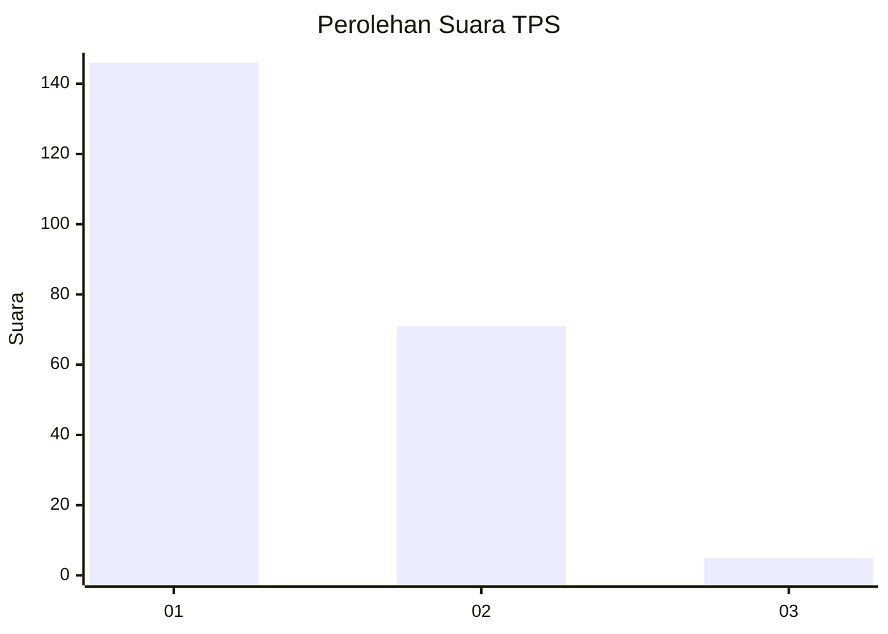
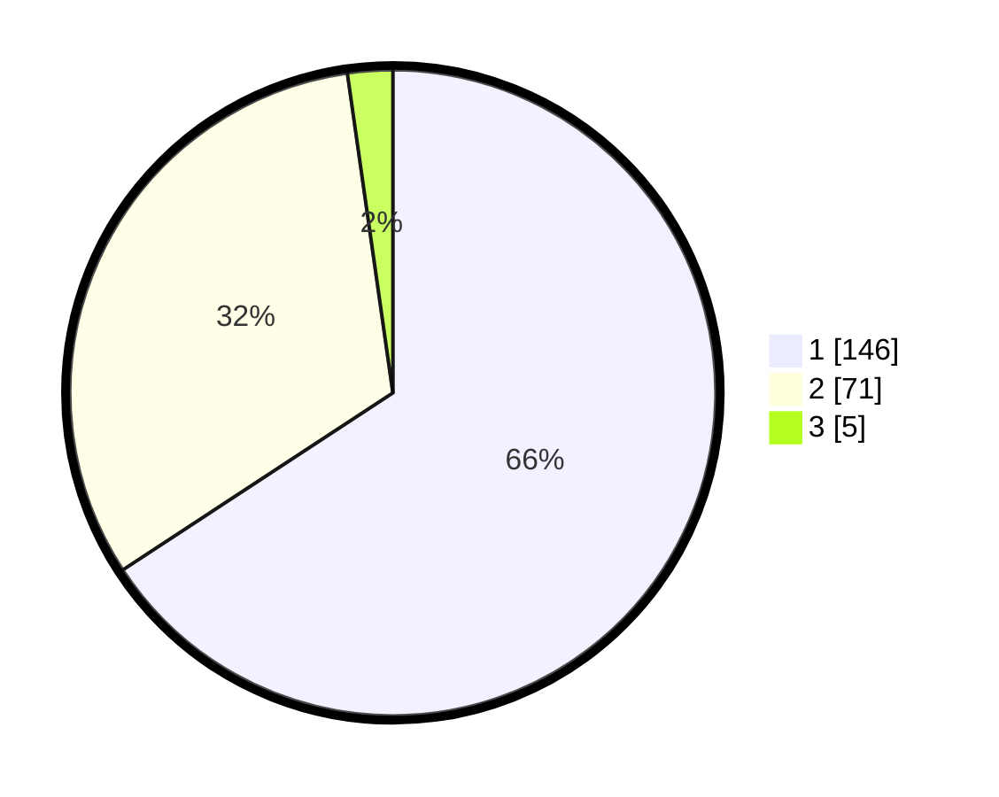

# Hasil

## Grafik

## Tabel

| No. | Nama Paslon    | Suara | Suara (raw) | Persentase |
|:--- |:-------------- | -----:| -----------:| ----------:|
| 1   | ANIES MUHAIMIN | 146   | [146][p-1]  | 65,77      |
| 2   | PRABOWO GIBRAN | 71    | [71][p-2]   | 31,98      |
| 3   | GANJAR MAHFUD  | 5     | [5][p-3]    | 2,25       |

[p-1]: https://github.com/gigit-pemilu/pemilu-2024-12-sumatera-utara/blob/main/pilpres/hitung-suara/sub/12-sumatera-utara/sub/09-asahan/sub/10-tanjung-balai/sub/2005-kapias-batu-viii/sub/005-tps/sub/paslon-1.txt
[p-2]: https://github.com/gigit-pemilu/pemilu-2024-12-sumatera-utara/blob/main/pilpres/hitung-suara/sub/12-sumatera-utara/sub/09-asahan/sub/10-tanjung-balai/sub/2005-kapias-batu-viii/sub/005-tps/sub/paslon-2.txt
[p-3]: https://github.com/gigit-pemilu/pemilu-2024-12-sumatera-utara/blob/main/pilpres/hitung-suara/sub/12-sumatera-utara/sub/09-asahan/sub/10-tanjung-balai/sub/2005-kapias-batu-viii/sub/005-tps/sub/paslon-3.txt

## Foto C Plano

https://sirekap-obj-formc.kpu.go.id/e872/pemilu/ppwp/12/09/10/20/05/1209102005005-20240220-182602--eef01920-9e12-4b32-b713-e64af2a2c2ae.jpg

https://sirekap-obj-formc.kpu.go.id/e872/pemilu/ppwp/12/09/10/20/05/1209102005005-20240220-182728--63449a40-0e97-42ec-8687-eb910bf2094f.jpg

https://sirekap-obj-formc.kpu.go.id/e872/pemilu/ppwp/12/09/10/20/05/1209102005005-20240220-183135--ae1a1a73-1b45-4346-b64b-77beda12959e.jpg

## Metadata

| Key        | Value               |
| ---------- | ------------------- |
| Time Stamp | 2024-02-20 19:00:00 |

## DATA PEMILIH TETAP

Jumlah pemilih dalam DPT: **742**.
 * L: **834**.
 * P: **110**.

## DATA PENGGUNA HAK PILIH

Jumlah pengguna hak pilih dalam DPT: **177**.
 * L: **343**.
 * P: **95**.

Jumlah pengguna hak pilih dalam DPTb: **0**.
 * L: **800**.
 * P: **80**.

Jumlah pengguna hak pilih dalam DPK: **805**.
 * L: **7**.
 * P: **7**.

Jumlah pengguna hak pilih: **187**.
 * L: **5**.
 * P: **0**.

## JUMLAH SUARA SAH DAN TIDAK SAH

JUMLAH SELURUH SUARA SAH: **152**.

JUMLAH SUARA TIDAK SAH: **1**.

JUMLAH SELURUH SUARA SAH DAN SUARA TIDAK SAH: **583**.

