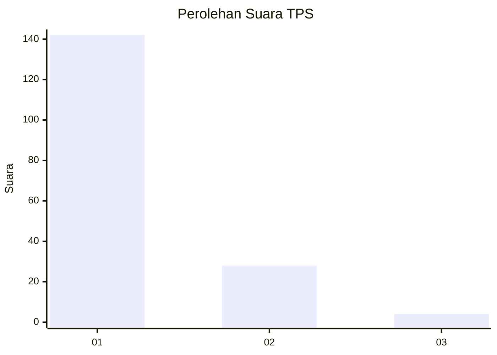
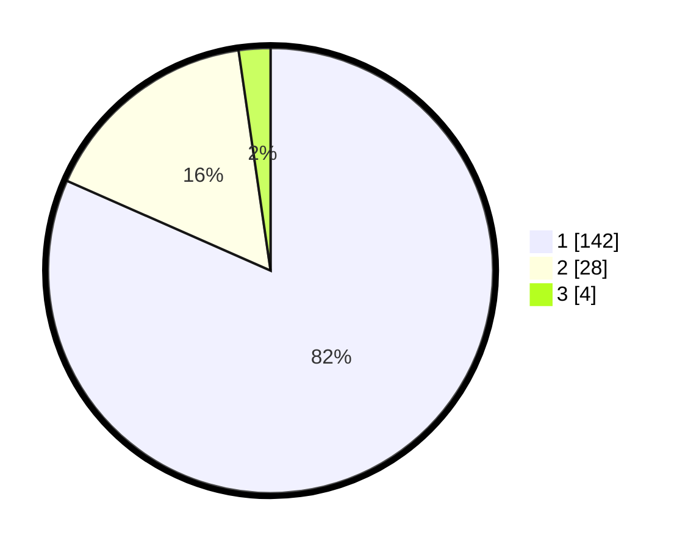

# Hasil

## Grafik

## Tabel

| No. | Nama Paslon    | Suara | Suara (raw) | Persentase |
|:--- |:-------------- | -----:| -----------:| ----------:|
| 1   | ANIES MUHAIMIN | 142   | [142][p-1]  | 81,61      |
| 2   | PRABOWO GIBRAN | 28    | [28][p-2]   | 16,09      |
| 3   | GANJAR MAHFUD  | 4     | [4][p-3]    | 2,30       |

[p-1]: https://github.com/gigit-pemilu/pemilu-2024-12-sumatera-utara/blob/main/pilpres/hitung-suara/sub/12-sumatera-utara/sub/09-asahan/sub/10-tanjung-balai/sub/2006-pematang-sei-baru/sub/010-tps/sub/paslon-1.txt
[p-2]: https://github.com/gigit-pemilu/pemilu-2024-12-sumatera-utara/blob/main/pilpres/hitung-suara/sub/12-sumatera-utara/sub/09-asahan/sub/10-tanjung-balai/sub/2006-pematang-sei-baru/sub/010-tps/sub/paslon-2.txt
[p-3]: https://github.com/gigit-pemilu/pemilu-2024-12-sumatera-utara/blob/main/pilpres/hitung-suara/sub/12-sumatera-utara/sub/09-asahan/sub/10-tanjung-balai/sub/2006-pematang-sei-baru/sub/010-tps/sub/paslon-3.txt

## Foto C Plano

https://sirekap-obj-formc.kpu.go.id/da00/pemilu/ppwp/12/09/10/20/06/1209102006010-20240214-155747--09983def-2523-4b38-9b7b-35cc52dd3948.jpg

https://sirekap-obj-formc.kpu.go.id/da00/pemilu/ppwp/12/09/10/20/06/1209102006010-20240214-160106--da0ab05f-e7a6-491d-9b30-3044aad781e0.jpg

https://sirekap-obj-formc.kpu.go.id/da00/pemilu/ppwp/12/09/10/20/06/1209102006010-20240215-112231--8819cf45-74ac-4431-8440-3411a893c05f.jpg

## Metadata

| Key        | Value               |
| ---------- | ------------------- |
| Time Stamp | 2024-02-25 17:00:00 |

