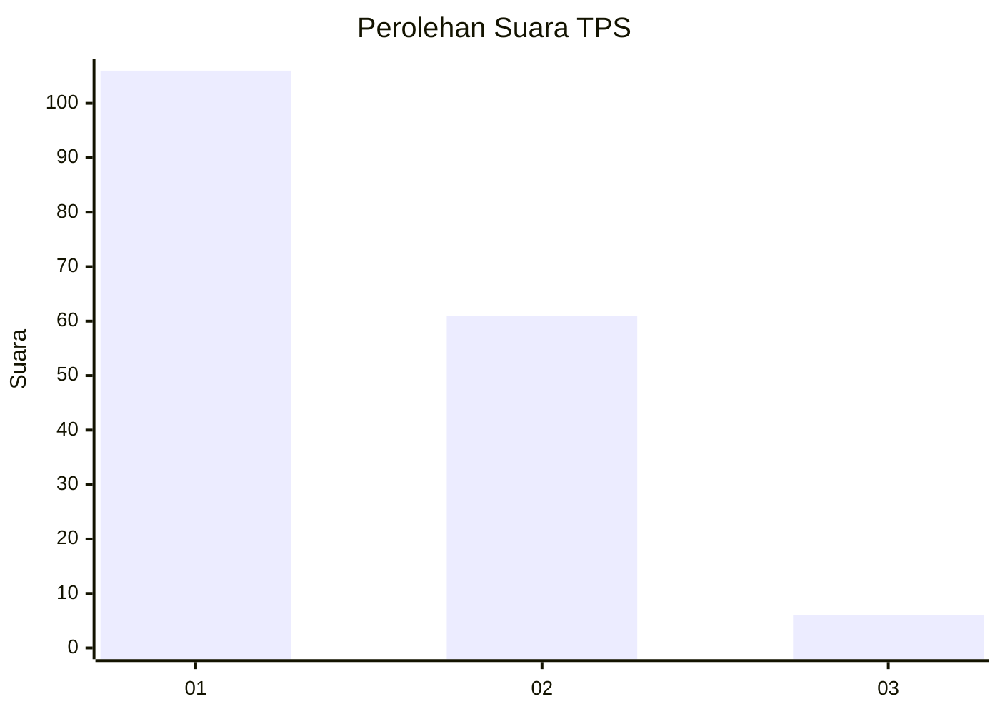
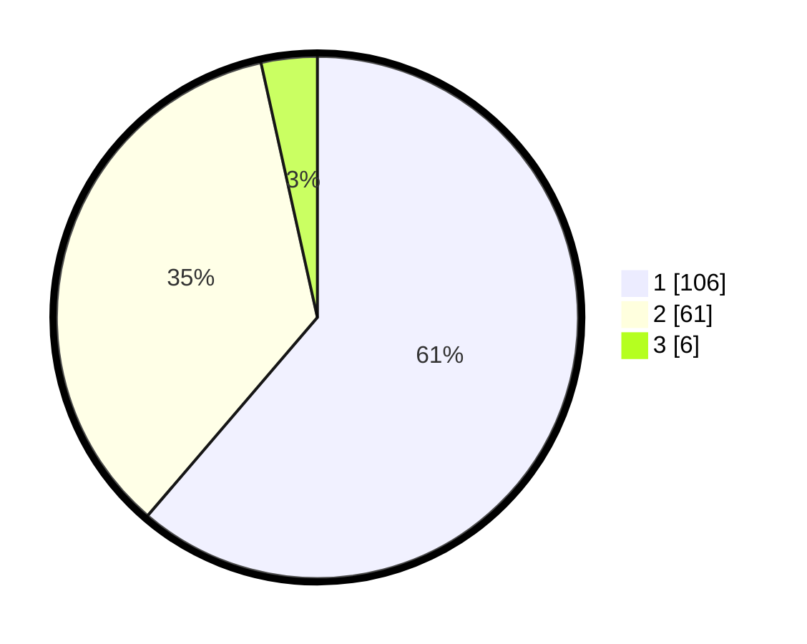

# Hasil

## Grafik

## Tabel

| No. | Nama Paslon    | Suara | Suara (raw) | Persentase |
|:--- |:-------------- | -----:| -----------:| ----------:|
| 1   | ANIES MUHAIMIN | 106   | [106][p-1]  | 61,27      |
| 2   | PRABOWO GIBRAN | 61    | [61][p-2]   | 35,26      |
| 3   | GANJAR MAHFUD  | 6     | [6][p-3]    | 3,47       |

[p-1]: https://github.com/gigit-pemilu/pemilu-2024-12-sumatera-utara/blob/main/pilpres/hitung-suara/sub/12-sumatera-utara/sub/09-asahan/sub/11-sei-kepayang/sub/2008-sei-kepayang-tengah/sub/002-tps/sub/paslon-1.txt
[p-2]: https://github.com/gigit-pemilu/pemilu-2024-12-sumatera-utara/blob/main/pilpres/hitung-suara/sub/12-sumatera-utara/sub/09-asahan/sub/11-sei-kepayang/sub/2008-sei-kepayang-tengah/sub/002-tps/sub/paslon-2.txt
[p-3]: https://github.com/gigit-pemilu/pemilu-2024-12-sumatera-utara/blob/main/pilpres/hitung-suara/sub/12-sumatera-utara/sub/09-asahan/sub/11-sei-kepayang/sub/2008-sei-kepayang-tengah/sub/002-tps/sub/paslon-3.txt

## Foto C Plano

https://sirekap-obj-formc.kpu.go.id/b59d/pemilu/ppwp/12/09/11/20/08/1209112008002-20240215-053047--8e494798-be99-4807-885b-b1d2cf88f64f.jpg

https://sirekap-obj-formc.kpu.go.id/b59d/pemilu/ppwp/12/09/11/20/08/1209112008002-20240215-053254--8fb9f6bd-f891-43c7-b565-6c537dfae5fd.jpg

https://sirekap-obj-formc.kpu.go.id/b59d/pemilu/ppwp/12/09/11/20/08/1209112008002-20240215-054129--349b1a9a-6a3f-485a-8eda-2961b14e7b10.jpg

## Metadata

| Key        | Value               |
| ---------- | ------------------- |
| Time Stamp | 2024-02-25 18:00:00 |

