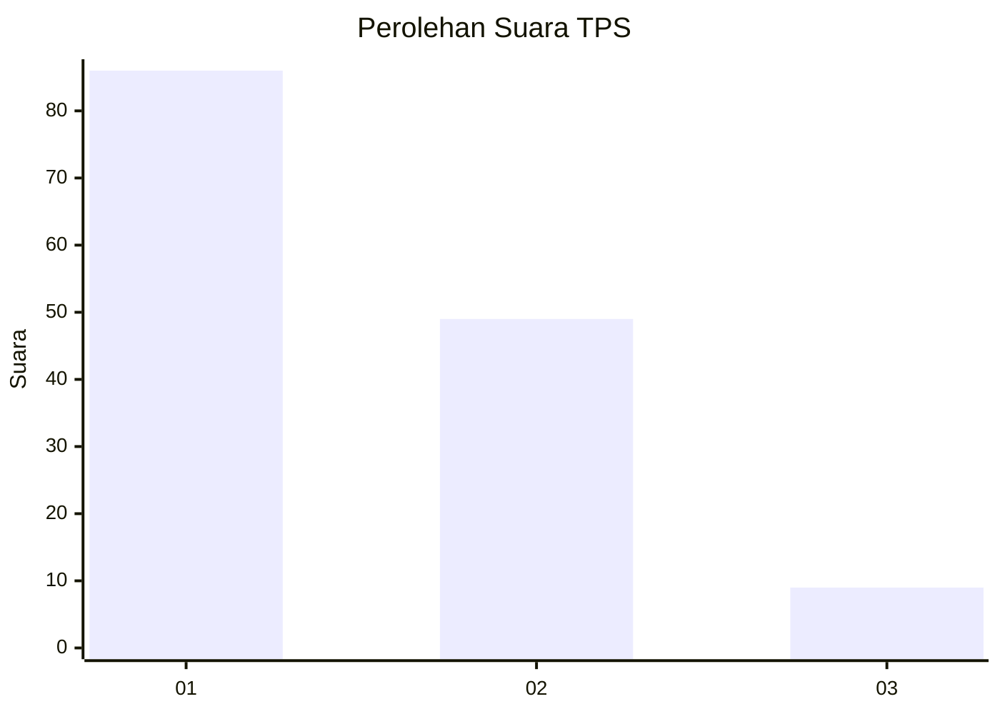
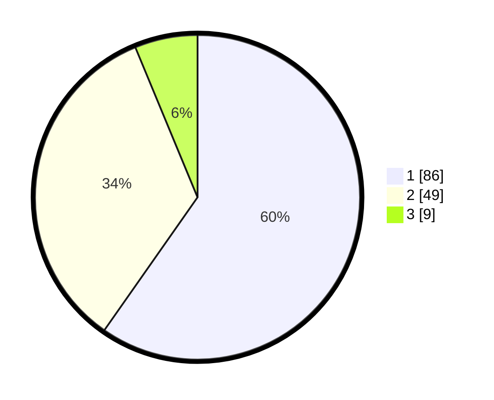

# Hasil

## Grafik

## Tabel

| No. | Nama Paslon    | Suara | Suara (raw) | Persentase |
|:--- |:-------------- | -----:| -----------:| ----------:|
| 1   | ANIES MUHAIMIN | 86    | [86][p-1]   | 59,72      |
| 2   | PRABOWO GIBRAN | 49    | [49][p-2]   | 34,03      |
| 3   | GANJAR MAHFUD  | 9     | [9][p-3]    | 6,25       |

[p-1]: https://github.com/gigit-pemilu/pemilu-2024-12-sumatera-utara/blob/main/pilpres/hitung-suara/sub/12-sumatera-utara/sub/09-asahan/sub/11-sei-kepayang/sub/2010-sei-kepayang-kanan/sub/004-tps/sub/paslon-1.txt
[p-2]: https://github.com/gigit-pemilu/pemilu-2024-12-sumatera-utara/blob/main/pilpres/hitung-suara/sub/12-sumatera-utara/sub/09-asahan/sub/11-sei-kepayang/sub/2010-sei-kepayang-kanan/sub/004-tps/sub/paslon-2.txt
[p-3]: https://github.com/gigit-pemilu/pemilu-2024-12-sumatera-utara/blob/main/pilpres/hitung-suara/sub/12-sumatera-utara/sub/09-asahan/sub/11-sei-kepayang/sub/2010-sei-kepayang-kanan/sub/004-tps/sub/paslon-3.txt

## Foto C Plano

https://sirekap-obj-formc.kpu.go.id/d0a5/pemilu/ppwp/12/09/11/20/10/1209112010004-20240214-215637--edf3128f-7f2a-46bd-a6b2-fa4a8a180422.jpg

https://sirekap-obj-formc.kpu.go.id/d0a5/pemilu/ppwp/12/09/11/20/10/1209112010004-20240215-063056--d93311c3-b33d-48b9-9867-0732628b5023.jpg

https://sirekap-obj-formc.kpu.go.id/d0a5/pemilu/ppwp/12/09/11/20/10/1209112010004-20240214-220056--551d88ac-d6c9-4248-8426-b4cb61221f2c.jpg

## Metadata

| Key        | Value               |
| ---------- | ------------------- |
| Time Stamp | 2024-02-16 13:30:32 |

