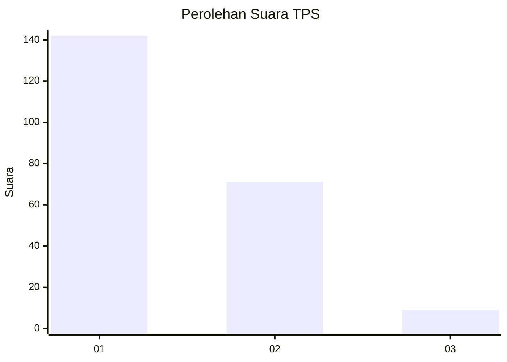
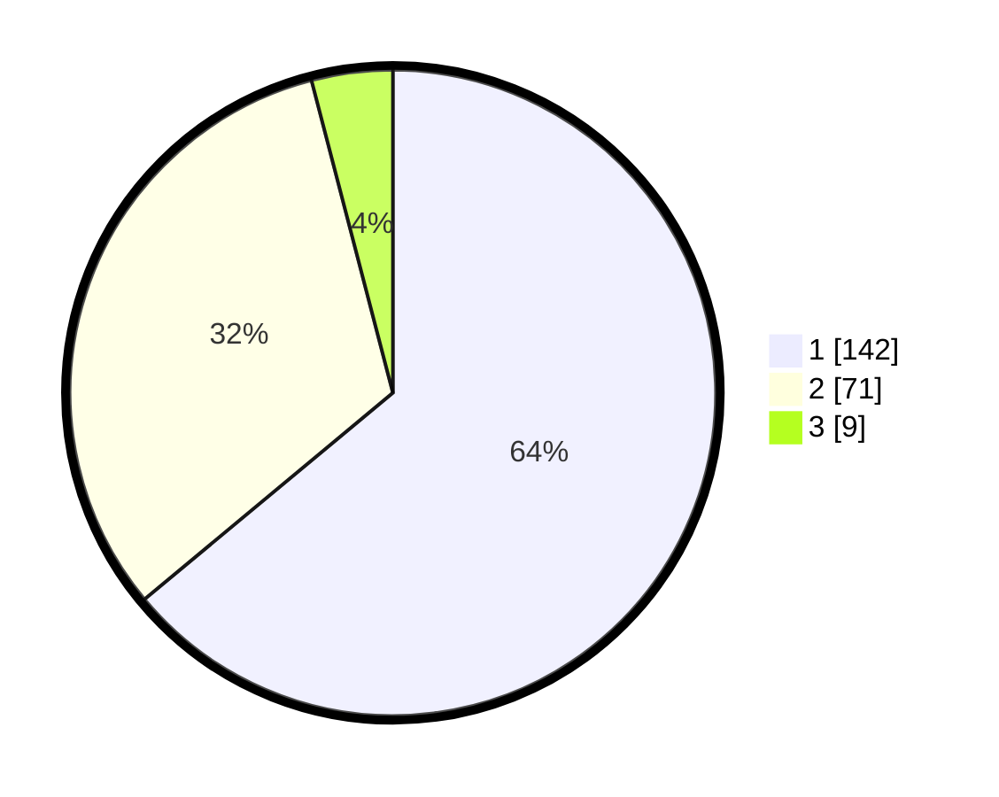

# Hasil

## Grafik

## Tabel

| No. | Nama Paslon    | Suara | Suara (raw) | Persentase |
|:--- |:-------------- | -----:| -----------:| ----------:|
| 1   | ANIES MUHAIMIN | 142   | [142][p-1]  | 63,96      |
| 2   | PRABOWO GIBRAN | 71    | [71][p-2]   | 31,98      |
| 3   | GANJAR MAHFUD  | 9     | [9][p-3]    | 4,05       |

[p-1]: https://github.com/gigit-pemilu/pemilu-2024/blob/main/pilpres/hitung-suara/sub/12-sumatera-utara/sub/09-asahan/sub/11-sei-kepayang/sub/2011-sei-paham/sub/005-tps/sub/paslon-1.txt
[p-2]: https://github.com/gigit-pemilu/pemilu-2024/blob/main/pilpres/hitung-suara/sub/12-sumatera-utara/sub/09-asahan/sub/11-sei-kepayang/sub/2011-sei-paham/sub/005-tps/sub/paslon-2.txt
[p-3]: https://github.com/gigit-pemilu/pemilu-2024/blob/main/pilpres/hitung-suara/sub/12-sumatera-utara/sub/09-asahan/sub/11-sei-kepayang/sub/2011-sei-paham/sub/005-tps/sub/paslon-3.txt

## Foto C Plano

https://sirekap-obj-formc.kpu.go.id/f0e7/pemilu/ppwp/12/09/11/20/11/1209112011005-20240214-195746--28368a4e-e4bb-4a20-80f7-33a593b45716.jpg

https://sirekap-obj-formc.kpu.go.id/f0e7/pemilu/ppwp/12/09/11/20/11/1209112011005-20240214-195829--cb515c7b-a20f-42c4-af62-d55760c72c4c.jpg

https://sirekap-obj-formc.kpu.go.id/f0e7/pemilu/ppwp/12/09/11/20/11/1209112011005-20240214-195903--7520b9ca-5822-42a3-b32b-24d364e53e97.jpg

## Metadata

| Key        | Value               |
| ---------- | ------------------- |
| Time Stamp | 2024-02-25 11:00:00 |

