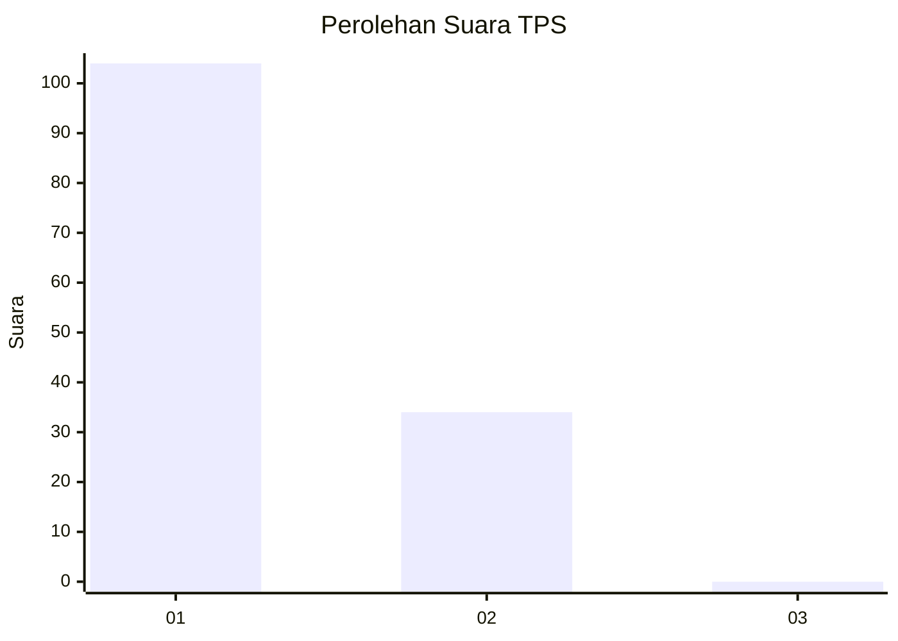
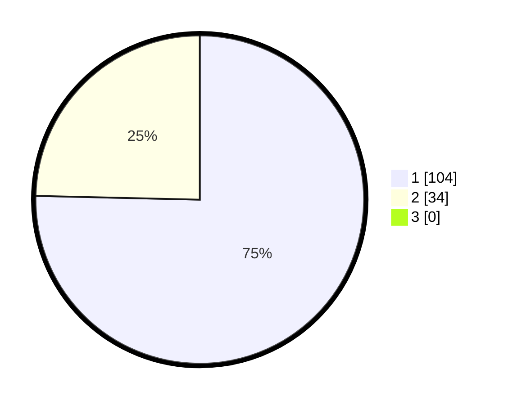

# Hasil

## Grafik

## Tabel

| No. | Nama Paslon    | Suara | Suara (raw) | Persentase |
|:--- |:-------------- | -----:| -----------:| ----------:|
| 1   | ANIES MUHAIMIN | 104   | [104][p-1]  | 75,36      |
| 2   | PRABOWO GIBRAN | 34    | [34][p-2]   | 24,64      |
| 3   | GANJAR MAHFUD  | 0     | [0][p-3]    | 0,00       |

[p-1]: https://github.com/gigit-pemilu/pemilu-2024/blob/main/pilpres/hitung-suara/sub/12-sumatera-utara/sub/09-asahan/sub/11-sei-kepayang/sub/2011-sei-paham/sub/006-tps/sub/paslon-1.txt
[p-2]: https://github.com/gigit-pemilu/pemilu-2024/blob/main/pilpres/hitung-suara/sub/12-sumatera-utara/sub/09-asahan/sub/11-sei-kepayang/sub/2011-sei-paham/sub/006-tps/sub/paslon-2.txt
[p-3]: https://github.com/gigit-pemilu/pemilu-2024/blob/main/pilpres/hitung-suara/sub/12-sumatera-utara/sub/09-asahan/sub/11-sei-kepayang/sub/2011-sei-paham/sub/006-tps/sub/paslon-3.txt

## Foto C Plano

https://sirekap-obj-formc.kpu.go.id/99b4/pemilu/ppwp/12/09/11/20/11/1209112011006-20240215-060700--ee33857c-f202-486d-9d1d-255410b932d9.jpg

https://sirekap-obj-formc.kpu.go.id/99b4/pemilu/ppwp/12/09/11/20/11/1209112011006-20240215-085301--a857b9bd-c1b8-4c43-90ac-3030cc885a73.jpg

https://sirekap-obj-formc.kpu.go.id/99b4/pemilu/ppwp/12/09/11/20/11/1209112011006-20240215-085510--6647414b-73e6-4e5e-9de4-a184563793b8.jpg

## Metadata

| Key        | Value               |
| ---------- | ------------------- |
| Time Stamp | 2024-02-24 22:31:28 |

