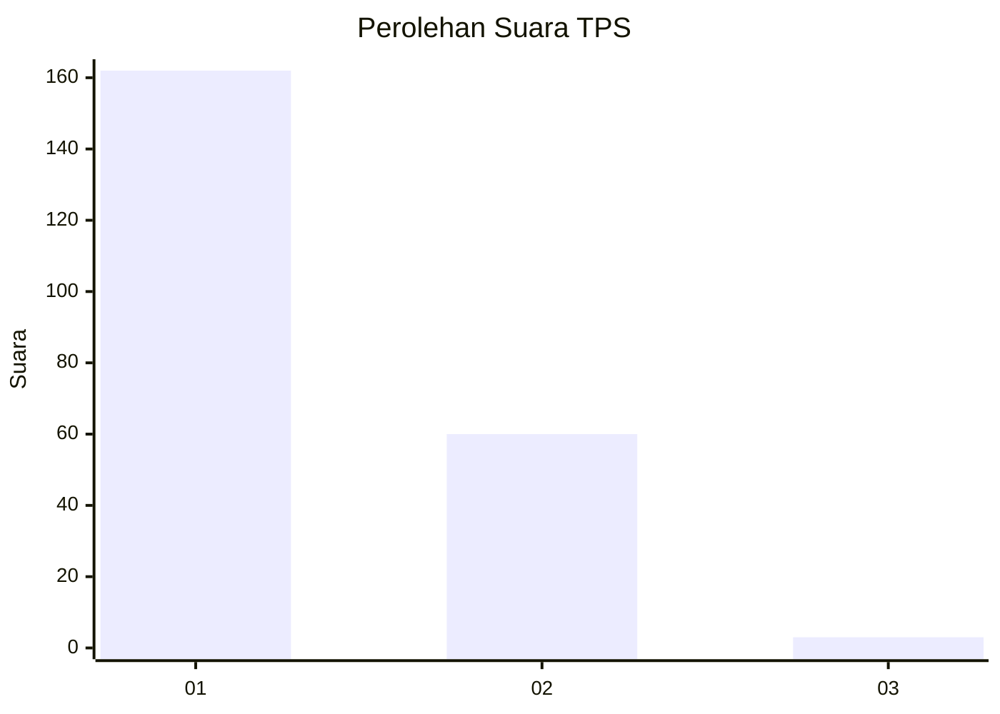
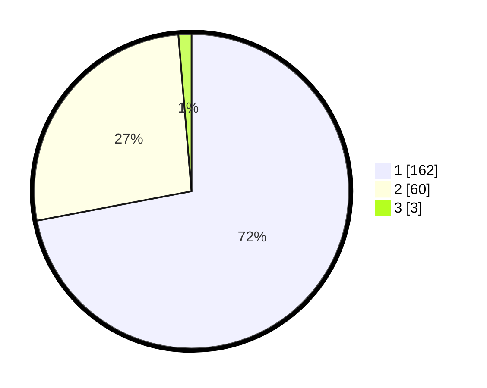

# Hasil

## Grafik

## Tabel

| No. | Nama Paslon    | Suara | Suara (raw) | Persentase |
|:--- |:-------------- | -----:| -----------:| ----------:|
| 1   | ANIES MUHAIMIN | 162   | [162][p-1]  | 72,00      |
| 2   | PRABOWO GIBRAN | 60    | [60][p-2]   | 26,67      |
| 3   | GANJAR MAHFUD  | 3     | [3][p-3]    | 1,33       |

[p-1]: https://github.com/gigit-pemilu/pemilu-2024-12-sumatera-utara/blob/main/pilpres/hitung-suara/sub/12-sumatera-utara/sub/09-asahan/sub/11-sei-kepayang/sub/2011-sei-paham/sub/009-tps/sub/paslon-1.txt
[p-2]: https://github.com/gigit-pemilu/pemilu-2024-12-sumatera-utara/blob/main/pilpres/hitung-suara/sub/12-sumatera-utara/sub/09-asahan/sub/11-sei-kepayang/sub/2011-sei-paham/sub/009-tps/sub/paslon-2.txt
[p-3]: https://github.com/gigit-pemilu/pemilu-2024-12-sumatera-utara/blob/main/pilpres/hitung-suara/sub/12-sumatera-utara/sub/09-asahan/sub/11-sei-kepayang/sub/2011-sei-paham/sub/009-tps/sub/paslon-3.txt

## Foto C Plano

https://sirekap-obj-formc.kpu.go.id/e807/pemilu/ppwp/12/09/11/20/11/1209112011009-20240214-233858--b7dbe7a1-c215-4831-8153-b81a033af6ec.jpg

https://sirekap-obj-formc.kpu.go.id/e807/pemilu/ppwp/12/09/11/20/11/1209112011009-20240215-021243--6781a83b-0761-4897-afd3-435754a22339.jpg

https://sirekap-obj-formc.kpu.go.id/e807/pemilu/ppwp/12/09/11/20/11/1209112011009-20240215-021310--4395a995-18b9-491c-8e60-0870543523da.jpg

## Metadata

| Key        | Value               |
| ---------- | ------------------- |
| Time Stamp | 2024-02-16 14:00:34 |

