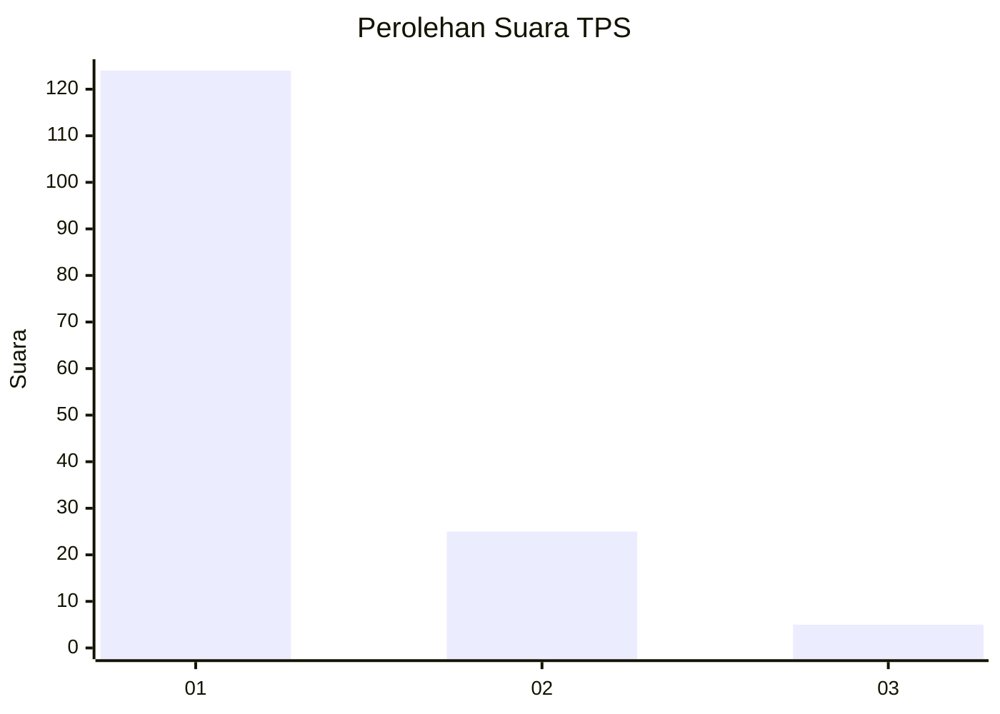
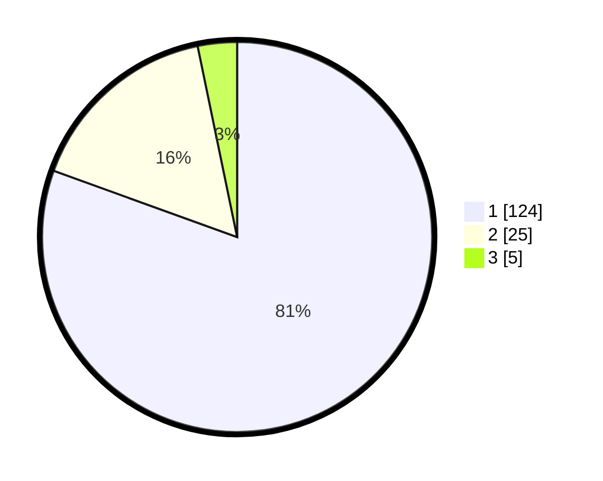

# Hasil

## Grafik

## Tabel

| No. | Nama Paslon    | Suara | Suara (raw) | Persentase |
|:--- |:-------------- | -----:| -----------:| ----------:|
| 1   | ANIES MUHAIMIN | 124   | [124][p-1]  | 80,52      |
| 2   | PRABOWO GIBRAN | 25    | [25][p-2]   | 16,23      |
| 3   | GANJAR MAHFUD  | 5     | [5][p-3]    | 3,25       |

[p-1]: https://github.com/gigit-pemilu/pemilu-2024-12-sumatera-utara/blob/main/pilpres/hitung-suara/sub/12-sumatera-utara/sub/09-asahan/sub/11-sei-kepayang/sub/2011-sei-paham/sub/013-tps/sub/paslon-1.txt
[p-2]: https://github.com/gigit-pemilu/pemilu-2024-12-sumatera-utara/blob/main/pilpres/hitung-suara/sub/12-sumatera-utara/sub/09-asahan/sub/11-sei-kepayang/sub/2011-sei-paham/sub/013-tps/sub/paslon-2.txt
[p-3]: https://github.com/gigit-pemilu/pemilu-2024-12-sumatera-utara/blob/main/pilpres/hitung-suara/sub/12-sumatera-utara/sub/09-asahan/sub/11-sei-kepayang/sub/2011-sei-paham/sub/013-tps/sub/paslon-3.txt

## Foto C Plano

https://sirekap-obj-formc.kpu.go.id/99e8/pemilu/ppwp/12/09/11/20/11/1209112011013-20240215-143229--23f8ab40-0893-4505-8388-bc4bd0d5466e.jpg

https://sirekap-obj-formc.kpu.go.id/99e8/pemilu/ppwp/12/09/11/20/11/1209112011013-20240214-191805--6bd78178-49de-41f0-a7ef-af8eb53035ed.jpg

https://sirekap-obj-formc.kpu.go.id/99e8/pemilu/ppwp/12/09/11/20/11/1209112011013-20240214-191835--21c6d987-f259-4c26-83cb-df0304c4d995.jpg

## Metadata

| Key        | Value               |
| ---------- | ------------------- |
| Time Stamp | 2024-02-21 16:00:00 |

