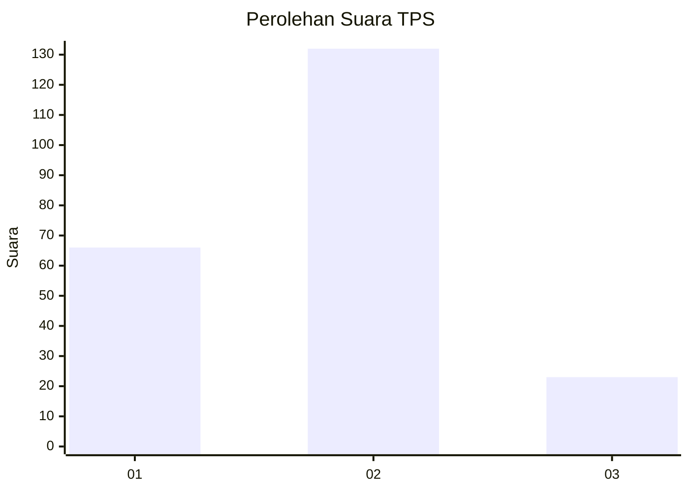
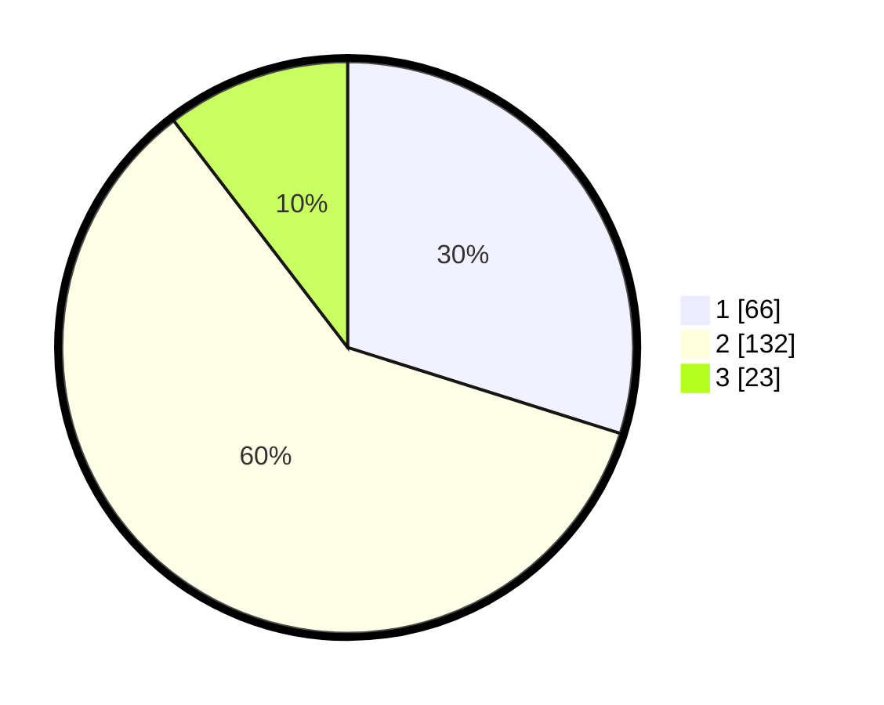

# Hasil

## Grafik

## Tabel

| No. | Nama Paslon    | Suara | Suara (raw) | Persentase |
|:--- |:-------------- | -----:| -----------:| ----------:|
| 1   | ANIES MUHAIMIN | 66    | [66][p-1]   | 29,86      |
| 2   | PRABOWO GIBRAN | 132   | [132][p-2]  | 59,73      |
| 3   | GANJAR MAHFUD  | 23    | [23][p-3]   | 10,41      |

[p-1]: https://github.com/gigit-pemilu/pemilu-2024-12-sumatera-utara/blob/main/pilpres/hitung-suara/sub/12-sumatera-utara/sub/09-asahan/sub/12-simpang-empat/sub/2002-perkebunan-suka-raja/sub/002-tps/sub/paslon-1.txt
[p-2]: https://github.com/gigit-pemilu/pemilu-2024-12-sumatera-utara/blob/main/pilpres/hitung-suara/sub/12-sumatera-utara/sub/09-asahan/sub/12-simpang-empat/sub/2002-perkebunan-suka-raja/sub/002-tps/sub/paslon-2.txt
[p-3]: https://github.com/gigit-pemilu/pemilu-2024-12-sumatera-utara/blob/main/pilpres/hitung-suara/sub/12-sumatera-utara/sub/09-asahan/sub/12-simpang-empat/sub/2002-perkebunan-suka-raja/sub/002-tps/sub/paslon-3.txt

## Foto C Plano

https://sirekap-obj-formc.kpu.go.id/8f0a/pemilu/ppwp/12/09/12/20/02/1209122002002-20240216-172134--13c17c3d-1897-4467-9df9-1396c3788eb4.jpg

https://sirekap-obj-formc.kpu.go.id/8f0a/pemilu/ppwp/12/09/12/20/02/1209122002002-20240215-082553--2cc767ca-9bcc-4d7e-aff9-c1ce0c95f6e2.jpg

https://sirekap-obj-formc.kpu.go.id/8f0a/pemilu/ppwp/12/09/12/20/02/1209122002002-20240216-133325--8b04f2c1-6dbb-4bf6-9dcc-04a6dfa593e5.jpg

## Metadata

| Key        | Value               |
| ---------- | ------------------- |
| Time Stamp | 2024-02-24 22:31:28 |

