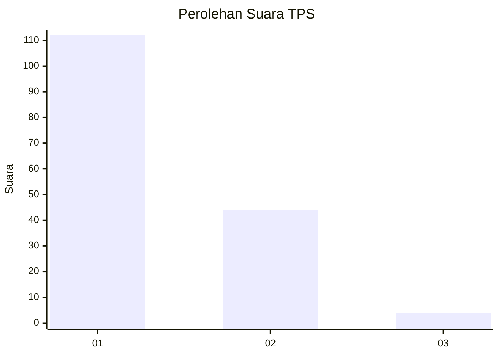
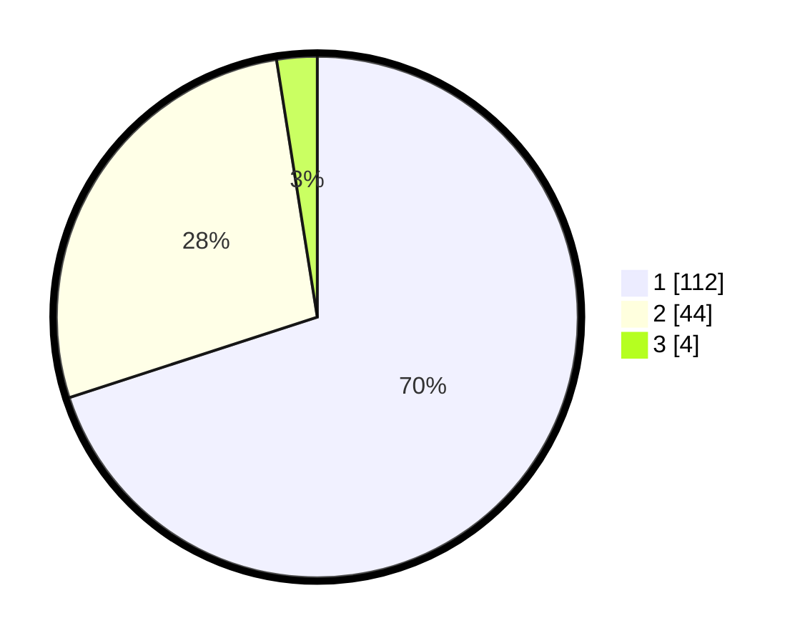

# Hasil

## Grafik

## Tabel

| No. | Nama Paslon    | Suara | Suara (raw) | Persentase |
|:--- |:-------------- | -----:| -----------:| ----------:|
| 1   | ANIES MUHAIMIN | 112   | [112][p-1]  | 70,00      |
| 2   | PRABOWO GIBRAN | 44    | [44][p-2]   | 27,50      |
| 3   | GANJAR MAHFUD  | 4     | [4][p-3]    | 2,50       |

[p-1]: https://github.com/gigit-pemilu/pemilu-2024/blob/main/pilpres/hitung-suara/sub/12-sumatera-utara/sub/09-asahan/sub/12-simpang-empat/sub/2006-sei-dua-hulu/sub/005-tps/sub/paslon-1.txt
[p-2]: https://github.com/gigit-pemilu/pemilu-2024/blob/main/pilpres/hitung-suara/sub/12-sumatera-utara/sub/09-asahan/sub/12-simpang-empat/sub/2006-sei-dua-hulu/sub/005-tps/sub/paslon-2.txt
[p-3]: https://github.com/gigit-pemilu/pemilu-2024/blob/main/pilpres/hitung-suara/sub/12-sumatera-utara/sub/09-asahan/sub/12-simpang-empat/sub/2006-sei-dua-hulu/sub/005-tps/sub/paslon-3.txt

## Foto C Plano

https://sirekap-obj-formc.kpu.go.id/56e2/pemilu/ppwp/12/09/12/20/06/1209122006005-20240216-180842--390e876f-1de8-4031-8863-f86c9f73262c.jpg

https://sirekap-obj-formc.kpu.go.id/56e2/pemilu/ppwp/12/09/12/20/06/1209122006005-20240216-181027--56d2558a-df61-40ba-b6f3-b9c8450b8411.jpg

https://sirekap-obj-formc.kpu.go.id/56e2/pemilu/ppwp/12/09/12/20/06/1209122006005-20240216-181153--00b46b17-ae9d-45d9-b4c2-74f0440f6766.jpg

## Metadata

| Key        | Value               |
| ---------- | ------------------- |
| Time Stamp | 2024-02-26 10:00:00 |

