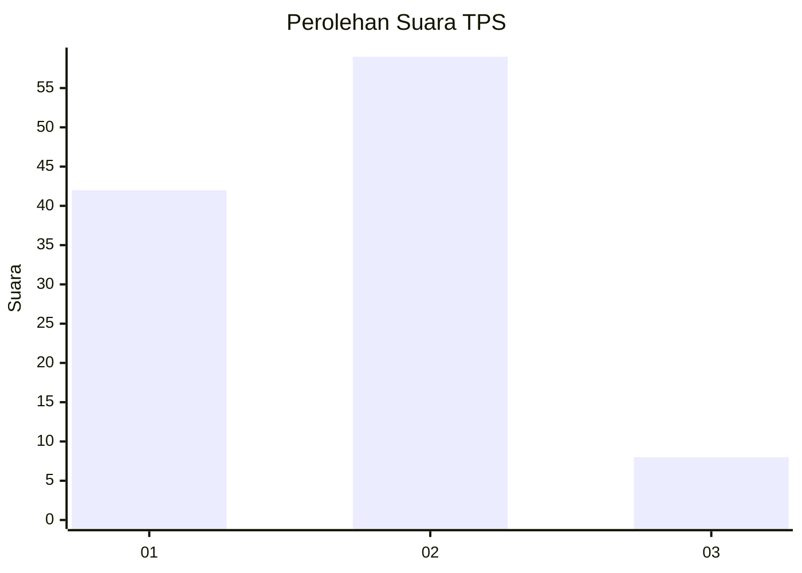
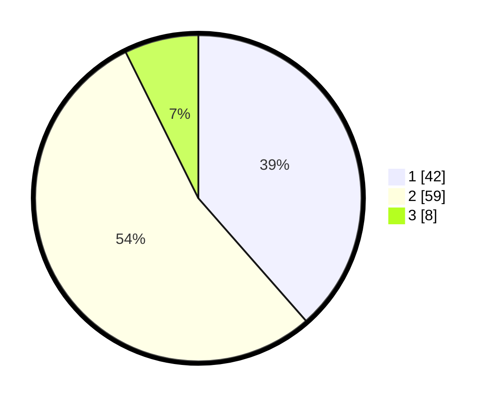

# Hasil

## Grafik

## Tabel

| No. | Nama Paslon    | Suara | Suara (raw) | Persentase |
|:--- |:-------------- | -----:| -----------:| ----------:|
| 1   | ANIES MUHAIMIN | 42    | [42][p-1]   | 38,53      |
| 2   | PRABOWO GIBRAN | 59    | [59][p-2]   | 54,13      |
| 3   | GANJAR MAHFUD  | 8     | [8][p-3]    | 7,34       |

[p-1]: https://github.com/gigit-pemilu/pemilu-2024-12-sumatera-utara/blob/main/pilpres/hitung-suara/sub/12-sumatera-utara/sub/09-asahan/sub/12-simpang-empat/sub/2006-sei-dua-hulu/sub/012-tps/sub/paslon-1.txt
[p-2]: https://github.com/gigit-pemilu/pemilu-2024-12-sumatera-utara/blob/main/pilpres/hitung-suara/sub/12-sumatera-utara/sub/09-asahan/sub/12-simpang-empat/sub/2006-sei-dua-hulu/sub/012-tps/sub/paslon-2.txt
[p-3]: https://github.com/gigit-pemilu/pemilu-2024-12-sumatera-utara/blob/main/pilpres/hitung-suara/sub/12-sumatera-utara/sub/09-asahan/sub/12-simpang-empat/sub/2006-sei-dua-hulu/sub/012-tps/sub/paslon-3.txt

## Foto C Plano

https://sirekap-obj-formc.kpu.go.id/e735/pemilu/ppwp/12/09/12/20/06/1209122006012-20240214-155913--ffe778c8-dd71-4d47-80e8-240971a9e3d8.jpg

https://sirekap-obj-formc.kpu.go.id/e735/pemilu/ppwp/12/09/12/20/06/1209122006012-20240214-160059--90af09c0-89b3-4283-aa5a-42443456a78b.jpg

https://sirekap-obj-formc.kpu.go.id/e735/pemilu/ppwp/12/09/12/20/06/1209122006012-20240214-155831--57322d82-e7aa-4a92-b3ba-9a03819cc642.jpg

## Metadata

| Key        | Value               |
| ---------- | ------------------- |
| Time Stamp | 2024-02-24 22:31:28 |

