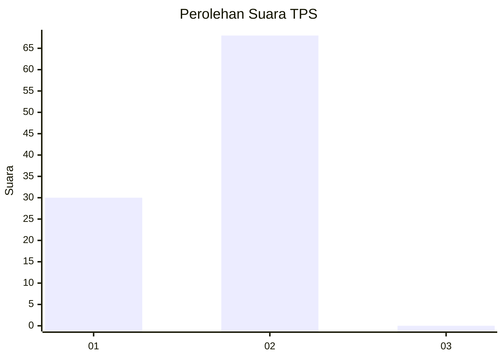
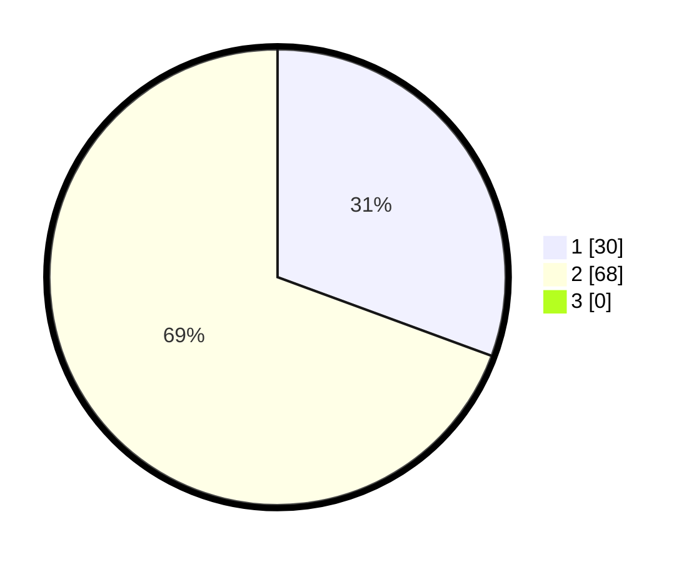

# Hasil

## Grafik

## Tabel

| No. | Nama Paslon    | Suara | Suara (raw) | Persentase |
|:--- |:-------------- | -----:| -----------:| ----------:|
| 1   | ANIES MUHAIMIN | 30    | [30][p-1]   | 30,61      |
| 2   | PRABOWO GIBRAN | 68    | [68][p-2]   | 69,39      |
| 3   | GANJAR MAHFUD  | 0     | [0][p-3]    | 0,00       |

[p-1]: https://github.com/gigit-pemilu/pemilu-2024-12-sumatera-utara/blob/main/pilpres/hitung-suara/sub/12-sumatera-utara/sub/09-asahan/sub/12-simpang-empat/sub/2009-simpang-empat/sub/017-tps/sub/paslon-1.txt
[p-2]: https://github.com/gigit-pemilu/pemilu-2024-12-sumatera-utara/blob/main/pilpres/hitung-suara/sub/12-sumatera-utara/sub/09-asahan/sub/12-simpang-empat/sub/2009-simpang-empat/sub/017-tps/sub/paslon-2.txt
[p-3]: https://github.com/gigit-pemilu/pemilu-2024-12-sumatera-utara/blob/main/pilpres/hitung-suara/sub/12-sumatera-utara/sub/09-asahan/sub/12-simpang-empat/sub/2009-simpang-empat/sub/017-tps/sub/paslon-3.txt

## Foto C Plano

https://sirekap-obj-formc.kpu.go.id/8aa7/pemilu/ppwp/12/09/12/20/09/1209122009017-20240215-081658--2509266a-7bc2-4cda-9226-eafe9fe787c4.jpg

https://sirekap-obj-formc.kpu.go.id/8aa7/pemilu/ppwp/12/09/12/20/09/1209122009017-20240215-081724--9d2c02ea-db9c-4405-b59b-e656bab9d951.jpg

https://sirekap-obj-formc.kpu.go.id/8aa7/pemilu/ppwp/12/09/12/20/09/1209122009017-20240215-081741--c8f31840-bf2f-4127-90a2-91b6ec76e4e7.jpg

## Metadata

| Key        | Value               |
| ---------- | ------------------- |
| Time Stamp | 2024-02-26 17:00:04 |

