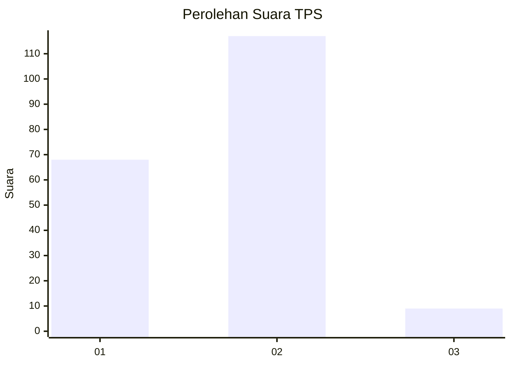
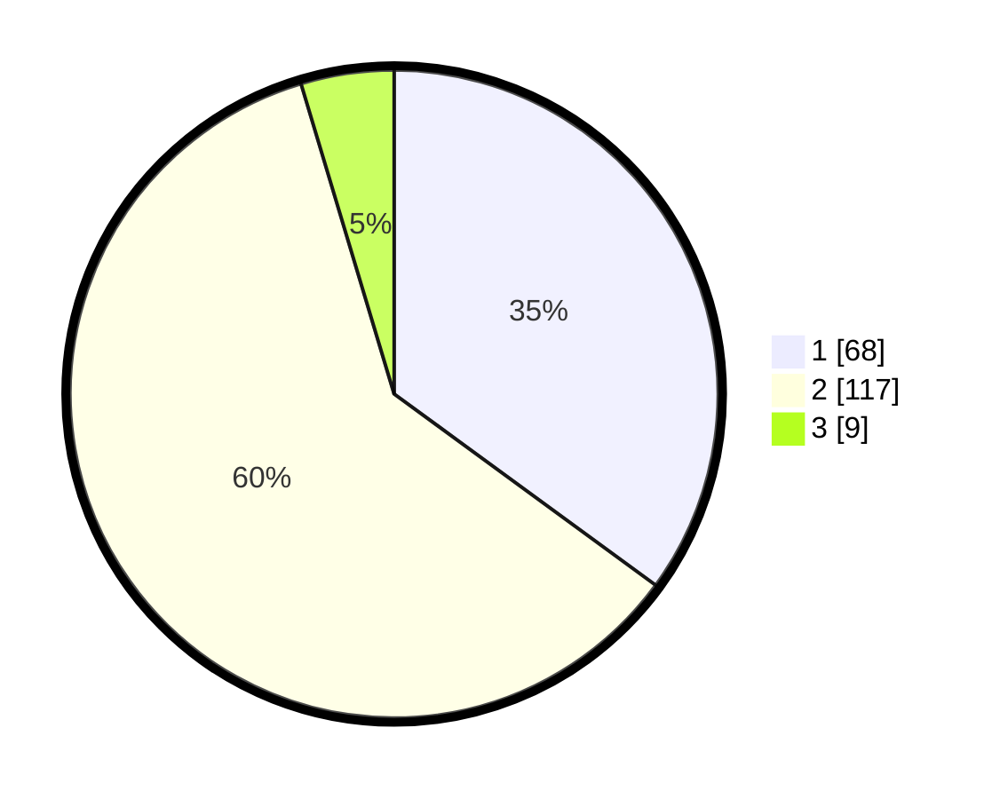

# Hasil

## Grafik

## Tabel

| No. | Nama Paslon    | Suara | Suara (raw) | Persentase |
|:--- |:-------------- | -----:| -----------:| ----------:|
| 1   | ANIES MUHAIMIN | 68    | [68][p-1]   | 35,05      |
| 2   | PRABOWO GIBRAN | 117   | [117][p-2]  | 60,31      |
| 3   | GANJAR MAHFUD  | 9     | [9][p-3]    | 4,64       |

[p-1]: https://github.com/gigit-pemilu/pemilu-2024-12-sumatera-utara/blob/main/pilpres/hitung-suara/sub/12-sumatera-utara/sub/09-asahan/sub/13-air-batu/sub/2001-sei-alim-ulu/sub/003-tps/sub/paslon-1.txt
[p-2]: https://github.com/gigit-pemilu/pemilu-2024-12-sumatera-utara/blob/main/pilpres/hitung-suara/sub/12-sumatera-utara/sub/09-asahan/sub/13-air-batu/sub/2001-sei-alim-ulu/sub/003-tps/sub/paslon-2.txt
[p-3]: https://github.com/gigit-pemilu/pemilu-2024-12-sumatera-utara/blob/main/pilpres/hitung-suara/sub/12-sumatera-utara/sub/09-asahan/sub/13-air-batu/sub/2001-sei-alim-ulu/sub/003-tps/sub/paslon-3.txt

## Foto C Plano

https://sirekap-obj-formc.kpu.go.id/2136/pemilu/ppwp/12/09/13/20/01/1209132001003-20240214-211133--23264e9c-2c24-4fb3-ac2c-eb0baabb0cb0.jpg

https://sirekap-obj-formc.kpu.go.id/2136/pemilu/ppwp/12/09/13/20/01/1209132001003-20240214-211110--f8c318cd-357f-4fcb-8ffa-919329160c65.jpg

https://sirekap-obj-formc.kpu.go.id/2136/pemilu/ppwp/12/09/13/20/01/1209132001003-20240214-211152--45ba4227-d963-4e00-baae-deffbb847ad5.jpg

## Metadata

| Key        | Value               |
| ---------- | ------------------- |
| Time Stamp | 2024-02-24 22:31:28 |

