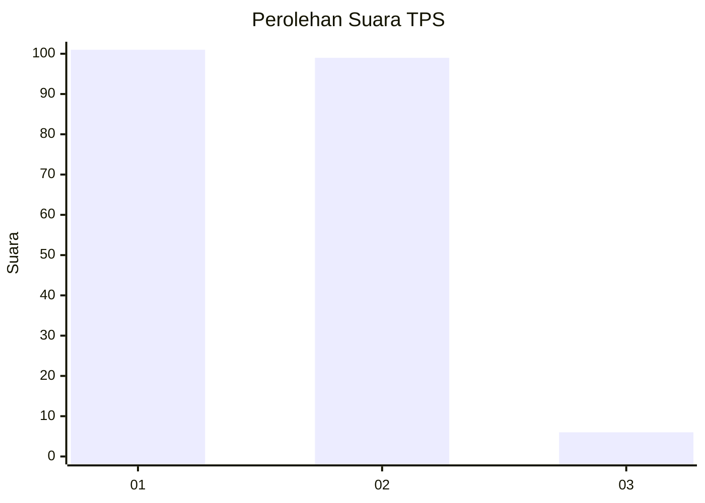
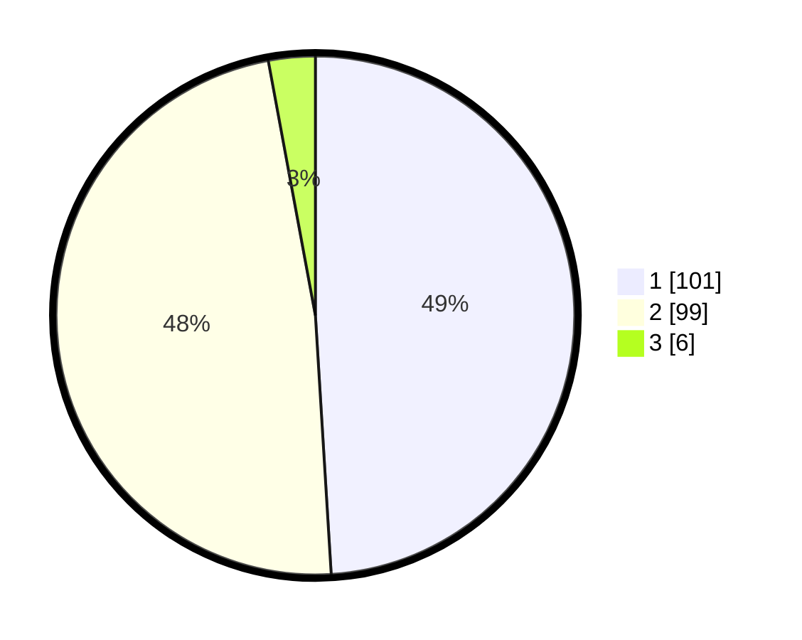

# Hasil

## Grafik

## Tabel

| No. | Nama Paslon    | Suara | Suara (raw) | Persentase |
|:--- |:-------------- | -----:| -----------:| ----------:|
| 1   | ANIES MUHAIMIN | 101   | [101][p-1]  | 49,03      |
| 2   | PRABOWO GIBRAN | 99    | [99][p-2]   | 48,06      |
| 3   | GANJAR MAHFUD  | 6     | [6][p-3]    | 2,91       |

[p-1]: https://github.com/gigit-pemilu/pemilu-2024/blob/main/pilpres/hitung-suara/sub/12-sumatera-utara/sub/09-asahan/sub/13-air-batu/sub/2001-sei-alim-ulu/sub/008-tps/sub/paslon-1.txt
[p-2]: https://github.com/gigit-pemilu/pemilu-2024/blob/main/pilpres/hitung-suara/sub/12-sumatera-utara/sub/09-asahan/sub/13-air-batu/sub/2001-sei-alim-ulu/sub/008-tps/sub/paslon-2.txt
[p-3]: https://github.com/gigit-pemilu/pemilu-2024/blob/main/pilpres/hitung-suara/sub/12-sumatera-utara/sub/09-asahan/sub/13-air-batu/sub/2001-sei-alim-ulu/sub/008-tps/sub/paslon-3.txt

## Foto C Plano

https://sirekap-obj-formc.kpu.go.id/fa55/pemilu/ppwp/12/09/13/20/01/1209132001008-20240214-204613--f1d67551-959c-4bc6-99ef-0772e520cecf.jpg

https://sirekap-obj-formc.kpu.go.id/fa55/pemilu/ppwp/12/09/13/20/01/1209132001008-20240214-204934--062136e5-96cb-4f9c-9332-aa03d0c0f516.jpg

https://sirekap-obj-formc.kpu.go.id/fa55/pemilu/ppwp/12/09/13/20/01/1209132001008-20240214-205013--4563a15a-68a4-4388-a3d6-660789aca45f.jpg

## Metadata

| Key        | Value               |
| ---------- | ------------------- |
| Time Stamp | 2024-02-24 22:31:28 |

