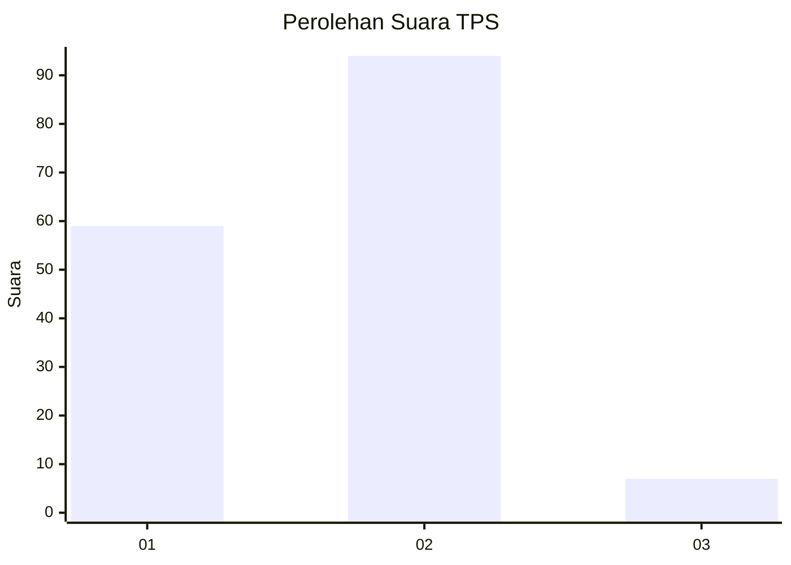
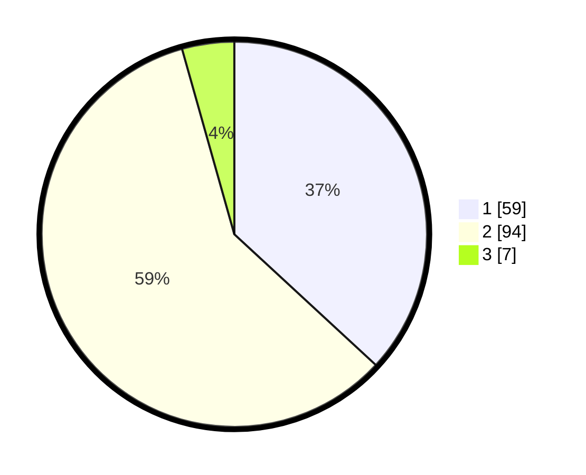

# Hasil

## Grafik

## Tabel

| No. | Nama Paslon    | Suara | Suara (raw) | Persentase |
|:--- |:-------------- | -----:| -----------:| ----------:|
| 1   | ANIES MUHAIMIN | 59    | [59][p-1]   | 36,88      |
| 2   | PRABOWO GIBRAN | 94    | [94][p-2]   | 58,75      |
| 3   | GANJAR MAHFUD  | 7     | [7][p-3]    | 4,38       |

[p-1]: https://github.com/gigit-pemilu/pemilu-2024-12-sumatera-utara/blob/main/pilpres/hitung-suara/sub/12-sumatera-utara/sub/09-asahan/sub/13-air-batu/sub/2001-sei-alim-ulu/sub/013-tps/sub/paslon-1.txt
[p-2]: https://github.com/gigit-pemilu/pemilu-2024-12-sumatera-utara/blob/main/pilpres/hitung-suara/sub/12-sumatera-utara/sub/09-asahan/sub/13-air-batu/sub/2001-sei-alim-ulu/sub/013-tps/sub/paslon-2.txt
[p-3]: https://github.com/gigit-pemilu/pemilu-2024-12-sumatera-utara/blob/main/pilpres/hitung-suara/sub/12-sumatera-utara/sub/09-asahan/sub/13-air-batu/sub/2001-sei-alim-ulu/sub/013-tps/sub/paslon-3.txt

## Foto C Plano

https://sirekap-obj-formc.kpu.go.id/b71e/pemilu/ppwp/12/09/13/20/01/1209132001013-20240214-210359--15254b32-9246-4998-8b90-26edfabd7e48.jpg

https://sirekap-obj-formc.kpu.go.id/b71e/pemilu/ppwp/12/09/13/20/01/1209132001013-20240214-210500--93434e3d-1288-4cd4-b15e-6477ce362e18.jpg

https://sirekap-obj-formc.kpu.go.id/b71e/pemilu/ppwp/12/09/13/20/01/1209132001013-20240214-210554--a48dba38-d4bf-47ca-a975-e6fdbc32d8ac.jpg

## Metadata

| Key        | Value               |
| ---------- | ------------------- |
| Time Stamp | 2024-02-25 09:00:00 |

