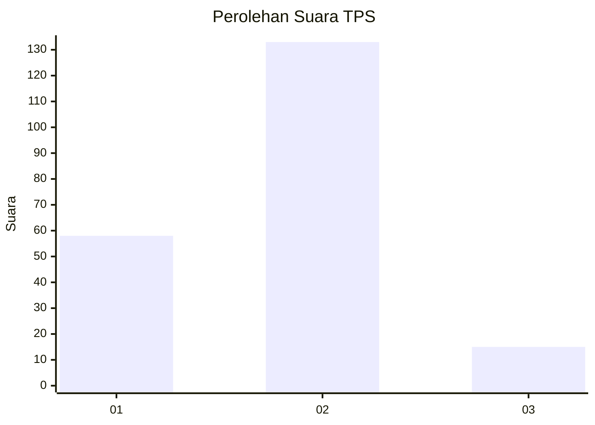
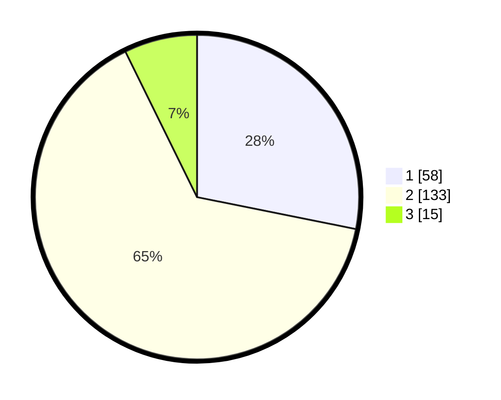

# Hasil

## Grafik

## Tabel

| No. | Nama Paslon    | Suara | Suara (raw) | Persentase |
|:--- |:-------------- | -----:| -----------:| ----------:|
| 1   | ANIES MUHAIMIN | 58    | [58][p-1]   | 28,16      |
| 2   | PRABOWO GIBRAN | 133   | [133][p-2]  | 64,56      |
| 3   | GANJAR MAHFUD  | 15    | [15][p-3]   | 7,28       |

[p-1]: https://github.com/gigit-pemilu/pemilu-2024-12-sumatera-utara/blob/main/pilpres/hitung-suara/sub/12-sumatera-utara/sub/09-asahan/sub/13-air-batu/sub/2006-perkebunan-pulahan/sub/003-tps/sub/paslon-1.txt
[p-2]: https://github.com/gigit-pemilu/pemilu-2024-12-sumatera-utara/blob/main/pilpres/hitung-suara/sub/12-sumatera-utara/sub/09-asahan/sub/13-air-batu/sub/2006-perkebunan-pulahan/sub/003-tps/sub/paslon-2.txt
[p-3]: https://github.com/gigit-pemilu/pemilu-2024-12-sumatera-utara/blob/main/pilpres/hitung-suara/sub/12-sumatera-utara/sub/09-asahan/sub/13-air-batu/sub/2006-perkebunan-pulahan/sub/003-tps/sub/paslon-3.txt

## Foto C Plano

https://sirekap-obj-formc.kpu.go.id/3f42/pemilu/ppwp/12/09/13/20/06/1209132006003-20240214-192310--f47d5dbd-409d-4cbe-bf3d-64dcf9d0be5e.jpg

https://sirekap-obj-formc.kpu.go.id/3f42/pemilu/ppwp/12/09/13/20/06/1209132006003-20240214-191941--9d43a628-802a-47fa-b8e2-5317dd0974a3.jpg

https://sirekap-obj-formc.kpu.go.id/3f42/pemilu/ppwp/12/09/13/20/06/1209132006003-20240214-192552--ff4f9c61-47e2-42a6-9cd4-f103b835ee56.jpg

## Metadata

| Key        | Value               |
| ---------- | ------------------- |
| Time Stamp | 2024-02-25 00:00:00 |

