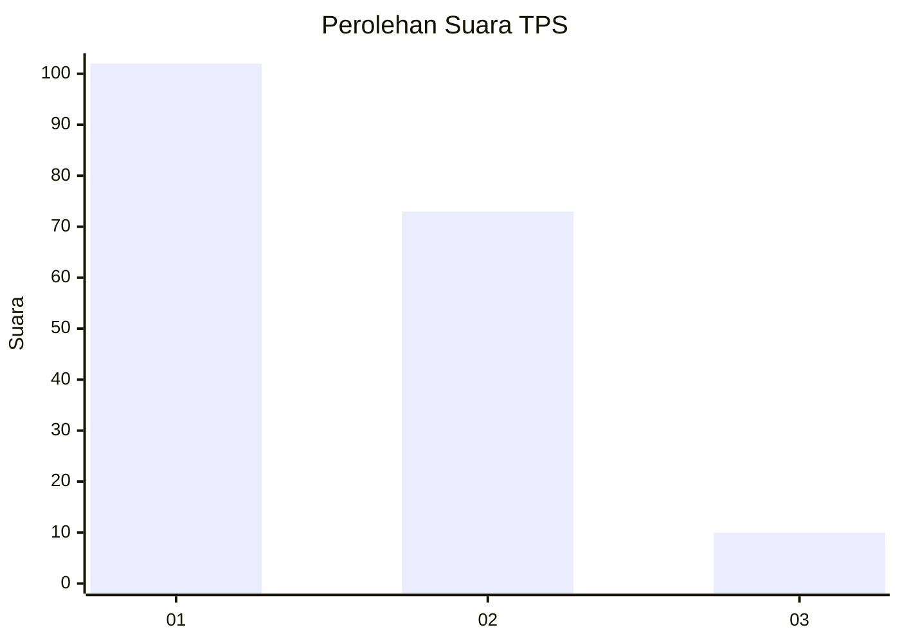
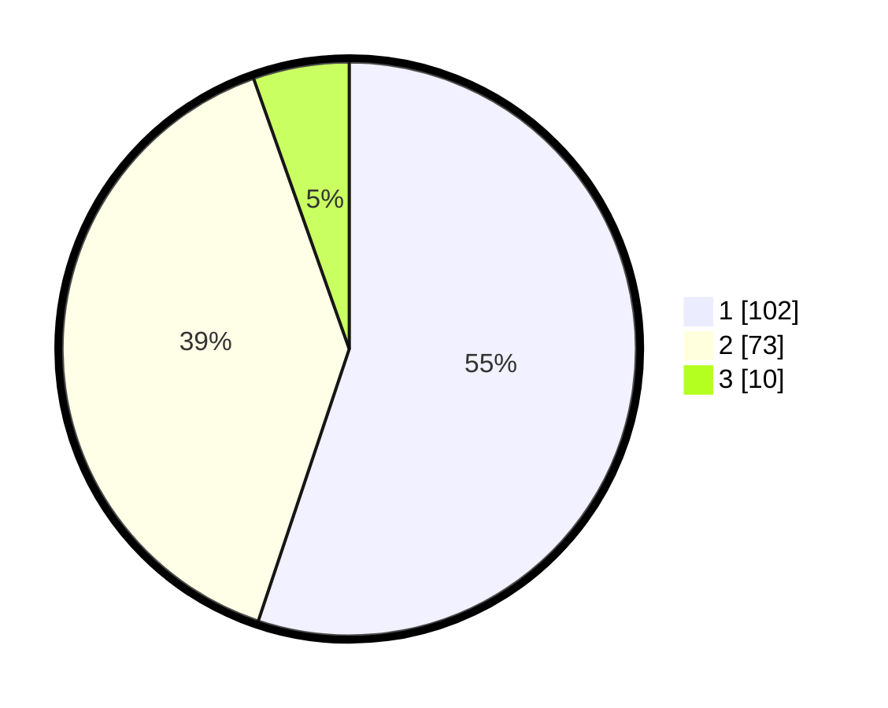

# Hasil

## Grafik

## Tabel

| No. | Nama Paslon    | Suara | Suara (raw) | Persentase |
|:--- |:-------------- | -----:| -----------:| ----------:|
| 1   | ANIES MUHAIMIN | 102   | [102][p-1]  | 55,14      |
| 2   | PRABOWO GIBRAN | 73    | [73][p-2]   | 39,46      |
| 3   | GANJAR MAHFUD  | 10    | [10][p-3]   | 5,41       |

[p-1]: https://github.com/gigit-pemilu/pemilu-2024-12-sumatera-utara/blob/main/pilpres/hitung-suara/sub/12-sumatera-utara/sub/09-asahan/sub/15-bandar-pulau/sub/2003-bandar-pulau-pekan/sub/002-tps/sub/paslon-1.txt
[p-2]: https://github.com/gigit-pemilu/pemilu-2024-12-sumatera-utara/blob/main/pilpres/hitung-suara/sub/12-sumatera-utara/sub/09-asahan/sub/15-bandar-pulau/sub/2003-bandar-pulau-pekan/sub/002-tps/sub/paslon-2.txt
[p-3]: https://github.com/gigit-pemilu/pemilu-2024-12-sumatera-utara/blob/main/pilpres/hitung-suara/sub/12-sumatera-utara/sub/09-asahan/sub/15-bandar-pulau/sub/2003-bandar-pulau-pekan/sub/002-tps/sub/paslon-3.txt

## Foto C Plano

https://sirekap-obj-formc.kpu.go.id/1ceb/pemilu/ppwp/12/09/15/20/03/1209152003002-20240215-081250--bd2d62ae-4a99-416d-9832-d4392ce3459b.jpg

https://sirekap-obj-formc.kpu.go.id/1ceb/pemilu/ppwp/12/09/15/20/03/1209152003002-20240215-081451--4c8ea1a2-a13e-4111-8161-905a59e4a729.jpg

https://sirekap-obj-formc.kpu.go.id/1ceb/pemilu/ppwp/12/09/15/20/03/1209152003002-20240215-081532--0cb57a23-e2e2-4246-ae54-e772fcef1431.jpg

## Metadata

| Key        | Value               |
| ---------- | ------------------- |
| Time Stamp | 2024-02-15 21:30:27 |

