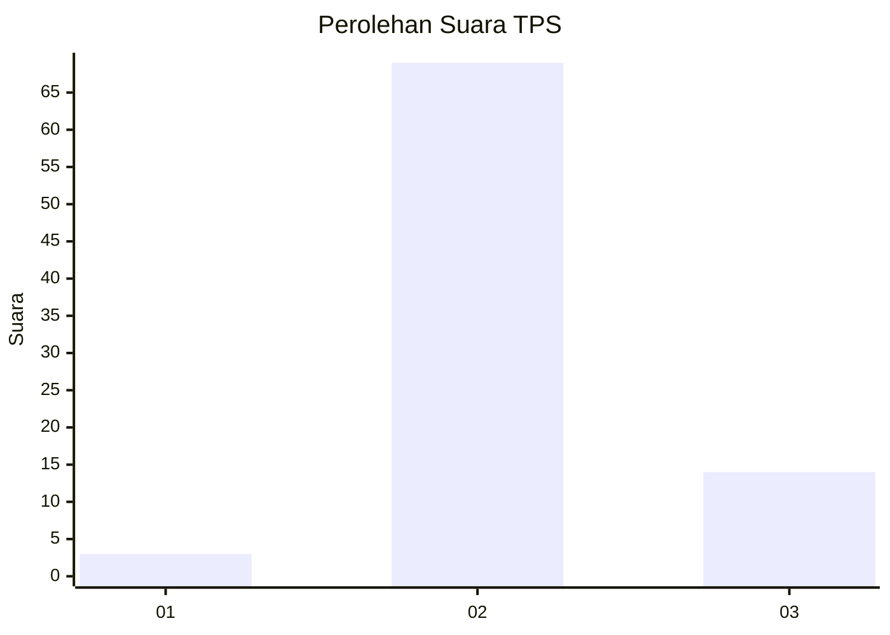
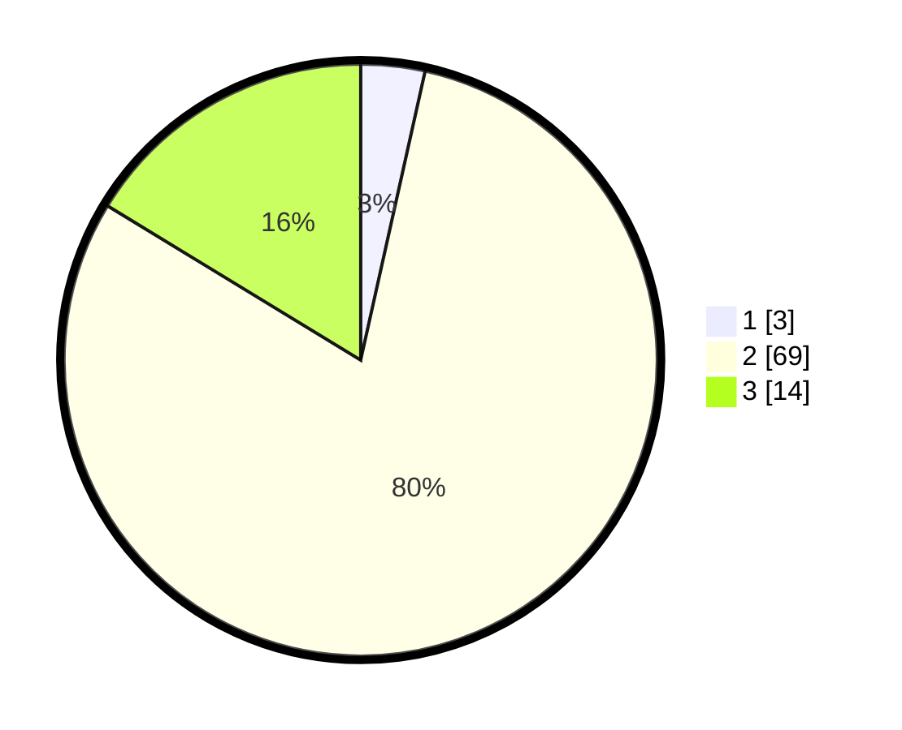

# Hasil

## Grafik

## Tabel

| No. | Nama Paslon    | Suara | Suara (raw) | Persentase |
|:--- |:-------------- | -----:| -----------:| ----------:|
| 1   | ANIES MUHAIMIN | 3     | [3][p-1]    | 3,49       |
| 2   | PRABOWO GIBRAN | 69    | [69][p-2]   | 80,23      |
| 3   | GANJAR MAHFUD  | 14    | [14][p-3]   | 16,28      |

[p-1]: https://github.com/gigit-pemilu/pemilu-2024/blob/main/pilpres/hitung-suara/sub/12-sumatera-utara/sub/09-asahan/sub/16-buntu-pane/sub/2003-lestari/sub/006-tps/sub/paslon-1.txt
[p-2]: https://github.com/gigit-pemilu/pemilu-2024/blob/main/pilpres/hitung-suara/sub/12-sumatera-utara/sub/09-asahan/sub/16-buntu-pane/sub/2003-lestari/sub/006-tps/sub/paslon-2.txt
[p-3]: https://github.com/gigit-pemilu/pemilu-2024/blob/main/pilpres/hitung-suara/sub/12-sumatera-utara/sub/09-asahan/sub/16-buntu-pane/sub/2003-lestari/sub/006-tps/sub/paslon-3.txt

## Foto C Plano

https://sirekap-obj-formc.kpu.go.id/00f9/pemilu/ppwp/12/09/16/20/03/1209162003006-20240214-155041--412f5185-65ed-42cb-a4e4-0ed09d6aa127.jpg

https://sirekap-obj-formc.kpu.go.id/00f9/pemilu/ppwp/12/09/16/20/03/1209162003006-20240214-155107--4878ee5e-8be0-46eb-a266-6b8a18933e8b.jpg

https://sirekap-obj-formc.kpu.go.id/00f9/pemilu/ppwp/12/09/16/20/03/1209162003006-20240214-155113--820fddd0-0580-4232-b72d-bcf93c049958.jpg

## Metadata

| Key        | Value               |
| ---------- | ------------------- |
| Time Stamp | 2024-02-25 13:00:00 |

