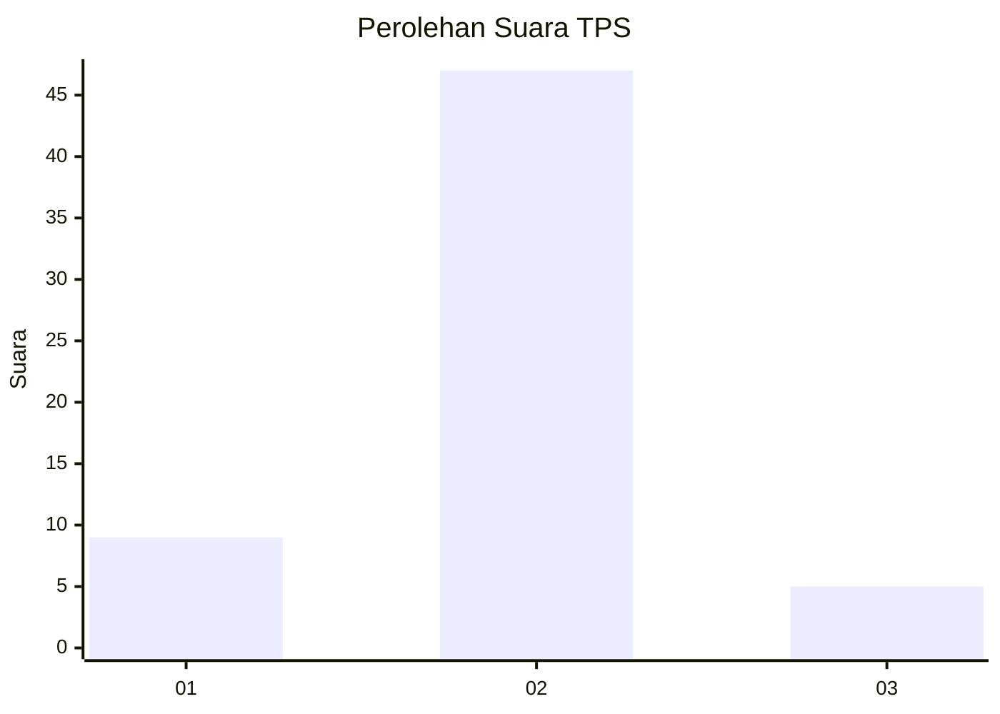
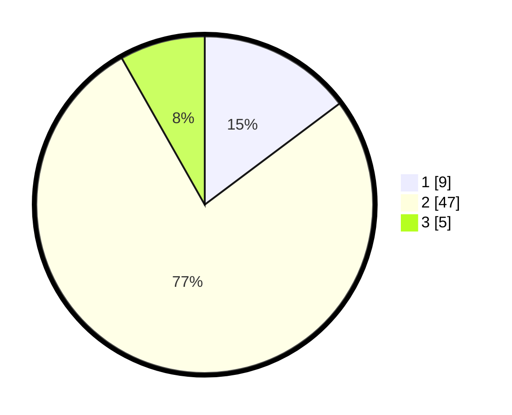

# Hasil

## Grafik

## Tabel

| No. | Nama Paslon    | Suara | Suara (raw) | Persentase |
|:--- |:-------------- | -----:| -----------:| ----------:|
| 1   | ANIES MUHAIMIN | 9     | [9][p-1]    | 14,75      |
| 2   | PRABOWO GIBRAN | 47    | [47][p-2]   | 77,05      |
| 3   | GANJAR MAHFUD  | 5     | [5][p-3]    | 8,20       |

[p-1]: https://github.com/gigit-pemilu/pemilu-2024/blob/main/pilpres/hitung-suara/sub/12-sumatera-utara/sub/09-asahan/sub/16-buntu-pane/sub/2007-sei-silau-timur/sub/013-tps/sub/paslon-1.txt
[p-2]: https://github.com/gigit-pemilu/pemilu-2024/blob/main/pilpres/hitung-suara/sub/12-sumatera-utara/sub/09-asahan/sub/16-buntu-pane/sub/2007-sei-silau-timur/sub/013-tps/sub/paslon-2.txt
[p-3]: https://github.com/gigit-pemilu/pemilu-2024/blob/main/pilpres/hitung-suara/sub/12-sumatera-utara/sub/09-asahan/sub/16-buntu-pane/sub/2007-sei-silau-timur/sub/013-tps/sub/paslon-3.txt

## Foto C Plano

https://sirekap-obj-formc.kpu.go.id/51d4/pemilu/ppwp/12/09/16/20/07/1209162007013-20240214-185340--99964dfe-f4a0-497a-b85d-25647d281210.jpg

https://sirekap-obj-formc.kpu.go.id/51d4/pemilu/ppwp/12/09/16/20/07/1209162007013-20240216-193331--701a71e8-d55e-4436-bfe0-c51b1083b83d.jpg

https://sirekap-obj-formc.kpu.go.id/51d4/pemilu/ppwp/12/09/16/20/07/1209162007013-20240216-194103--2080c7bd-bf2b-4ed7-82c9-e3e86c1d43c1.jpg

## Metadata

| Key        | Value               |
| ---------- | ------------------- |
| Time Stamp | 2024-02-19 06:16:00 |

