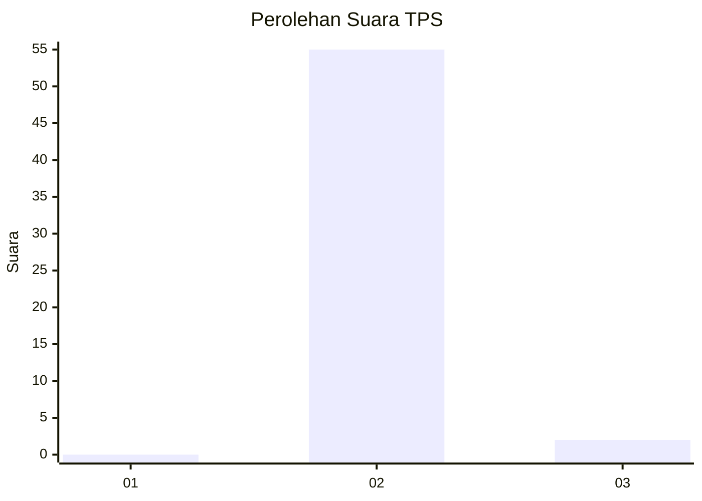
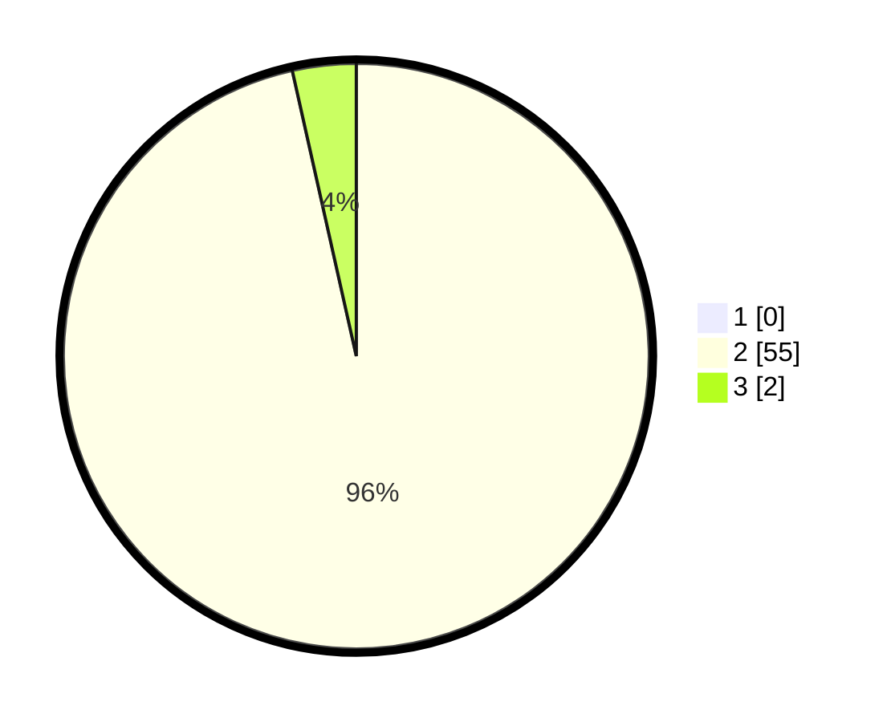

# Hasil

## Grafik

## Tabel

| No. | Nama Paslon    | Suara | Suara (raw) | Persentase |
|:--- |:-------------- | -----:| -----------:| ----------:|
| 1   | ANIES MUHAIMIN | 0     | [0][p-1]    | 0,00       |
| 2   | PRABOWO GIBRAN | 55    | [55][p-2]   | 96,49      |
| 3   | GANJAR MAHFUD  | 2     | [2][p-3]    | 3,51       |

[p-1]: https://github.com/gigit-pemilu/pemilu-2024-12-sumatera-utara/blob/main/pilpres/hitung-suara/sub/12-sumatera-utara/sub/09-asahan/sub/17-bandar-pasir-mandoge/sub/2003-sei-nadoras/sub/006-tps/sub/paslon-1.txt
[p-2]: https://github.com/gigit-pemilu/pemilu-2024-12-sumatera-utara/blob/main/pilpres/hitung-suara/sub/12-sumatera-utara/sub/09-asahan/sub/17-bandar-pasir-mandoge/sub/2003-sei-nadoras/sub/006-tps/sub/paslon-2.txt
[p-3]: https://github.com/gigit-pemilu/pemilu-2024-12-sumatera-utara/blob/main/pilpres/hitung-suara/sub/12-sumatera-utara/sub/09-asahan/sub/17-bandar-pasir-mandoge/sub/2003-sei-nadoras/sub/006-tps/sub/paslon-3.txt

## Foto C Plano

https://sirekap-obj-formc.kpu.go.id/7f31/pemilu/ppwp/12/09/17/20/03/1209172003006-20240215-060118--53d21528-e56c-4270-aeab-90739e20bd67.jpg

https://sirekap-obj-formc.kpu.go.id/7f31/pemilu/ppwp/12/09/17/20/03/1209172003006-20240214-231937--995a4f26-fa5e-4b22-be8f-91a9bca815f3.jpg

https://sirekap-obj-formc.kpu.go.id/7f31/pemilu/ppwp/12/09/17/20/03/1209172003006-20240214-232403--6fdfeae1-0e38-4413-ad53-559f4bc60c17.jpg

## Metadata

| Key        | Value               |
| ---------- | ------------------- |
| Time Stamp | 2024-02-15 07:00:44 |

