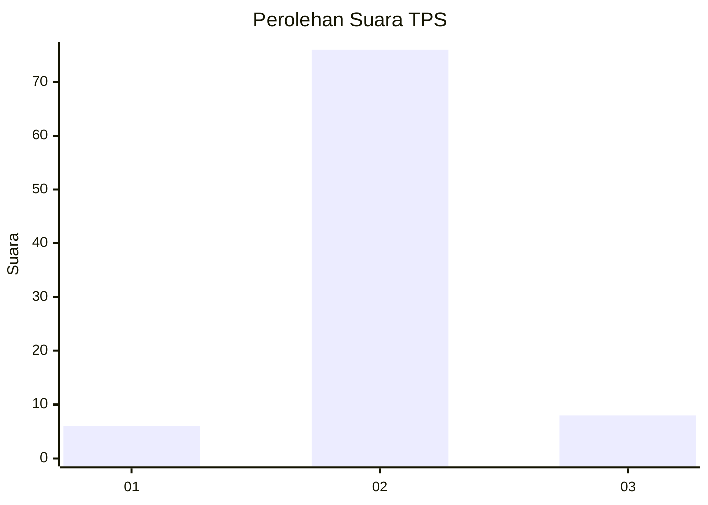
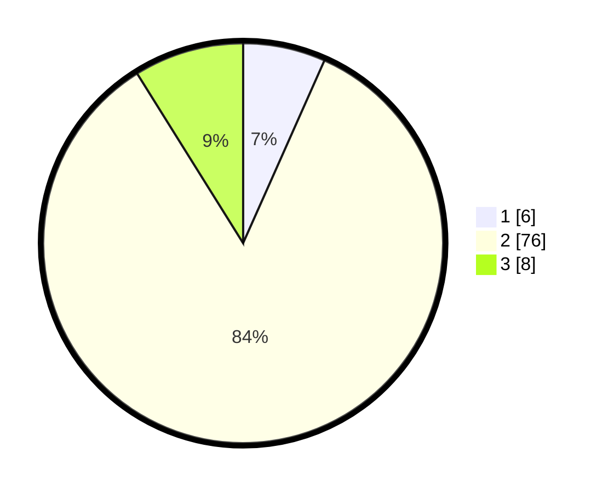

# Hasil

## Grafik

## Tabel

| No. | Nama Paslon    | Suara | Suara (raw) | Persentase |
|:--- |:-------------- | -----:| -----------:| ----------:|
| 1   | ANIES MUHAIMIN | 6     | [6][p-1]    | 6,67       |
| 2   | PRABOWO GIBRAN | 76    | [76][p-2]   | 84,44      |
| 3   | GANJAR MAHFUD  | 8     | [8][p-3]    | 8,89       |

[p-1]: https://github.com/gigit-pemilu/pemilu-2024/blob/main/pilpres/hitung-suara/sub/12-sumatera-utara/sub/09-asahan/sub/17-bandar-pasir-mandoge/sub/2003-sei-nadoras/sub/007-tps/sub/paslon-1.txt
[p-2]: https://github.com/gigit-pemilu/pemilu-2024/blob/main/pilpres/hitung-suara/sub/12-sumatera-utara/sub/09-asahan/sub/17-bandar-pasir-mandoge/sub/2003-sei-nadoras/sub/007-tps/sub/paslon-2.txt
[p-3]: https://github.com/gigit-pemilu/pemilu-2024/blob/main/pilpres/hitung-suara/sub/12-sumatera-utara/sub/09-asahan/sub/17-bandar-pasir-mandoge/sub/2003-sei-nadoras/sub/007-tps/sub/paslon-3.txt

## Foto C Plano

https://sirekap-obj-formc.kpu.go.id/1a58/pemilu/ppwp/12/09/17/20/03/1209172003007-20240217-115800--ef49271d-1e5a-4480-8e11-7f105667ff3e.jpg

https://sirekap-obj-formc.kpu.go.id/1a58/pemilu/ppwp/12/09/17/20/03/1209172003007-20240217-120035--17f097e3-dfe9-4ee0-be32-1762ac0d4b1c.jpg

https://sirekap-obj-formc.kpu.go.id/1a58/pemilu/ppwp/12/09/17/20/03/1209172003007-20240217-120055--5ee73cc2-4ef3-499d-9dfb-b6ba770ec769.jpg

## Metadata

| Key        | Value               |
| ---------- | ------------------- |
| Time Stamp | 2024-02-26 16:00:00 |

