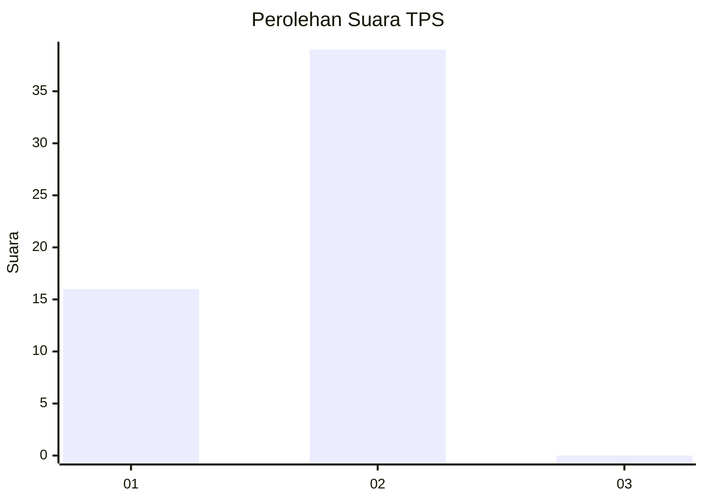
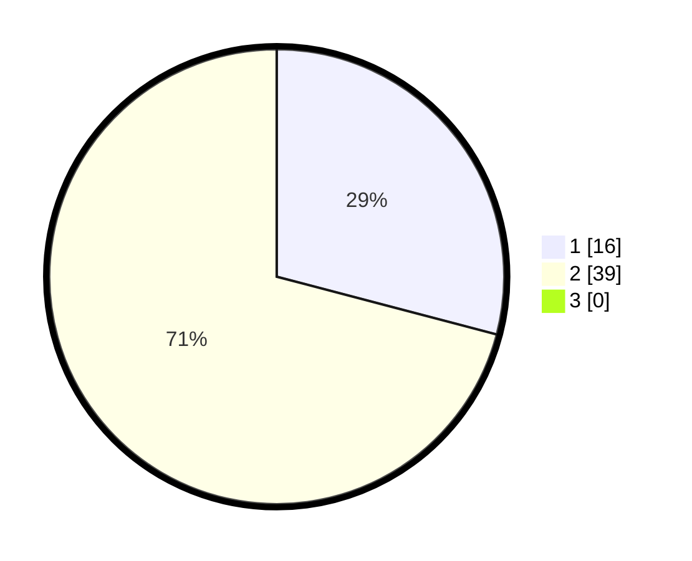

# Hasil

## Grafik

## Tabel

| No. | Nama Paslon    | Suara | Suara (raw) | Persentase |
|:--- |:-------------- | -----:| -----------:| ----------:|
| 1   | ANIES MUHAIMIN | 16    | [16][p-1]   | 29,09      |
| 2   | PRABOWO GIBRAN | 39    | [39][p-2]   | 70,91      |
| 3   | GANJAR MAHFUD  | 0     | [0][p-3]    | 0,00       |

[p-1]: https://github.com/gigit-pemilu/pemilu-2024-12-sumatera-utara/blob/main/pilpres/hitung-suara/sub/12-sumatera-utara/sub/09-asahan/sub/17-bandar-pasir-mandoge/sub/2004-silau-jawa/sub/007-tps/sub/paslon-1.txt
[p-2]: https://github.com/gigit-pemilu/pemilu-2024-12-sumatera-utara/blob/main/pilpres/hitung-suara/sub/12-sumatera-utara/sub/09-asahan/sub/17-bandar-pasir-mandoge/sub/2004-silau-jawa/sub/007-tps/sub/paslon-2.txt
[p-3]: https://github.com/gigit-pemilu/pemilu-2024-12-sumatera-utara/blob/main/pilpres/hitung-suara/sub/12-sumatera-utara/sub/09-asahan/sub/17-bandar-pasir-mandoge/sub/2004-silau-jawa/sub/007-tps/sub/paslon-3.txt

## Foto C Plano

https://sirekap-obj-formc.kpu.go.id/9b1b/pemilu/ppwp/12/09/17/20/04/1209172004007-20240215-035050--88e82a02-4533-4c29-958f-e142fdffbf20.jpg

https://sirekap-obj-formc.kpu.go.id/9b1b/pemilu/ppwp/12/09/17/20/04/1209172004007-20240215-035228--e45ecb46-47a7-4543-8bcb-0bbb382156e6.jpg

https://sirekap-obj-formc.kpu.go.id/9b1b/pemilu/ppwp/12/09/17/20/04/1209172004007-20240215-035406--bc461ac4-8ded-469a-966c-48b16eaf7022.jpg

## Metadata

| Key        | Value               |
| ---------- | ------------------- |
| Time Stamp | 2024-02-24 22:31:28 |

