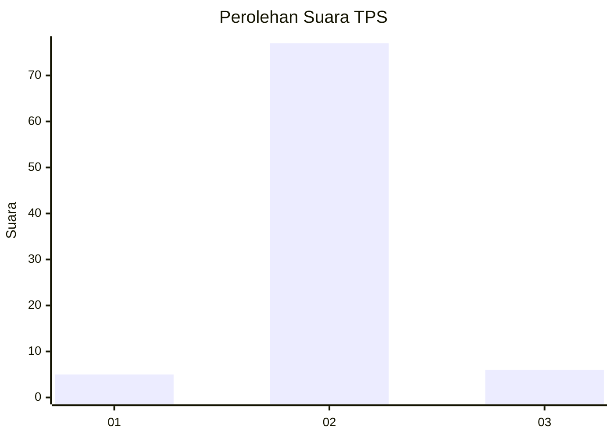
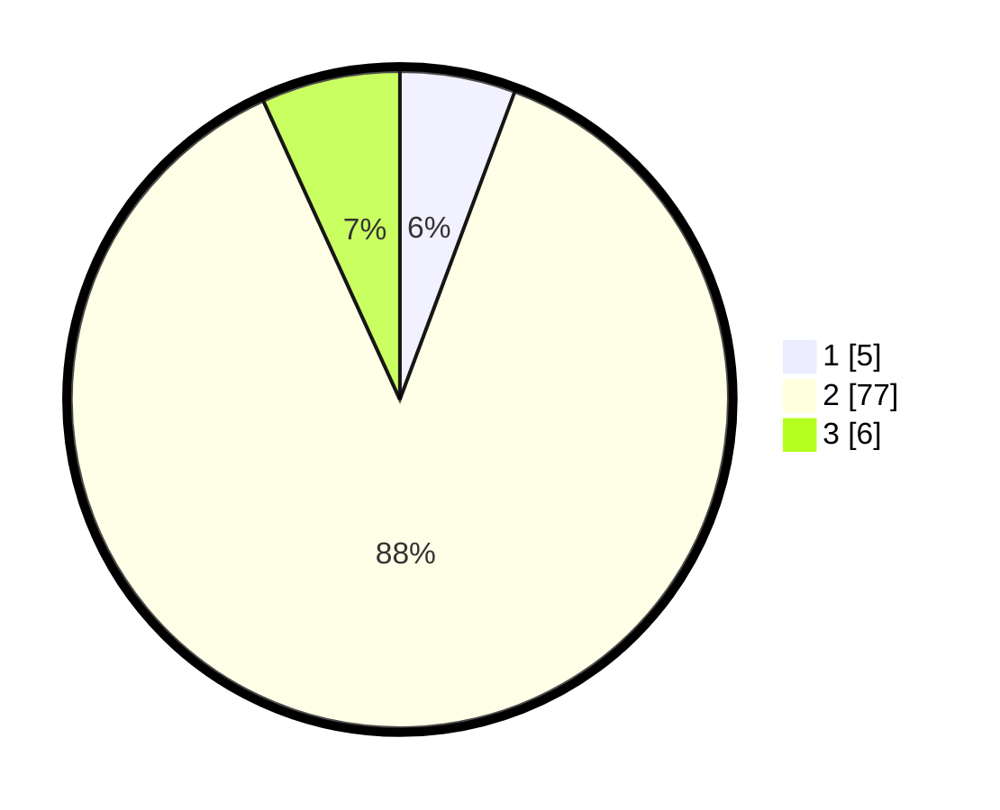

# Hasil

## Grafik

## Tabel

| No. | Nama Paslon    | Suara | Suara (raw) | Persentase |
|:--- |:-------------- | -----:| -----------:| ----------:|
| 1   | ANIES MUHAIMIN | 5     | [5][p-1]    | 5,68       |
| 2   | PRABOWO GIBRAN | 77    | [77][p-2]   | 87,50      |
| 3   | GANJAR MAHFUD  | 6     | [6][p-3]    | 6,82       |

[p-1]: https://github.com/gigit-pemilu/pemilu-2024/blob/main/pilpres/hitung-suara/sub/12-sumatera-utara/sub/09-asahan/sub/17-bandar-pasir-mandoge/sub/2006-sei-kopas/sub/009-tps/sub/paslon-1.txt
[p-2]: https://github.com/gigit-pemilu/pemilu-2024/blob/main/pilpres/hitung-suara/sub/12-sumatera-utara/sub/09-asahan/sub/17-bandar-pasir-mandoge/sub/2006-sei-kopas/sub/009-tps/sub/paslon-2.txt
[p-3]: https://github.com/gigit-pemilu/pemilu-2024/blob/main/pilpres/hitung-suara/sub/12-sumatera-utara/sub/09-asahan/sub/17-bandar-pasir-mandoge/sub/2006-sei-kopas/sub/009-tps/sub/paslon-3.txt

## Foto C Plano

https://sirekap-obj-formc.kpu.go.id/c722/pemilu/ppwp/12/09/17/20/06/1209172006009-20240215-151317--39376bd2-962f-4e39-8a33-120eb2372872.jpg

https://sirekap-obj-formc.kpu.go.id/c722/pemilu/ppwp/12/09/17/20/06/1209172006009-20240215-151500--cb9f63e4-f2d5-411c-ab93-2d2af38a1ba0.jpg

https://sirekap-obj-formc.kpu.go.id/c722/pemilu/ppwp/12/09/17/20/06/1209172006009-20240215-151616--55236535-10c0-4ca8-a473-7cf9f919715f.jpg

## Metadata

| Key        | Value               |
| ---------- | ------------------- |
| Time Stamp | 2024-02-25 16:00:00 |

