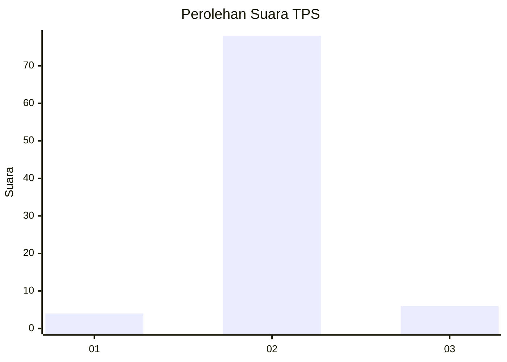
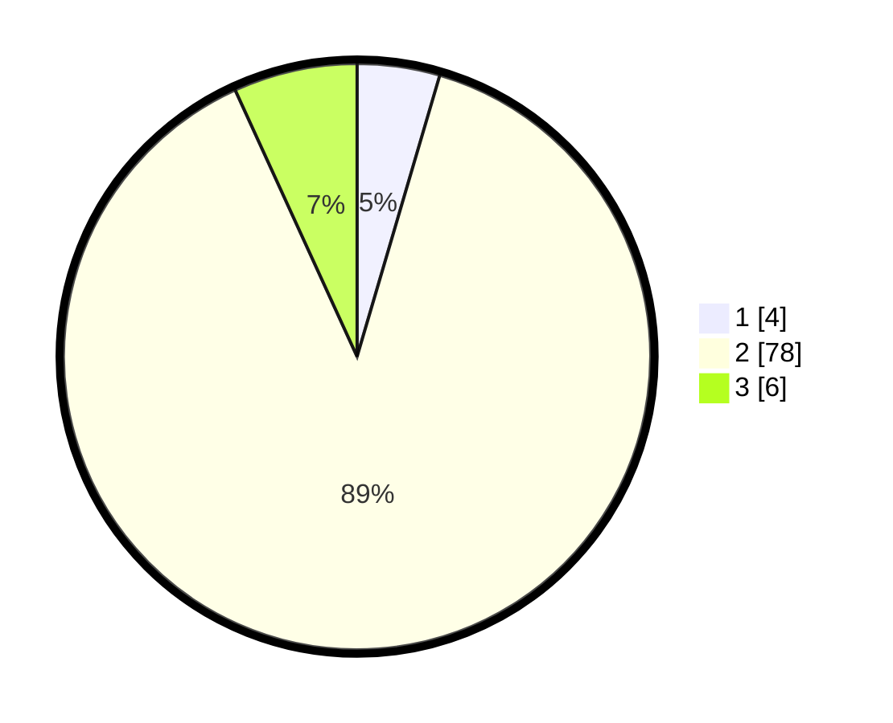

# Hasil

## Grafik

## Tabel

| No. | Nama Paslon    | Suara | Suara (raw) | Persentase |
|:--- |:-------------- | -----:| -----------:| ----------:|
| 1   | ANIES MUHAIMIN | 4     | [4][p-1]    | 4,55       |
| 2   | PRABOWO GIBRAN | 78    | [78][p-2]   | 88,64      |
| 3   | GANJAR MAHFUD  | 6     | [6][p-3]    | 6,82       |

[p-1]: https://github.com/gigit-pemilu/pemilu-2024/blob/main/pilpres/hitung-suara/sub/12-sumatera-utara/sub/09-asahan/sub/17-bandar-pasir-mandoge/sub/2006-sei-kopas/sub/010-tps/sub/paslon-1.txt
[p-2]: https://github.com/gigit-pemilu/pemilu-2024/blob/main/pilpres/hitung-suara/sub/12-sumatera-utara/sub/09-asahan/sub/17-bandar-pasir-mandoge/sub/2006-sei-kopas/sub/010-tps/sub/paslon-2.txt
[p-3]: https://github.com/gigit-pemilu/pemilu-2024/blob/main/pilpres/hitung-suara/sub/12-sumatera-utara/sub/09-asahan/sub/17-bandar-pasir-mandoge/sub/2006-sei-kopas/sub/010-tps/sub/paslon-3.txt

## Foto C Plano

https://sirekap-obj-formc.kpu.go.id/0404/pemilu/ppwp/12/09/17/20/06/1209172006010-20240214-194010--d444a83d-78cf-4928-bfb6-9bf828daf325.jpg

https://sirekap-obj-formc.kpu.go.id/0404/pemilu/ppwp/12/09/17/20/06/1209172006010-20240214-193742--aa434d47-74c8-42e9-8c71-60359762e9c6.jpg

https://sirekap-obj-formc.kpu.go.id/0404/pemilu/ppwp/12/09/17/20/06/1209172006010-20240214-193931--25ef3efe-531b-4e09-9e9a-970f0351c6fd.jpg

## Metadata

| Key        | Value               |
| ---------- | ------------------- |
| Time Stamp | 2024-02-25 15:00:00 |

