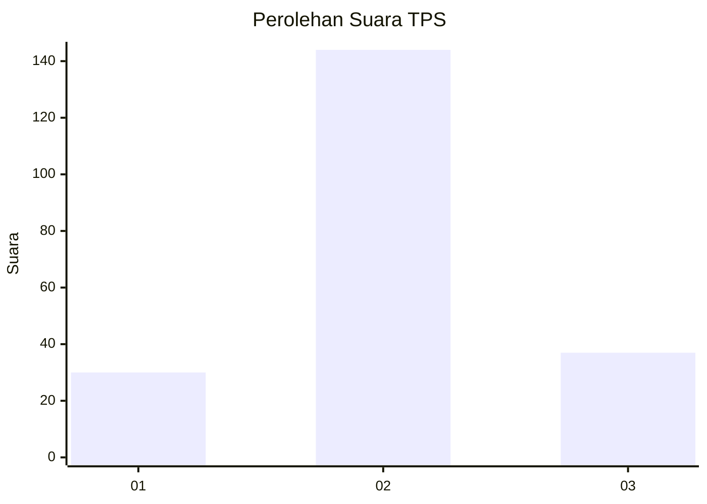
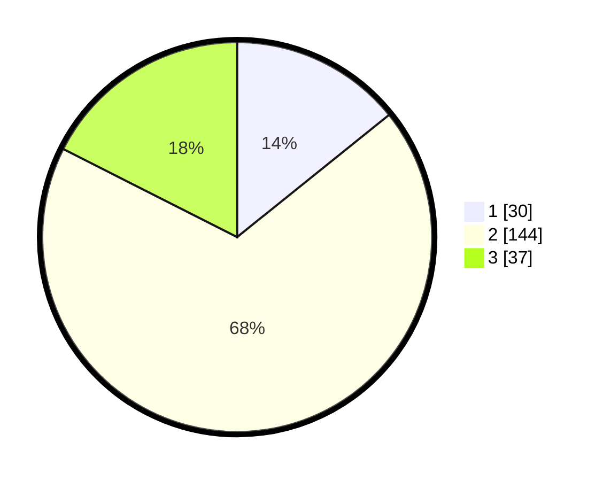

# Hasil

## Grafik

## Tabel

| No. | Nama Paslon    | Suara | Suara (raw) | Persentase |
|:--- |:-------------- | -----:| -----------:| ----------:|
| 1   | ANIES MUHAIMIN | 30    | [30][p-1]   | 14,22      |
| 2   | PRABOWO GIBRAN | 144   | [144][p-2]  | 68,25      |
| 3   | GANJAR MAHFUD  | 37    | [37][p-3]   | 17,54      |

[p-1]: https://github.com/gigit-pemilu/pemilu-2024/blob/main/pilpres/hitung-suara/sub/12-sumatera-utara/sub/09-asahan/sub/18-aek-kuasan/sub/2003-alang-bonbon/sub/007-tps/sub/paslon-1.txt
[p-2]: https://github.com/gigit-pemilu/pemilu-2024/blob/main/pilpres/hitung-suara/sub/12-sumatera-utara/sub/09-asahan/sub/18-aek-kuasan/sub/2003-alang-bonbon/sub/007-tps/sub/paslon-2.txt
[p-3]: https://github.com/gigit-pemilu/pemilu-2024/blob/main/pilpres/hitung-suara/sub/12-sumatera-utara/sub/09-asahan/sub/18-aek-kuasan/sub/2003-alang-bonbon/sub/007-tps/sub/paslon-3.txt

## Foto C Plano

https://sirekap-obj-formc.kpu.go.id/66ec/pemilu/ppwp/12/09/18/20/03/1209182003007-20240215-040757--97e36751-825e-4dac-b1d7-8b1a86adfe8e.jpg

https://sirekap-obj-formc.kpu.go.id/66ec/pemilu/ppwp/12/09/18/20/03/1209182003007-20240215-041729--fb380aa2-23a2-474e-ac0f-758d04937c1b.jpg

https://sirekap-obj-formc.kpu.go.id/66ec/pemilu/ppwp/12/09/18/20/03/1209182003007-20240215-042023--c264f5c4-9019-4d3c-a1fe-87d20a8ae731.jpg

## Metadata

| Key        | Value               |
| ---------- | ------------------- |
| Time Stamp | 2024-02-25 16:00:00 |

