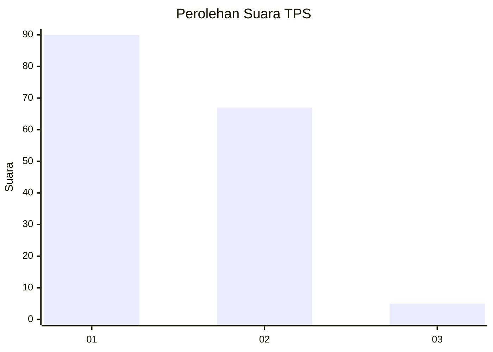
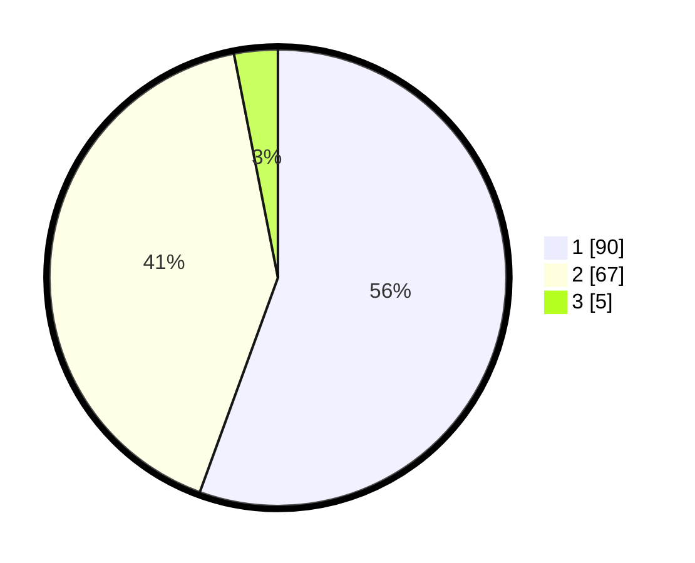

# Hasil

## Grafik

## Tabel

| No. | Nama Paslon    | Suara | Suara (raw) | Persentase |
|:--- |:-------------- | -----:| -----------:| ----------:|
| 1   | ANIES MUHAIMIN | 90    | [90][p-1]   | 55,56      |
| 2   | PRABOWO GIBRAN | 67    | [67][p-2]   | 41,36      |
| 3   | GANJAR MAHFUD  | 5     | [5][p-3]    | 3,09       |

[p-1]: https://github.com/gigit-pemilu/pemilu-2024-12-sumatera-utara/blob/main/pilpres/hitung-suara/sub/12-sumatera-utara/sub/09-asahan/sub/19-kota-kisaran-barat/sub/1001-bunut/sub/003-tps/sub/paslon-1.txt
[p-2]: https://github.com/gigit-pemilu/pemilu-2024-12-sumatera-utara/blob/main/pilpres/hitung-suara/sub/12-sumatera-utara/sub/09-asahan/sub/19-kota-kisaran-barat/sub/1001-bunut/sub/003-tps/sub/paslon-2.txt
[p-3]: https://github.com/gigit-pemilu/pemilu-2024-12-sumatera-utara/blob/main/pilpres/hitung-suara/sub/12-sumatera-utara/sub/09-asahan/sub/19-kota-kisaran-barat/sub/1001-bunut/sub/003-tps/sub/paslon-3.txt

## Foto C Plano

https://sirekap-obj-formc.kpu.go.id/98b2/pemilu/ppwp/12/09/19/10/01/1209191001003-20240214-224126--f2c8271b-6a50-48ea-a9bc-8c6633b04c06.jpg

https://sirekap-obj-formc.kpu.go.id/98b2/pemilu/ppwp/12/09/19/10/01/1209191001003-20240214-224257--10a102c6-47b9-4cb4-9a6a-24da743a5abf.jpg

https://sirekap-obj-formc.kpu.go.id/98b2/pemilu/ppwp/12/09/19/10/01/1209191001003-20240214-224410--049d8dd5-3aa8-44ca-8bce-35ae40326f28.jpg

## Metadata

| Key        | Value               |
| ---------- | ------------------- |
| Time Stamp | 2024-02-25 18:00:00 |

