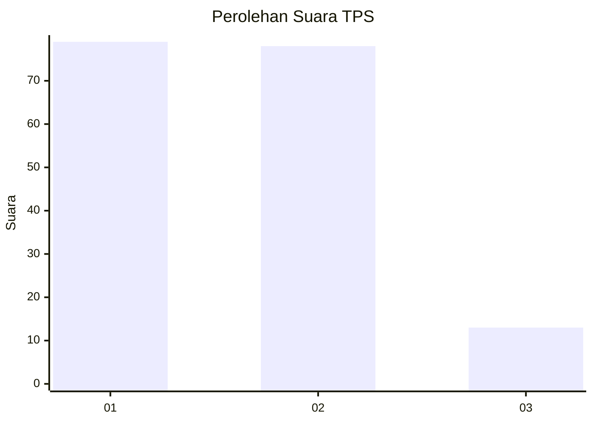
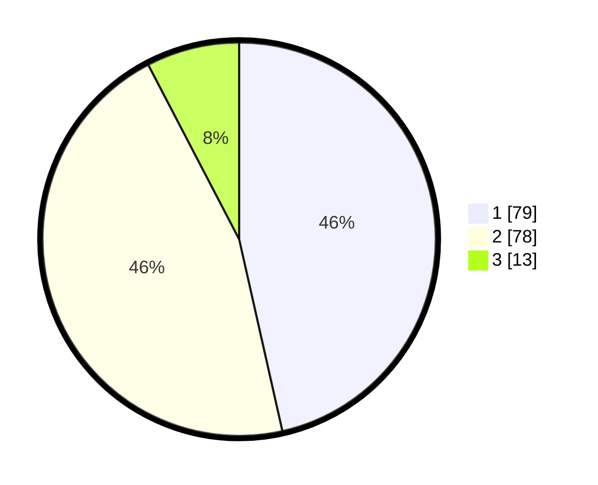

# Hasil

## Grafik

## Tabel

| No. | Nama Paslon    | Suara | Suara (raw) | Persentase |
|:--- |:-------------- | -----:| -----------:| ----------:|
| 1   | ANIES MUHAIMIN | 79    | [79][p-1]   | 46,47      |
| 2   | PRABOWO GIBRAN | 78    | [78][p-2]   | 45,88      |
| 3   | GANJAR MAHFUD  | 13    | [13][p-3]   | 7,65       |

[p-1]: https://github.com/gigit-pemilu/pemilu-2024/blob/main/pilpres/hitung-suara/sub/12-sumatera-utara/sub/09-asahan/sub/19-kota-kisaran-barat/sub/1002-bunut-barat/sub/003-tps/sub/paslon-1.txt
[p-2]: https://github.com/gigit-pemilu/pemilu-2024/blob/main/pilpres/hitung-suara/sub/12-sumatera-utara/sub/09-asahan/sub/19-kota-kisaran-barat/sub/1002-bunut-barat/sub/003-tps/sub/paslon-2.txt
[p-3]: https://github.com/gigit-pemilu/pemilu-2024/blob/main/pilpres/hitung-suara/sub/12-sumatera-utara/sub/09-asahan/sub/19-kota-kisaran-barat/sub/1002-bunut-barat/sub/003-tps/sub/paslon-3.txt

## Foto C Plano

https://sirekap-obj-formc.kpu.go.id/5337/pemilu/ppwp/12/09/19/10/02/1209191002003-20240214-230651--3fa5f703-5c62-4423-bebe-610d3e819dc0.jpg

https://sirekap-obj-formc.kpu.go.id/5337/pemilu/ppwp/12/09/19/10/02/1209191002003-20240214-231112--bb701c1f-ca69-4cfe-99f9-4868ac6d7225.jpg

https://sirekap-obj-formc.kpu.go.id/5337/pemilu/ppwp/12/09/19/10/02/1209191002003-20240214-231456--99b89cd2-bb46-4bbe-9cbb-1e6e3c665ec6.jpg

## Metadata

| Key        | Value               |
| ---------- | ------------------- |
| Time Stamp | 2024-02-25 17:00:00 |

