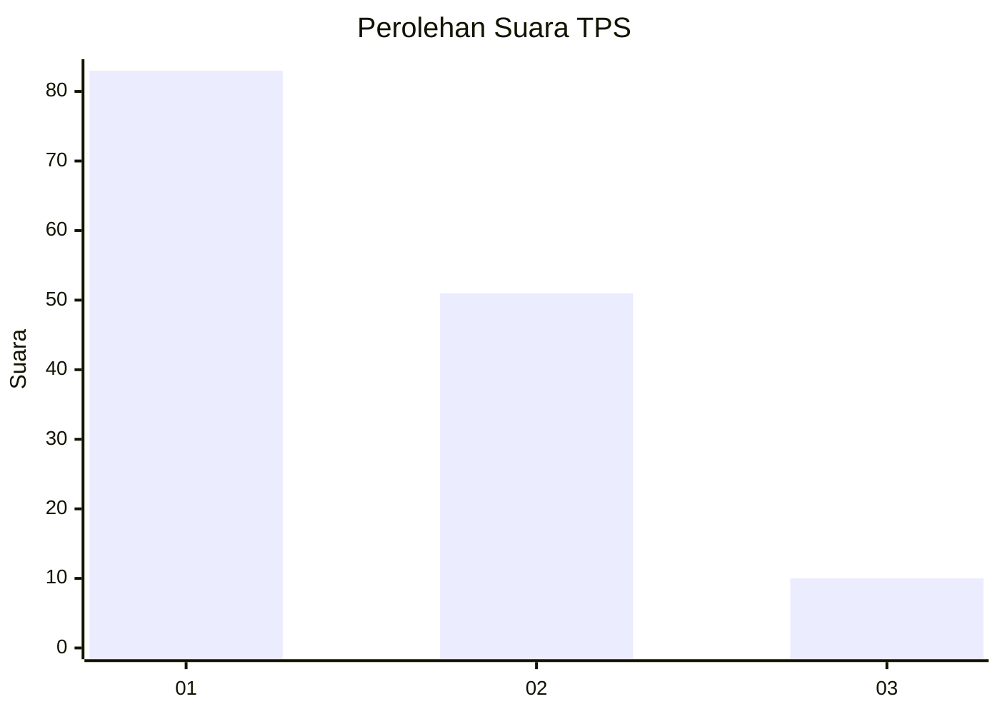
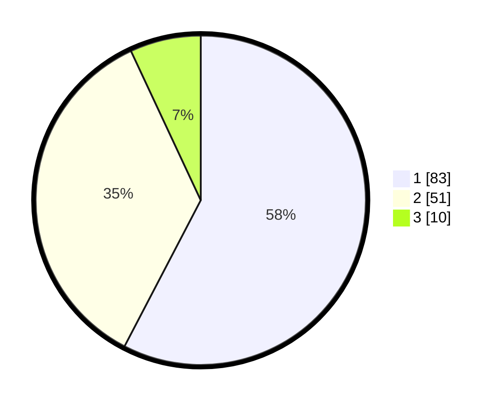

# Hasil

## Grafik

## Tabel

| No. | Nama Paslon    | Suara | Suara (raw) | Persentase |
|:--- |:-------------- | -----:| -----------:| ----------:|
| 1   | ANIES MUHAIMIN | 83    | [83][p-1]   | 57,64      |
| 2   | PRABOWO GIBRAN | 51    | [51][p-2]   | 35,42      |
| 3   | GANJAR MAHFUD  | 10    | [10][p-3]   | 6,94       |

[p-1]: https://github.com/gigit-pemilu/pemilu-2024/blob/main/pilpres/hitung-suara/sub/12-sumatera-utara/sub/09-asahan/sub/19-kota-kisaran-barat/sub/1007-mekar-baru/sub/007-tps/sub/paslon-1.txt
[p-2]: https://github.com/gigit-pemilu/pemilu-2024/blob/main/pilpres/hitung-suara/sub/12-sumatera-utara/sub/09-asahan/sub/19-kota-kisaran-barat/sub/1007-mekar-baru/sub/007-tps/sub/paslon-2.txt
[p-3]: https://github.com/gigit-pemilu/pemilu-2024/blob/main/pilpres/hitung-suara/sub/12-sumatera-utara/sub/09-asahan/sub/19-kota-kisaran-barat/sub/1007-mekar-baru/sub/007-tps/sub/paslon-3.txt

## Foto C Plano

https://sirekap-obj-formc.kpu.go.id/7fa6/pemilu/ppwp/12/09/19/10/07/1209191007007-20240214-231656--7dbfed53-b634-43a3-adc3-a17df844c044.jpg

https://sirekap-obj-formc.kpu.go.id/7fa6/pemilu/ppwp/12/09/19/10/07/1209191007007-20240214-235731--c1416710-2fa5-44ea-a35f-e81c6ee5adb7.jpg

https://sirekap-obj-formc.kpu.go.id/7fa6/pemilu/ppwp/12/09/19/10/07/1209191007007-20240214-235517--1598f1d1-cd69-4104-9adc-d65ea93d6a29.jpg

## Metadata

| Key        | Value               |
| ---------- | ------------------- |
| Time Stamp | 2024-02-15 19:30:26 |

