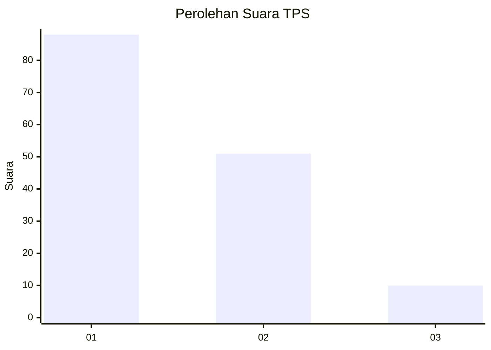
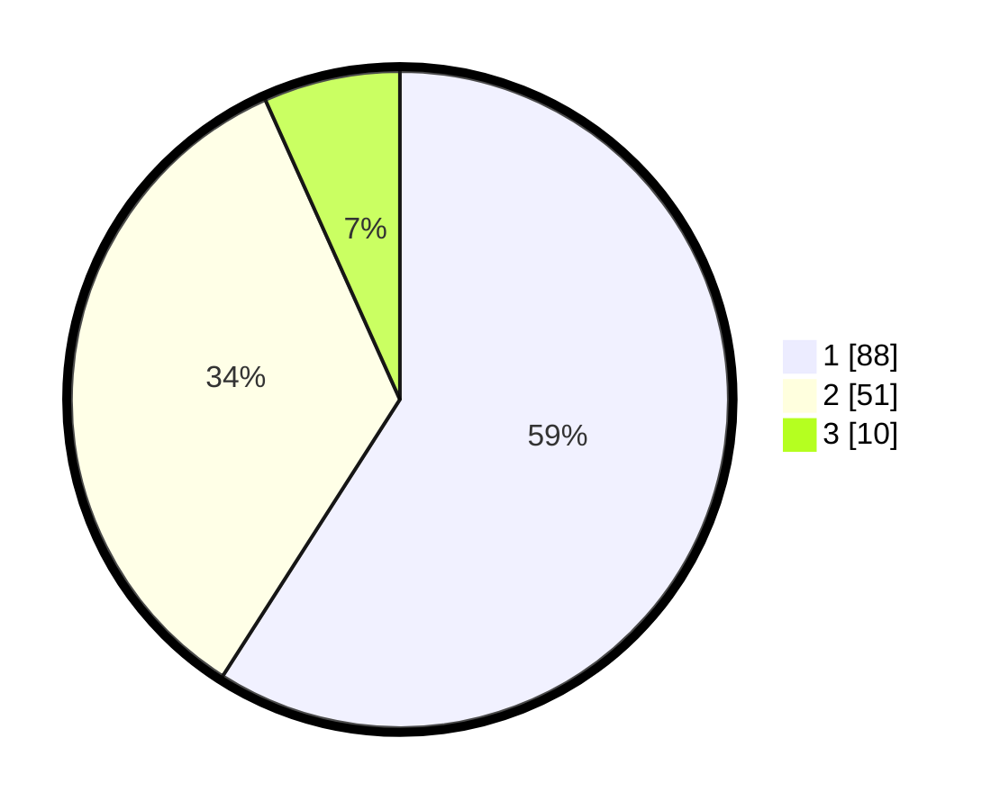

# Hasil

## Grafik

## Tabel

| No. | Nama Paslon    | Suara | Suara (raw) | Persentase |
|:--- |:-------------- | -----:| -----------:| ----------:|
| 1   | ANIES MUHAIMIN | 88    | [88][p-1]   | 59,06      |
| 2   | PRABOWO GIBRAN | 51    | [51][p-2]   | 34,23      |
| 3   | GANJAR MAHFUD  | 10    | [10][p-3]   | 6,71       |

[p-1]: https://github.com/gigit-pemilu/pemilu-2024/blob/main/pilpres/hitung-suara/sub/12-sumatera-utara/sub/09-asahan/sub/19-kota-kisaran-barat/sub/1012-tebing-kisaran/sub/001-tps/sub/paslon-1.txt
[p-2]: https://github.com/gigit-pemilu/pemilu-2024/blob/main/pilpres/hitung-suara/sub/12-sumatera-utara/sub/09-asahan/sub/19-kota-kisaran-barat/sub/1012-tebing-kisaran/sub/001-tps/sub/paslon-2.txt
[p-3]: https://github.com/gigit-pemilu/pemilu-2024/blob/main/pilpres/hitung-suara/sub/12-sumatera-utara/sub/09-asahan/sub/19-kota-kisaran-barat/sub/1012-tebing-kisaran/sub/001-tps/sub/paslon-3.txt

## Foto C Plano

https://sirekap-obj-formc.kpu.go.id/a72b/pemilu/ppwp/12/09/19/10/12/1209191012001-20240219-133011--e746d5b5-9a5f-4ed7-8e96-7f3161328741.jpg

https://sirekap-obj-formc.kpu.go.id/a72b/pemilu/ppwp/12/09/19/10/12/1209191012001-20240219-133149--d927e1ca-d0ee-4cf6-9c3a-ce23790117ce.jpg

https://sirekap-obj-formc.kpu.go.id/a72b/pemilu/ppwp/12/09/19/10/12/1209191012001-20240215-011623--5968e4ac-1455-4cc0-9c40-8621d38f7705.jpg

## Metadata

| Key        | Value               |
| ---------- | ------------------- |
| Time Stamp | 2024-02-25 11:00:00 |

