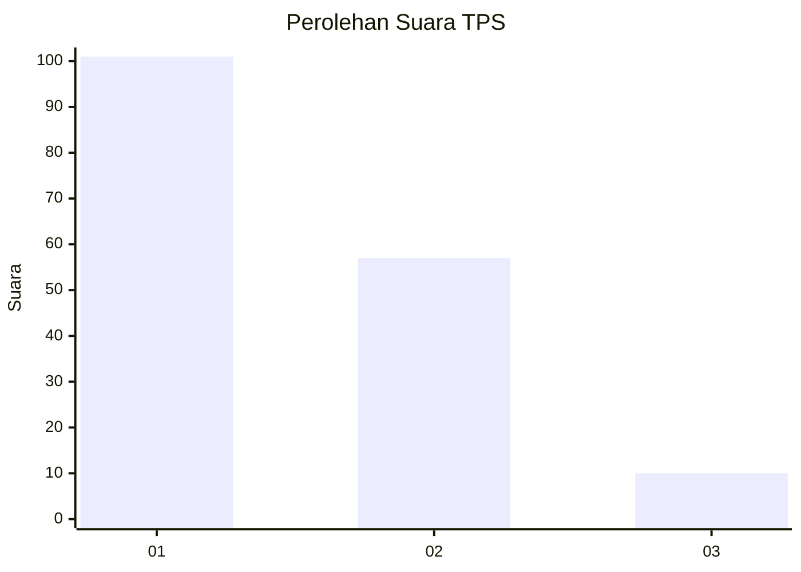
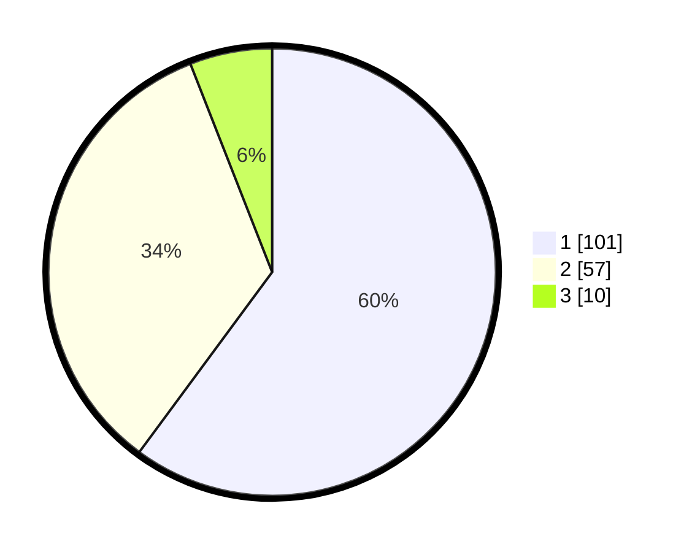

# Hasil

## Grafik

## Tabel

| No. | Nama Paslon    | Suara | Suara (raw) | Persentase |
|:--- |:-------------- | -----:| -----------:| ----------:|
| 1   | ANIES MUHAIMIN | 101   | [101][p-1]  | 60,12      |
| 2   | PRABOWO GIBRAN | 57    | [57][p-2]   | 33,93      |
| 3   | GANJAR MAHFUD  | 10    | [10][p-3]   | 5,95       |

[p-1]: https://github.com/gigit-pemilu/pemilu-2024-12-sumatera-utara/blob/main/pilpres/hitung-suara/sub/12-sumatera-utara/sub/09-asahan/sub/20-kota-kisaran-timur/sub/1001-teladan/sub/003-tps/sub/paslon-1.txt
[p-2]: https://github.com/gigit-pemilu/pemilu-2024-12-sumatera-utara/blob/main/pilpres/hitung-suara/sub/12-sumatera-utara/sub/09-asahan/sub/20-kota-kisaran-timur/sub/1001-teladan/sub/003-tps/sub/paslon-2.txt
[p-3]: https://github.com/gigit-pemilu/pemilu-2024-12-sumatera-utara/blob/main/pilpres/hitung-suara/sub/12-sumatera-utara/sub/09-asahan/sub/20-kota-kisaran-timur/sub/1001-teladan/sub/003-tps/sub/paslon-3.txt

## Foto C Plano

https://sirekap-obj-formc.kpu.go.id/f07e/pemilu/ppwp/12/09/20/10/01/1209201001003-20240214-225002--9a03d804-e76e-4e2e-ac03-e979bbbc0309.jpg

https://sirekap-obj-formc.kpu.go.id/f07e/pemilu/ppwp/12/09/20/10/01/1209201001003-20240214-225217--4f3fd399-ce00-4db0-8b6b-7062d600f657.jpg

https://sirekap-obj-formc.kpu.go.id/f07e/pemilu/ppwp/12/09/20/10/01/1209201001003-20240214-225350--01b83fd0-3bb1-42fb-bac0-4c71676a938b.jpg

## Metadata

| Key        | Value               |
| ---------- | ------------------- |
| Time Stamp | 2024-02-25 21:00:00 |

