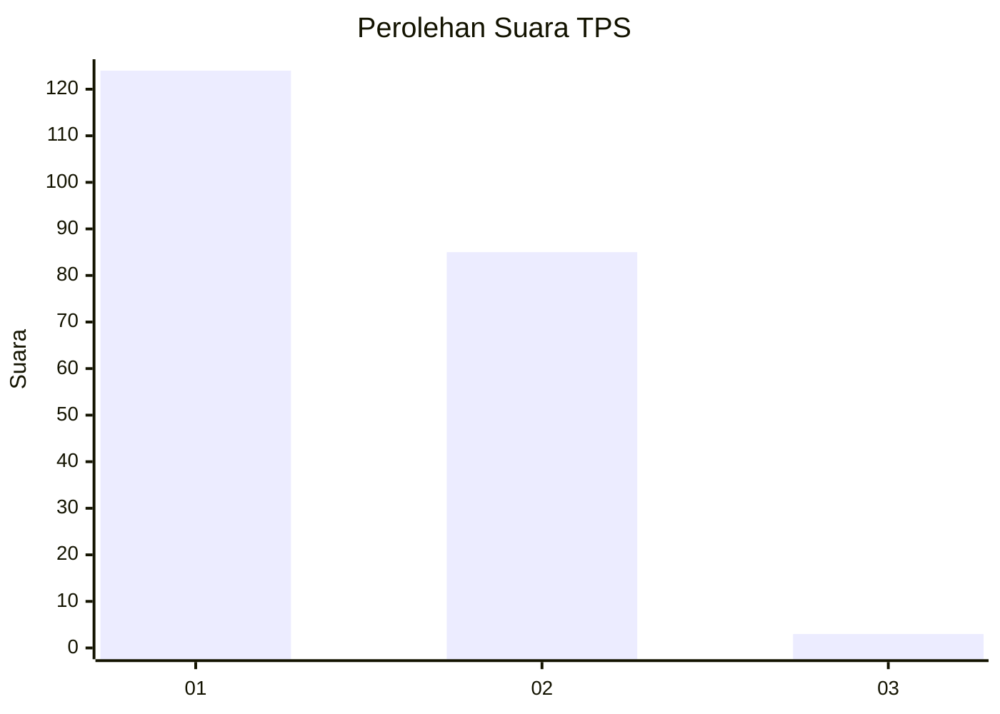
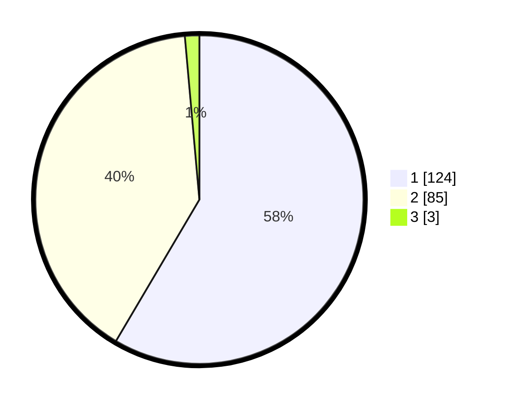

# Hasil

## Grafik

## Tabel

| No. | Nama Paslon    | Suara | Suara (raw) | Persentase |
|:--- |:-------------- | -----:| -----------:| ----------:|
| 1   | ANIES MUHAIMIN | 124   | [124][p-1]  | 58,49      |
| 2   | PRABOWO GIBRAN | 85    | [85][p-2]   | 40,09      |
| 3   | GANJAR MAHFUD  | 3     | [3][p-3]    | 1,42       |

[p-1]: https://github.com/gigit-pemilu/pemilu-2024-12-sumatera-utara/blob/main/pilpres/hitung-suara/sub/12-sumatera-utara/sub/09-asahan/sub/20-kota-kisaran-timur/sub/1001-teladan/sub/004-tps/sub/paslon-1.txt
[p-2]: https://github.com/gigit-pemilu/pemilu-2024-12-sumatera-utara/blob/main/pilpres/hitung-suara/sub/12-sumatera-utara/sub/09-asahan/sub/20-kota-kisaran-timur/sub/1001-teladan/sub/004-tps/sub/paslon-2.txt
[p-3]: https://github.com/gigit-pemilu/pemilu-2024-12-sumatera-utara/blob/main/pilpres/hitung-suara/sub/12-sumatera-utara/sub/09-asahan/sub/20-kota-kisaran-timur/sub/1001-teladan/sub/004-tps/sub/paslon-3.txt

## Foto C Plano

https://sirekap-obj-formc.kpu.go.id/ac1f/pemilu/ppwp/12/09/20/10/01/1209201001004-20240215-042422--c3a757c3-b615-4266-8434-0ea011662cf6.jpg

https://sirekap-obj-formc.kpu.go.id/ac1f/pemilu/ppwp/12/09/20/10/01/1209201001004-20240217-122959--296722a5-d204-4e59-a3b9-45092867f5da.jpg

https://sirekap-obj-formc.kpu.go.id/ac1f/pemilu/ppwp/12/09/20/10/01/1209201001004-20240217-123158--398212da-b6ec-4f1b-8806-cdddf79cf5e1.jpg

## Metadata

| Key        | Value               |
| ---------- | ------------------- |
| Time Stamp | 2024-02-25 17:00:00 |

